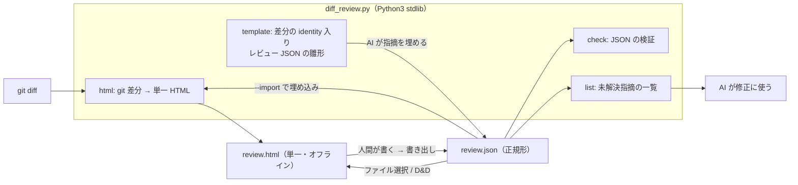
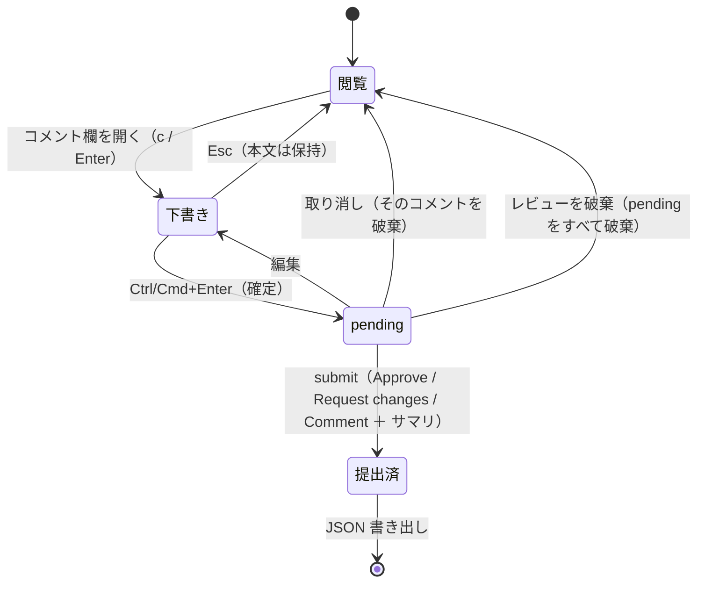

# 仕様: diff-review-html（差分レビュー画面の生成と、レビュー記録 JSON の往復）

## 概要

`docs/ClaudeCode/skills/other/diff-review-html/` に新規 skill を置く。中核は
**Python3 標準ライブラリだけで動く 1 本の script**（`diff_review.py`）と、それが読む
**HTML/CSS/JS のテンプレート**。script は `git` の差分を読み、テンプレートに差し込んで
**自己完結した単一 HTML** を出力する。人間はその HTML をブラウザで開いて GitHub PR 相当の操作
（行 / ファイル / 全体のコメント、返信、解決、pending → submit）を行い、結果を **JSON として書き出す**。
JSON は同じ HTML に読み込んで復元でき、生成時に埋め込むこともできる（AI → 人間の経路）。



## 設計方針

- **script は生成と検査に徹し、画面の状態は持たない**。レビュー中の状態はブラウザ側だけが持ち、
  外に出る形は JSON 1 種類に限る。往復の契約点を 1 つにすることで、AC7（往復で欠落しない）が
  「同じ構造を読み書きしているか」の検査に還元される。
- **Python3 標準ライブラリのみ・1 実装**（`decisions.md` D9 / D12）。`json` / `subprocess` / `hashlib` /
  `argparse` / `html` で足りる。pip パッケージ・Node・jq は使わない。
  **sh 版と pwsh 版を分けて持たない**——`aidev` CLI が背負っている「2 実装の挙動・出力・終了コードを
  一致させ、CI で両処理系を揃えて検証する」コスト（`.github/workflows/aidev-cli.yml` のコメントが
  その必要性と過去の実バグを記録している）を、レビュー画面 1 本のために常設しない。
- **テンプレートは別ファイル**（`templates/page.html` / `templates/app.js` / `templates/style.css`）。
  Python の文字列に HTML を埋め込むと、どちらも読みにくくなり JS の構文検査も効かない。
  先例は `wiki-init/templates/*.tmpl`（`docs/ClaudeCode/skills/wiki/wiki-init/templates/`）。
- **決定論を「作らない」ことで守る**（`decisions.md` D4）。生成物に時刻・乱数・実行環境由来の値を
  一切入れない。ID は内容と位置から決まる形にする。
- **描画はすべて DOM の `textContent`**。`innerHTML` を使わない。これで差分やコメントに
  何が入っていても HTML として解釈されない（AC10）。埋め込み JSON 側では `<` を `<` に退避する
  （`research.md` F6 の実測）。
- **操作部品は disclosure**（`research.md` F13）。コメント欄は行の直下にインライン展開し、モーダルにしない。
  差分を見ながら書けること、フォーカスの閉じ込め実装を負わないことの両方を取る。

## 対象範囲

追加するファイル（既存ファイルの変更は無い）:

| パス | 役割 |
|---|---|
| `docs/ClaudeCode/skills/other/diff-review-html/SKILL.md` | skill 本体（3 機能の入口・JSON スキーマの説明・使用例） |
| `docs/ClaudeCode/skills/other/diff-review-html/diff_review.py` | 生成・検証 script（サブコマンド `html` / `template` / `check` / `list`） |
| `docs/ClaudeCode/skills/other/diff-review-html/templates/page.html` | 単一 HTML の骨格（プレースホルダ置換） |
| `docs/ClaudeCode/skills/other/diff-review-html/templates/style.css` | 画面のスタイル（ライト/ダーク両対応） |
| `docs/ClaudeCode/skills/other/diff-review-html/templates/app.js` | 画面の挙動（コメント・提出・保存・入出力） |
| `docs/ClaudeCode/skills/other/diff-review-html/schema.md` | JSON スキーマの正典（AI が読む先） |
| `docs/ClaudeCode/skills/other/diff-review-html/tests/test_diff_review.py` | `unittest`（stdlib）による script のテスト |

**CI には載せない**（`.github/workflows/aidev-cli.yml` の `paths` は `docs/ClaudeCode/skills/aidev/**` 限定）。
ジョブ追加は今回のスコープ外とし、design の申し送りに残す。

## 依拠する既存の事実

- **単一 HTML を生成する skill の先例**: `docs/ClaudeCode/skills/other/md-to-doc/generate.py:1-15`
  （ドックストリングに「stdlib のみで動作」「単一HTML」「localStorage に保存」と明記）。
  この skill と同じ型を採る（言語・出力形態・依存方針）。
- **テンプレート同梱の先例**: `docs/ClaudeCode/skills/wiki/wiki-init/templates/`（`*.tmpl` 5 本）。
- **frontmatter の書式**: `docs/ClaudeCode/skills/wiki/wiki-lint/SKILL.md:1-4`
  （`name` / `description` に日英のトリガ語を併記）、
  `docs/ClaudeCode/skills/other/md-to-doc/SKILL.md:1-4`。
- **トリガ語の競合相手**: `docs/ClaudeCode/skills/github/create-pr/SKILL.md:3`
  （「PRを作って」「レビュー依頼のPRを出して」等で**必ず**発火すると宣言している）。
- **CI のパス限定**: `.github/workflows/aidev-cli.yml` の `on.push.paths` / `on.pull_request.paths`。
- **ブラウザ・git・性能の事実**: `research.md` の F1〜F10（**この環境での実測**。
  Chromium 1194 / Playwright 1.56.1、`git` 2.43.0）。
- **GitHub のレビューモデルと API 語彙**: `research.md` F11 / F12
  （**出典は検索要約で、一次ページは未確認**——egress 拒否のため。設計はこの語彙に「寄せる」だけで、
  API 互換を保証しない）。
- **既存の流用元コードは該当なし**。`docs/ClaudeCode/skills/` 配下を全走査した範囲で、
  差分パーサ・レビュー画面・JSON スキーマに相当する実装は存在しない（`md-to-doc` は Markdown → HTML で、
  差分も注釈も扱わない）。よって差分パーサ・テンプレート・スキーマは新規に書く。

## インターフェース / データ構造

### CLI

```
python3 diff_review.py html   [--unstaged | --staged | --range <A>..<B> | --commit <C>]
                              [--repo <DIR>] [--context <N>] [--title <T>]
                              [--import <review.json>] [--out <FILE>]
python3 diff_review.py template [--unstaged | --staged | --range <A>..<B> | --commit <C>]
                              [--repo <DIR>] [--out <FILE>]
python3 diff_review.py check  <review.json> [--repo <DIR>]
python3 diff_review.py list   <review.json> [--all] [--format text|tsv]
```

- 差分の指定を省略した場合は `--unstaged`（`git diff`）。`--staged` は `git diff --cached`。
- `--out` 省略時は標準出力（パイプで扱えること＝決定論の確認が `cmp` で済む）。
- 終了コード: `0` 正常 / `1` 使い方の誤り / `2` git の失敗 / `3` JSON が不正（`check`）。
- **`template`** は「差分の identity だけが入った、コメント 0 件のレビュー JSON」を出す。
  AI はこれを埋めるだけでよく、identity を手で書かないので不一致事故が起きない（D7 の予防）。

### 内部データ（script → テンプレート）

script は次の 2 つを JSON として HTML に埋め込む。埋め込み時は `<` を `<` に退避する。

| プレースホルダ | 中身 |
|---|---|
| `__DIFF_DATA__` | 下記 `target` ＋ ファイルごとのハンク・行 |
| `__REVIEW_DATA__` | `--import` で渡されたレビュー JSON（無ければ `null`） |
| `__STYLE__` / `__APP_JS__` | `templates/style.css` / `templates/app.js` の中身 |

差分データ:

```jsonc
{
  "target": { /* 下記 target と同一 */ },
  "files": [
    {
      "path": "docs/x.md", "old_path": null, "status": "M",
      "additions": 4, "deletions": 1, "binary": false,
      "hunks": [
        { "header": "@@ -1,4 +1,7 @@", "old_start": 1, "new_start": 1,
          "lines": [ { "kind": "ctx|add|del", "old": 1, "new": 1, "text": "…" } ] }
      ]
    }
  ]
}
```

### レビュー記録 JSON（往復の契約。正典は `schema.md`）

```jsonc
{
  "schema": "diff-review/1",
  "target": {
    "source": "unstaged|staged|range|commit",
    "range": "HEAD~1..HEAD",          // source が range/commit のときだけ。他は null
    "base_commit": "3d6624ec0a5d…",   // git rev-parse HEAD
    "diff_digest": "2d4df67c17c6…",   // 差分本文の git hash-object 値
    "files": [ { "path": "docs/x.md", "status": "M",
                 "old_blob": "edf5f7b", "new_blob": "69f6331" } ]
  },
  "reviews": [
    { "id": "r1", "author": "human", "state": "CHANGES_REQUESTED", "body": "…" }
  ],
  "threads": [
    {
      "id": "t1",
      "path": "docs/x.md",   // null = PR 全体へのコメント
      "line": 120,           // null = ファイル単位のコメント
      "side": "RIGHT",       // "LEFT"=削除側 / "RIGHT"=追加側。line が null なら null
      "start_line": null, "start_side": null,   // 複数行コメント（将来拡張。今回は null 固定）
      "resolved": false,
      "comments": [
        { "id": "c1", "review_id": "r1", "author": "human", "body": "…", "in_reply_to": null }
      ]
    }
  ]
}
```

- **語彙は GitHub REST に寄せる**（`decisions.md` D6 / `research.md` F12）:
  `path` / `line` / `side` / `start_line` / `start_side` / `body` / `in_reply_to`、
  `state` は `APPROVED` / `CHANGES_REQUESTED` / `COMMENTED`。
- **正規形**（`decisions.md` D4）: `json.dumps(obj, ensure_ascii=False, indent=2, sort_keys=True)` ＋ 末尾改行。
  ブラウザ側も同じ形で書き出す（キーを昇順に並べ、インデント 2、`JSON.stringify` の既定に任せない）。
- **ID**: `threads` は `(path の昇順, line の昇順, 追加順)` で並べ直したうえで `t1`… を振り直す。
  `comments` はスレッド内の順で `c1`…。**時刻を持たない**（AC9）。
- `submitted_at` のような時刻フィールドは**置かない**。必要な人は git のコミット時刻を見る。

## 振る舞いの詳細

### 生成（`html`）

1. `git -c core.quotepath=false diff --no-color --no-ext-diff [--cached|<range>] -U<N>` で本文、
   `--raw -z` と `--numstat -z` で種別・blob・行数を取る（`research.md` F9）。
2. `base_commit = git rev-parse HEAD`、`diff_digest = git hash-object --stdin <<< 差分本文`。
3. 差分本文をハンク単位に構造化する。`---` / `+++` のファイルヘッダ行は行分類に混ぜない。
   バイナリは `binary: true` として本文を持たず、一覧にだけ出す。
4. テンプレートに差し込み、単一 HTML を標準出力（または `--out`）へ書く。
5. `--import` があれば **`check` と同じ検証**を先に通し、不合格なら生成せず終了コード 3 で落ちる
   （壊れた記録を埋め込んだ HTML を作らない）。identity 不一致は**警告のみ**で続行（D7）。

### 画面（レビューの状態遷移）



- **pending は「提出前」の状態**で、画面上で他と区別して表示する（`research.md` F11 のモデル）。
- **提出は何度でもできる**（GitHub と同じく複数レビューが並ぶ）。`reviews` に 1 件追加される。
- **解決／未解決**はスレッド単位で、提出とは独立に切り替えられる。
- **AI が書いた記録を読み込んだ場合**、そのコメントは最初から「提出済」として表示され、
  人間は返信（`in_reply_to`）と解決操作ができる。

### キーボード（AC-I3 / AC-I5）

| キー | 動作 |
|---|---|
| `j` / `k`（`↓` / `↑`） | 差分行のフォーカス移動（roving tabindex） |
| `c` または `Enter` | フォーカス行のコメント欄を開く（`aria-expanded` を切り替え） |
| `Esc` | コメント欄を閉じる（**本文は保持**）。開いたボタンへフォーカスを戻す |
| `Ctrl` / `Cmd` + `Enter` | 入力中のコメントを pending として確定 |
| `f` | フォーカス中のファイルの折りたたみ切り替え |
| `r` | 提出パネルを開く |
| `?` | キー割り当て一覧 |

- **入力欄（`textarea` / `input`）にフォーカスがある間は、`Esc` と `Ctrl/Cmd+Enter` 以外の
  ショートカットを処理しない**（`event.target` を見て早期 return）。これで AC-I5 を満たす。
- 開閉ボタンは `role="button"` 相当の `<button>` ＋ `aria-expanded`、`Enter` / `Space` の両方で作動
  （`research.md` F13）。

### 保存と復元

- **下書き（pending・未提出）**は `localStorage` のキー
  `diff-review-html/v1/<diff_digest>` に保存する（`decisions.md` D5）。
  `file://` は全体で 1 オリジンを共有するため（`research.md` F1）、**digest をキーに含めないと
  別レビューの下書きが混ざる**。
- 読み書きは **try/catch** で囲む。例外が出る環境（Firefox の `file://`。`research.md` F2）では
  画面上部に「このブラウザでは下書きが保存されません」と表示し、機能を落として動作を続ける。
- 「下書きを破棄」ボタンで当該キーを削除する。
- **提出済みの記録は localStorage に依存しない**——JSON の書き出しが唯一の永続化。
  未書き出しの記録があるまま離脱しようとしたら `beforeunload` で警告する。

### 入出力

- **書き出し**: `Blob` ＋ `<a download>`（`file://` で動作確認済み。`research.md` F4）。
  ファイル名は `review-<base_commit の先頭 7 桁>-<diff_digest の先頭 7 桁>.json` で**時刻を含めない**。
  併せて、全文を選択済みの `textarea` に出す「コピー用」も置く（ダウンロードフォルダに落ちるのを
  避けたい人向け。`research.md` R3）。
- **読み込み**: `<input type="file">` とドラッグ＆ドロップの 2 経路のみ。
  **`fetch` は使わない**（`file://` では隣のファイルすら読めない。`research.md` F3）。
- 読み込んだ JSON は画面側でも検証する（構造・`schema` 値）。不合格なら理由を表示して**読み込まない**。

### 検証（`check`）と一覧（`list`）

- `check` は次を見る: `schema` が既知か / 必須キーの有無と型 / `state` の値域 /
  `in_reply_to` の参照先が同じスレッドに居るか / `line` と `side` の整合（`line: null` なら `side: null`）/
  ID の重複。**不合格は 1 件ずつ理由と場所（JSON パス）を出して終了コード 3**。
  `--repo` があれば identity も突き合わせ、**不一致は警告**（終了コードは変えない。D7）。
- `list` は既定で**未解決スレッドだけ**を `path:line` ＋ 本文（先頭の返信まで）で出す。
  `--format tsv` は `path<TAB>line<TAB>state<TAB>body` の 1 行 1 件で、AI が機械的に読む用。

## クロスプラットフォーム（Windows / macOS / Linux）

**1 つの Python3 実装で 3 OS を賄う**（`decisions.md` D12）。OS 差は script 側で吸収し、
出力は OS によって変わらないことを仕様とする（`decisions.md` D13）。

| 論点 | 仕様 |
|---|---|
| 実行系の名前 | SKILL.md に `python3`（macOS/Linux）/ `py -3` または `python`（Windows）を併記する。script 側は判定しない |
| 改行 | **出力は LF 固定**。ファイルは `open(..., encoding="utf-8", newline="\n")`、標準出力は `sys.stdout.reconfigure(encoding="utf-8", newline="\n")`。Windows の text mode 既定（CRLF）に任せない |
| 符号化 | 入出力とも **UTF-8 固定**。`git` の出力は `bytes` で受け取り自前で UTF-8 デコードする（コンソール CP に依存させない） |
| `core.autocrlf` | 差分本文に CR が混ざる環境がある。**行末の CR は削らずそのまま保持**して表示する（削ると差分の事実が変わる）。HTML 上は可視化しないが、JSON の本文には含めない（コメント本文は画面が持つ値） |
| パス | `git` には常に `-z` ＋ `core.quotepath=false` で取得した**スラッシュ区切りのパス**を使う。`os.sep` に変換しない（JSON の `path` は git の表記が正） |
| 改行を含む比較 | AC9（バイト一致）の検証は**バイト列**で行う（`cmp` / `filecmp`）。テキスト比較にしない |

> **なぜ pwsh 版を作らないのか**: sh で書くと Windows 用に PowerShell 版が必要になり、
> 「2 実装のパリティ」と「両処理系が揃った CI」が恒久的な義務になる。Python3 は
> 3 OS で 1 実装のまま動くので、その義務ごと消える（`decisions.md` D12）。

## ドメイン固有の考慮

- **skill の発火語**（`research.md` F19、`aidev-docs/README.md`「description の弁別性」）:
  「差分をHTMLで見たい」「差分レビューの画面を作って」「レビュー用HTMLを生成」「レビュー結果をJSONで」
  のように**具体語**で書き、「PRを作って」「レビューして」は**書かない**（`create-pr` と組み込み
  `code-review` に譲る）。
- **skill は 1 ディレクトリ 1 責務**に収める（既存 12 skill と同じ構成）。
- **この repo は配布物リポジトリ**なので、生成物（HTML/JSON の実例）をコミットしない。
  例示は SKILL.md 内のコード片に留める。

## エラー処理 / 異常系

| 事象 | 扱い |
|---|---|
| `git` が無い / リポジトリ外で実行 | 終了コード 2、`git` の stderr をそのまま見せる |
| 差分が空 | HTML は生成するが「差分なし」を明示（レビュー記録の読み込みはできる） |
| バイナリファイル | 一覧に出し、本文は「バイナリのため表示しません」。ファイル単位コメントは可能 |
| 巨大ファイル（**差分行数の合計**が既定 2,000 行超のファイル） | 既定で折りたたみ、開いたときに描画（`research.md` F7 より 20k 行は素で可）。単位はファイル合計であってハンクではない（`decisions.md` D8 の「ファイル単位の遅延展開」と揃える） |
| `--import` の JSON が不正 | 生成せず終了コード 3（`check` と同じ診断を出す） |
| identity 不一致（読み込み時） | **警告して続行**。画面上部に「この記録は別の差分に対するものです」の帯 ＋ 該当行が見つからない指摘は「位置不明」欄にまとめる |
| `localStorage` が使えない | 警告表示のうえ機能を落として続行（例外を握り潰さない） |
| 同名 ID の重複 | `check` が不合格、画面側は読み込み拒否 |

## 受け入れ基準との対応

- AC1: `html` サブコマンドが `--unstaged` / `--staged` / `--range` を受ける。入力は `git` の出力のみ
  （外部ネットワークを一切使わない）。出力は自己完結 HTML で、CSS/JS はテンプレートから埋め込む。
- AC2: 差分データ（`files[].additions/deletions` と `hunks`）から一覧・色分け・折りたたみを描く。
  入力は `git diff --numstat -z` と本文（`research.md` F9）。
- AC3: `threads[].path` と `line` の組み合わせで 3 階層を表す（行=両方あり / ファイル=`line: null` /
  全体=`path: null`）。UI は各階層に「コメントする」入口を置く。
- AC4: `comments[].in_reply_to` が同スレッド内の ID を指す。`threads[].resolved` が解決状態。
- AC5: 提出パネルが `state` とサマリ `body` を受け取り、`reviews` に 1 件追加する。pending は
  提出時にその `review_id` を得る（`research.md` F11 のモデル）。
- AC6: 書き出す JSON は `schema` / `target` / `reviews` / `threads` を必ず含む。
  `target` は生成時に script が埋めた値をそのまま持ち回る（人間が入力しない）。
- AC7: 画面の内部状態は JSON と 1:1 の形で保持する。書き出し → 読み込み → 再書き出しで
  バイト一致することを test で確かめる（正規形が前提。D4）。
- AC8: `html --import <review.json>` が `__REVIEW_DATA__` に埋め込む。入力は AI または人間が書いた JSON。
- AC9: 生成物に時刻・乱数・辞書順に依存しない値を入れない。ID は位置と順序から決める。
  **改行 LF・符号化 UTF-8 を明示指定**して OS 差を出さない（`decisions.md` D13）。
  `python3 diff_review.py html … | cmp -` で確認できる（比較はバイト列で行う）。
- AC10: 画面描画は `textContent` のみ、埋め込み JSON は `<` を `<` に退避
  （`research.md` F6 の実測に基づく）。
- AC11: `check` が構造・値域・参照整合・ID 重複を検査し、理由と JSON パスを出して終了コード 3。
  `html --import` も同じ検証を通す。
- AC12: `list` が未解決スレッドを `path:line` ＋ 本文で出す（`--format tsv` は機械可読）。
- AC13: SKILL.md に 3 機能（`html` / `template`＋`check` / 読み込み）の説明と、
  コピーして動く使用例、`schema.md` へのリンクを置く。
- AC14: `import` するのは `argparse` / `json` / `subprocess` / `hashlib` / `html` / `pathlib` のみ。
  テストも `unittest`（stdlib）で書く。
- AC15: 入出力は UTF-8 固定（`ensure_ascii=False`、ファイル I/O に `encoding="utf-8"` ＋ `newline="\n"`）。
  `git` の出力は bytes で受けて自前デコードし、コンソール CP（Windows の cp932 等）に依存させない。
  パスは `-z` ＋ `core.quotepath=false` で取得する（`research.md` F9）。
- AC16: 下書きを `diff-review-html/v1/<diff_digest>` に保存し、開き直しで復元、
  「下書きを破棄」で削除。**使えないブラウザでは明示して機能を落とす**（`decisions.md` D5）。
- AC-I1: コメント欄は `<button aria-expanded>` で開閉。`Esc` は閉じるだけで本文を保持し、
  破棄は「取り消し」ボタンのみ。
- AC-I2: `Ctrl/Cmd+Enter` と「コメントする」で pending に確定。「取り消し」で確定前へ戻し、
  取り消したコメントは JSON に残さない。
- AC-I3: 行フォーカス（`j`/`k`）→ 開く（`c`）→ 書く → 確定（`Ctrl/Cmd+Enter`）→ 閉じる（`Esc`）→
  提出（`r`）まで、すべてキーで到達できる。
- AC-I4: 開いたら入力欄へ `focus()`、閉じたら**開いたボタンの要素**へ `focus()` を戻す。
- AC-I5: キーハンドラは `event.target` が入力欄なら `Esc` / `Ctrl/Cmd+Enter` 以外を処理しない。
  ホイールは既定動作に任せる（独自の `preventDefault` を置かない）。

## 申し送り（tasks / 後続）

- **CI ジョブの追加は今回のスコープ外**。`.github/workflows/aidev-cli.yml` は aidev 配下限定なので、
  この skill のテストは手元実行のみ。必要なら別 work で足す。
- **test 工程では headless Chromium（この環境に同梱）で画面の受け入れ基準を確かめる**。
  ただし **skill 自体は Chromium を要求しない**（テスト側の都合）。
- **複数行コメント**（`start_line` / `start_side`）はスキーマに場所だけ用意し、今回は `null` 固定。
- **一次資料の再確認**（`research.md` R6）: GitHub API の語彙と APG のパターンは検索要約に基づく。
  ネットワークの通る環境で裏を取るのが望ましい。
