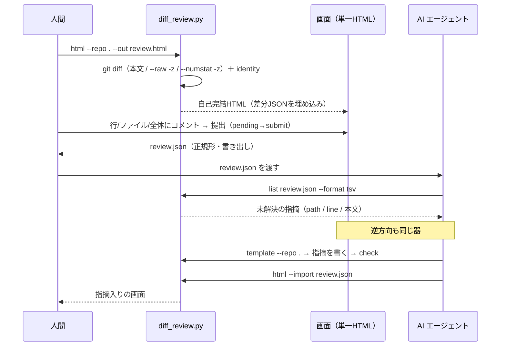

# レビューガイド: diff-review-html（差分レビュー画面と指摘 JSON の往復）

> 新規ファイル 8 本・約 2,560 行と差分が大きいので用意した（`aidev-60-review`「レビュー補助」条件1）。
> **既存ファイルの変更は `.aidev/` と `.gitignore` だけ**で、既存の skill には触れていない。

## 変更概要 / 目的

ローカルの `git` 差分を **GitHub PR 画面のように読める単一 HTML** にし、レビューの指摘を
**JSON で人間と AI のあいだで往復**させる skill を追加した。

- 人間 → AI: 画面で書いた指摘を JSON に書き出す → AI が `list` で読んで直す。
- AI → 人間: AI が `template` の雛形に指摘を書く → `html --import` で埋め込んだ画面を人間が開く。

達成したい状態（`requirements.md`「目的 / ゴール」）は「差分が読める画面がある」ことと
「指摘が構造を持って往復する」ことの 2 つで、**追加の実行環境を増やさない**ことが制約。

## 重要ポイント（非自明な判断）

判断の全文は `decisions.md`。レビューで見てほしいのは次の 5 点。

1. **言語は Python3 標準ライブラリ 1 実装**（D9 / D12）。当初は POSIX sh を予定していたが、
   sh にすると **Windows 用に PowerShell 版が必然**になり、この repo の `aidev` CLI が背負っている
   「2 実装のパリティ ＋ 両処理系を揃えた CI」が恒久コストになる。1 実装で 3 OS を賄う方を採った。
2. **決定論は「作らない」ことで守る**（D4 / D13）。生成物に時刻・乱数を入れず、
   出力は **UTF-8・LF 固定**（Windows の text mode 既定に任せない）。同じ入力なら `cmp` でバイト一致する。
3. **`file://` の制約に合わせた設計**（`research.md` F1〜F6 の実測）。
   ページから隣のファイルは読めないので **`fetch` を使わない**（読み込みはファイル選択・D&D・生成時埋め込みのみ）。
   `file://` は全ページで localStorage を共有するので、**保存キーに差分の digest を含める**。
4. **XSS を 2 重に塞ぐ**。描画は `textContent` のみ（`innerHTML` 不使用）、埋め込む JSON は
   `<` を `<` に退避（素で埋めると本文中の `</script>` でブロックが切れることを実測）。
5. **JSON の語彙は GitHub REST に寄せた**（D6）。将来 PR への書き戻しを足すときに変換層が要らない。
   ただし**互換の保証はしない**（書き戻しは今回スコープ外）。

## 処理フロー

## 主要な変更箇所

| 場所 | 見どころ |
|---|---|
| `docs/ClaudeCode/skills/other/diff-review-html/diff_review.py:45-75` | 出力の規約（正規形 JSON・`<` の退避・LF/UTF-8 固定）。**書き出し口をここ 1 箇所に閉じ込めている** |
| 同 `:120-210` | `--raw -z` / `--numstat -z` の読み取り。**パスは raw 側を正典にする**（本文の `diff --git` 行は空白入りパスで曖昧） |
| 同 `:212-265` | ハンクの構造化。`---` / `+++` を行分類に混ぜない、`\ No newline` は直前行の属性、行末 CR は削らない |
| 同 `:330-430` | `validate()`。値域・参照整合・ID 重複まで見て、**壊れた記録を黙って通さない**（exit 3） |
| `templates/app.js:96-130` | 画面側の正規形書き出し。**Python の `dumps_canonical` とバイト一致する**（AC7 の土台） |
| `templates/app.js:215-300` | 画面側の検証。**CLI と対にしてある**——片方だけ緩いと CLI が落とす記録を画面が受け入れる（cross 点検で実測した欠陥） |
| `templates/app.js:640-700` | キーボード処理。**Enter は行にフォーカスがあるときだけ**扱う（review ラウンド1 の must） |
| `schema.md` | レビュー記録 JSON の正典。**AI が書く前に読む先** |

## リスク / 確認したい点

- **未検証の環境**: Firefox / Safari と Windows は実機で確かめていない（`test-result.md`「未検証の穴」）。
  Firefox の `file://` は localStorage を塞ぐはずで、その場合は画面に明示して機能を落とす実装に
  してあるが、**その経路自体は実機未確認**。
- **`list` の TSV は本文の改行をスペースに潰す**（1 行 1 件を保つため）。長い指摘は画面か JSON を見る前提。
- **CI に載せていない**。`.github/workflows/aidev-cli.yml` は `docs/ClaudeCode/skills/aidev/**` 限定なので、
  この skill のテスト（`python3 -m unittest`）は手元実行のみ。ジョブ追加を別 work にするか、
  この PR で足すかは判断を仰ぎたい。
- **複数行コメント**（`start_line` / `start_side`）はスキーマに場所だけ用意して `null` 固定。
