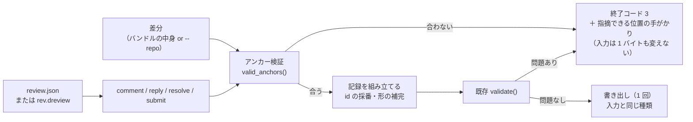

# 設計: 指摘を「書く」側の script

> 前提は research.md の実測。**アンカーの規則は画面 `anchorOf` と 307/307 で一致**することを
> 確認済み（F3）。この設計はその規則を生成側に 1 か所だけ置き、書く側と検証側の両方から呼ぶ。

## 全体像



**要は「検証 → 組み立て → もう一度検証 → 1 回だけ書く」**。
途中で落ちたら何も書かない（要件 AC15）。

## 1. アンカーの規則（research F3）——1 か所だけに置く

```python
def anchor_of(line):
    """1 行がどの位置を持つか。画面 app.js の anchorOf と**同じ規則**。"""
    if line["kind"] == "del":
        return ("LEFT", line["old"]) if line["old"] is not None else None
    if line["new"] is not None:
        return ("RIGHT", line["new"])
    if line["old"] is not None:
        return ("LEFT", line["old"])      # 旧側しか番号が無い文脈行（削除ファイルの展開）
    return None


def valid_anchors(entry):
    """そのファイルで指摘できる (side, line) の集合。ハンクの行 ＋ 展開して出せる行。"""
```

- **この 2 つだけが規則**。`check` も `comment` もここを呼ぶ。
  書く側に別の判定を持たせない（research R1）。
- 画面側（`app.js:anchorOf`）と**文言まで対応づけたコメント**を互いに書く。
  ずれたら 307/307 の一致が崩れるので、test 工程でそれを検査する。

### `side` の既定（research F4）

```
--side を省いたとき:
    RIGHT が有効なら RIGHT
    そうでなく LEFT が有効なら LEFT
    どちらも無効なら落とす
```

**両側が有効なときも RIGHT**（置き換えた行では両側が有効になる。実測で 10/297）。
これは推測ではなく**規約**——GitHub の REST も `side` の既定は `RIGHT`。文書に明記する。

## 2. サブコマンド

| コマンド | すること |
|---|---|
| `comment` | 指摘（既定）/ 説明（`--note`）/ 返信（`--reply-to`）を 1 件足す |
| `resolve` | スレッドを解決 / 未解決にする |
| `submit` | 判定とサマリを足し、**未提出のコメントを紐づける** |

### `comment`

```sh
diff_review.py comment <review.json | rev.dreview>
    [--path P] [--line N] [--side LEFT|RIGHT]      # 省くと: line 無し=ファイル / path 無し=全体
    --body "…" | --body-file F | --body-file -     # 本文（3 通り。長い本文を引数に押し込まない）
    [--severity must|should|nit]                   # 指摘のときだけ
    [--note]                                       # 説明（kind: note）。severity と併用不可
    [--reply-to <thread>[:<comment>]]              # 返信。既定は最後のコメントへ
    [--author ai]                                  # 既定 ai
    [--repo .] [--from …] [--rev …]                # 記録 JSON のときのアンカー検証用
    [--batch F | --batch -]                        # まとめて足す（下記）
    [--out F | --out -]                            # 既定は入力を上書き
```

- `--reply-to t3` … そのスレッドの**最後のコメント**への返信（返信への返信が自然に書ける）。
  `--reply-to t3:c1` … そのコメントへの返信。
- `--note` と `--severity` の併用は**落とす**（記録の規則で両立しないため）。
- `--reply-to` と `--path` の併用も**落とす**（位置はスレッドが既に持っている）。

### `resolve` / `submit`

```sh
diff_review.py resolve <入力> --thread t3 [--undo] [--out …]
diff_review.py submit  <入力> --state APPROVED|CHANGES_REQUESTED|COMMENTED
                              [--body "…" | --body-file F] [--author ai] [--out …]
```

`submit` は `reviews` に 1 件足し、**`review_id` が `null` の指摘コメント**に
その `id` を入れる（説明コメントは対象外＝記録の規則どおり）。

## 3. まとめて足す（AC10）

`--batch` は **JSON の配列**を受ける。1 件ぶんのキーは、`comment` の引数名から
**先頭の `--` を取って `-` を `_` にしたもの**（機械的に対応させ、覚えることを増やさない）。

| 引数 | バッチのキー |
|---|---|
| `--path` / `--line` / `--side` | `path` / `line` / `side` |
| `--body` | `body` |
| `--severity` | `severity` |
| `--note` | `note`（真偽値） |
| `--reply-to` | `reply_to` |
| `--author` | `author` |

```json
[
  {"path": "src/a.py", "line": 12, "severity": "must", "body": "空文字で落ちます"},
  {"path": "src/a.py", "line": 8, "side": "LEFT", "body": "消したのは意図的ですか"},
  {"path": "src/a.py", "line": 30, "note": true, "body": "ここは意図的に残しています"},
  {"reply_to": "t1", "body": "直しました"}
]
```

知らないキーは**落とす**（黙って無視すると、綴り違いが握り潰される）。

- **全件を先に検証する。1 件でも駄目なら 1 件も書かない**（research R2 / R5）。
- 失敗の報告は**何件目が何故か**を全部出す（1 件目で止めない。AI が 1 往復で直せる）。
- 行区切りの形（JSONL）は採らない——**本文に改行が入る**ので相性が悪い。

## 4. 入出力（AC11・AC16）

| 入力 | 出力（既定） |
|---|---|
| `review.json`（記録） | 同じファイルを上書き（記録として） |
| `rev.dreview`（バンドル） | 同じファイルを上書き（**バンドルとして**。中の `review` だけ入れ替わる） |

- 種類は**中身で判別**（既存 `looks_like_bundle`）。拡張子に頼らない。
- `--out F` で別ファイル、`--out -` で標準出力。
- **バンドルを渡せばアンカー検証に git が要らない**（research F6）。記録 JSON なら `--repo` が要る。

## 5. 失敗の出し方（AC6・AC7）

```
$ diff_review.py comment r.dreview --path src/core/util.py --line 999 --body "…"
NG: src/core/util.py:999 (RIGHT) はこの差分に存在しません
    このファイルで指摘できる位置: RIGHT 1-40 / LEFT 10-12, 21
    （ヒント: バンドルの中の差分に対して検証しています）
```

> ヒントで `list` を案内しない。`list` は**既に書かれた指摘**を並べるもので、
> **これから指摘できる位置**は出さない。使えないものを案内すると、
> 受け取った側がそこで 1 往復を無駄にする。
> 「指摘できる位置」を見せるのは**この失敗メッセージ自身**の仕事にする。

- **範囲にまとめて出す**。40 行のファイルで 40 個並べても読めない。
- ファイルそのものが差分に無いときは、**差分にあるファイル名**を出す（打ち間違いが多いため）。
- 終了コードは **3**（記録が不正）。`--batch` なら全件ぶんまとめて出す。

## 6. 既存との関係

| 既存 | 触るか | どうするか |
|---|---|---|
| `validate()` | **触らない** | 書いたあとに必ず通す。書く側に規則を複製しない |
| `check` | **拡張する** | `--anchors` でアンカーも検証する（既定は従来どおり。回帰を避ける） |
| `list` | 触らない | 位置の確認に使える（失敗メッセージから案内） |
| `template` | 触らない | 器を作るのは従来どおり |
| 画面（`app.js`） | **触らない** | この work は script 側だけ |

## AC ごとの実現方法

- AC1: `comment --path --line --severity --body`。`--line` 無しでファイル単位、`--path` 無しで全体。
- AC2: `comment --note`。`kind: "note"` にし、`review_id` と `severity` を `null` に固定する。
- AC3: `comment --reply-to t3[:c1]`。`in_reply_to` に**同じスレッド内の id** を入れる。
- AC4: 記録の中の既存 id を集め、`t<最大+1>` / `c<最大+1>` を採る。
- AC5: 組み立てたあと既存 `validate()` を通し、問題があれば書かずに落ちる。
- AC6: `valid_anchors()` に無ければ終了コード 3。**書き込みの前**に判定する。
- AC7: そのファイルの有効な位置を**範囲にまとめて**出す。ファイルごと無ければファイル名を出す。
- AC8: `submit` が `reviews` に 1 件足し、`review_id: null` の**指摘**コメントに紐づける。
- AC9: `resolve --thread t3 [--undo]`。
- AC10: `--batch` が JSON 配列。**全件検証 → 全件成功なら 1 回書く**。
- AC11: 入力の種類を中身で判別し、**同じ種類で**書き出す。
- AC12: 既存サブコマンドに手を入れない（`check --anchors` は**追加**であって既定の変更ではない）。
- AC13: 正規形で書き出す。id は「既存の最大＋1」なので入力が同じなら同じ。時刻を入れない。
- AC14: `--body` / `--body-file F` / `--body-file -`（標準入力）。
- AC15: 検証をすべて通ってから**1 回だけ**書く。落ちた経路では書き込みに到達しない。
- AC16: `--out F` / `--out -` / 省略（上書き）。

## 既存への影響と回帰

| 既存の性質 | 影響 | 手当て |
|---|---|---|
| `validate()` の規則 | **変わらない** | 書く側が呼ぶだけ |
| 既存サブコマンドの出力 | **変わらない** | 既存 91 件のテストを通したまま |
| 記録の形（`diff-review/2`） | **変わらない** | 新しいキーを足さない |
| 画面 | **変わらない** | 触らない。既存 80＋34 件の画面確認を再実行して確かめる |

## テスト方針

- **生成側（unittest）**: `comment` の 3 形態（指摘 / 説明 / 返信）・id の採番・`--note` と
  `--severity` の併用拒否・アンカーの成功と失敗・**失敗時に入力が変わらないこと**・
  `--batch` の全件成功と 1 件失敗・`resolve` / `submit` の紐づけ・
  記録とバンドルの往復・`--body-file` と標準入力・決定論（2 回実行でバイト一致）。
- **規則の一致（test 工程）**: 生成側 `valid_anchors()` が出す位置と、
  **画面が実際に提供する位置**が一致すること（research F3 と同じ照合を回帰として固定）。
- **回帰**: 既存の生成側 **91 件**と画面 **80＋34 件**を通したままにする。
  この work は既存サブコマンドに手を入れないので、落ちたら「触っていないつもりで触った」ということ。
- **画面（test 工程）**: 触っていないが、**既存 80＋34 件を再実行**して壊していないことを示す。

## 未解決 / design では決めない

- 失敗メッセージの範囲のまとめ方（`1-40` の刻み）は実装時に読みやすさで決める。
- `--batch` で同じ位置に複数件が来たときの扱い（別スレッドにするか 1 本にまとめるか）は実装時に確認。
