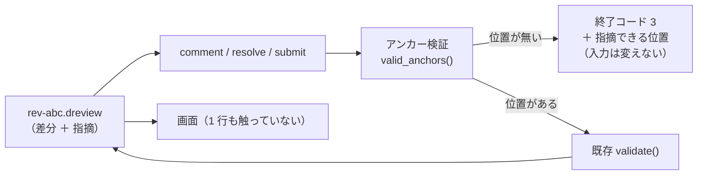

# レビューガイド: 指摘を「書く」側の script

> 既存 2 ファイルの変更（`diff_review.py` ＋ `tests/` ＋ `SKILL.md`）。**画面は 1 行も触っていない。**

## 変更概要 / 目的

この skill は「AI がレビュー → 人が画面で確認」「人が書く → AI が読んで直す」の往復を掲げているが、
**書く側だけが素手**だった。AI は `threads` の JSON を手で組み立て、`id` の一意性・
`in_reply_to` の参照先・`kind: "note"` の制約を自分で管理していた。

そして**いちばん痛い穴**があった——`check` は「その行が差分に実在するか」を見ていない。
`line: 9999` と書いても検証を通り、画面では黙って「位置不明」に落ちる。
**AI が行番号を数え間違えたときに、気づける場所がどこにもなかった。**

## 重要ポイント（非自明な判断）

1. **規則は生成側に 1 か所だけ**（D1）。`anchor_of` / `valid_anchors` を `comment` も
   `check --anchors` も呼ぶ。画面 `app.js:anchorOf` と**位置の集合が一致すること**を
   test 工程で検査している（**307/307**）。ずれると、script は「書ける」と言い、
   画面は入れ物を用意しない——**エラーも警告も出ずに指摘が消える**。
2. **`--side` の既定 RIGHT は規約であって推測ではない**（D2）。
   両側が有効になるのは**その行が置き換えられたとき**（実測 10/297）で、
   そこで落とすと「書き換えた行に指摘できない」という最悪の形になる。GitHub の REST と揃えた。
3. **書く前に全件検証し、1 回だけ書く**（D3）。落ちたら入力は 1 バイトも変わらない。
   失敗は**全件ぶん**まとめて出す——相手は AI なので、**1 往復で全部直せる**ことに意味がある。
4. **バンドルを渡せば git が要らない**。`.dreview` は差分を持っているので、
   リポジトリが手元になくてもアンカーを検証できる（research F6 で git と 307/307 一致を実測）。

## 主要な変更箇所

| 場所 | 見どころ |
|---|---|
| `diff_review.py:anchor_of` / `valid_anchors` | **位置の規則。画面 `anchorOf` と対**。互いを指すコメントを書いてある |
| `diff_review.py:resolve_side` | 省略時の解決。両側あるときは RIGHT（規約） |
| `diff_review.py:path_problem` / `anchor_problem` | 失敗の手がかり。範囲に畳む・ファイル名を出す・反対側を示唆 |
| `diff_review.py:format_ranges` | `1-40, 55, 60-62`。40 個並べても読めない |
| `diff_review.py:Record` | 入力が記録かバンドルかを覚えていて、**同じ種類で書き戻す** |
| `diff_review.py:spec_problems` / `apply_spec` | **検証と適用を分ける**。全件検証してから全件適用 |
| `diff_review.py:cmd_comment` | `--batch` も 1 件も同じ経路。**1 件でも駄目なら 1 件も書かない** |
| `diff_review.py:cmd_submit` | 未提出の**指摘**だけを紐づける（説明は対象外） |
| `tests/test_diff_review.py` | 35 件追加。変異 3 種で落ちることを確認済み |

## リスク / 確認したい点

- **`--batch` の中で、同じ実行の中で作ったスレッドには返信できない**（D3 の帰結）。
  理由は出るが、「1 回で指摘と返信をまとめて入れたい」使い方はできない。
- **大きな `--batch`（数百件）は試していない**。全件を先に検証するので、
  失敗時のメッセージが長くなりすぎる可能性がある。
- **記録 JSON 経由の検証は差分を取り直す**ので、記録を書いた時点と差分が変わっていれば位置がずれる。
  `identity_mismatch` の警告は出るが、その先の扱いは呼ぶ側に委ねている。
- **画面から書いた記録を script で読んでさらに足す往復は 1 往復しか試していない。**
- 規則が 2 つの言語にある（Python と JS）。**一致はテストで縛っている**が、
  縛りを外したり入力を変えたりすれば抜ける。
