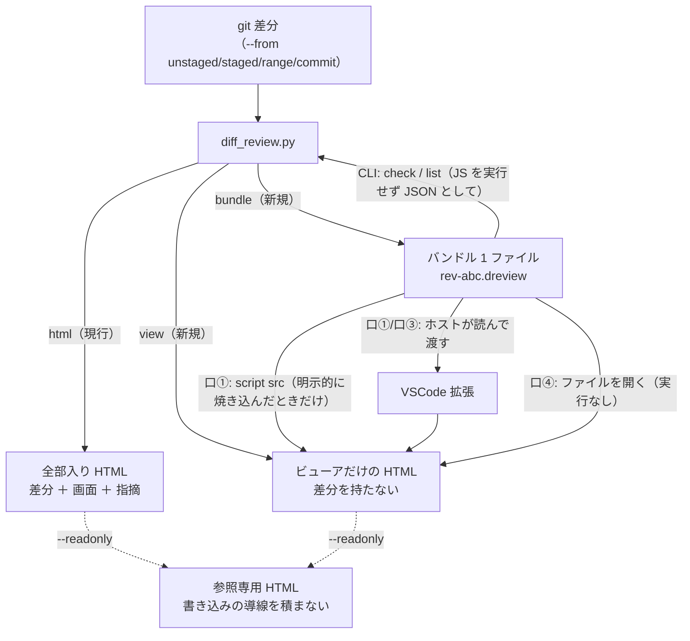

# 設計: 差分ファイル（バンドル）とビューアの分離

> 前提は research.md の実測（F1〜F6）。**既存の出力（全部入り HTML）は 1 バイトも壊さない**。
> 足すのは「別の出し方」であって、「別のもの」ではない。

## 全体像



## 1. バンドルの形（F2・AC1・AC2・AC3・AC14）

**1 ファイル。JS としても JSON としても読める。**

```
window.__DIFF_REVIEW_BUNDLE__ = {
  "schema": "diff-review-bundle/1",
  "target": { …差分の識別情報… },
  "files":  [ …差分の本体（いま HTML に埋めているもの）… ],
  "rich_enabled": true,
  "review": { "schema": "diff-review/2", "target": …, "reviews": […], "threads": […] }
};
```

- **前置き `window.__DIFF_REVIEW_BUNDLE__ = ` と後置き `;\n` は固定**。
  剥がせば正規形の JSON になる（Python・Node・ブラウザの 3 者で実測済み）。
- `review` は **`diff-review/2` の記録をそのまま**入れる（`null` 可）。
  こうすると**検証が 1 本で済む**——既存の `validate()` を再利用でき、
  「バンドル用の検証」と「記録用の検証」が食い違う事故（research R4）が起きない。
  `target` が二重に入るが、MB 単位のファイルで数百バイトの重複は問題にならない。
- **`U+2028` / `U+2029` は `
` / `
` へ退避**（JS の行終端文字。JSON の意味は変わらない）。
- 拡張子は **`.dreview`**。

### 生成側の関数

| 関数 | 役割 |
|---|---|
| `bundle_text(target, files, rich_enabled, review)` | 上の形の**文字列**を作る（前後の固定・退避・正規形） |
| `parse_bundle(text)` | 前後を検査して剥がし、`json.loads`。**合わなければ例外**（実行はしない） |
| `validate_bundle(obj)` | 外側の形 ＋ 内側は既存 `validate()` へ委譲 |

## 2. ビューアの取り込み口（F1・F3・AC4〜AC7）

**4 つ。どれも「検証してから使う」**。

| # | 口 | 誰が使う | 実行 |
|---|---|---|---|
| ① | `window.__DIFF_REVIEW_BUNDLE__` が既に定義済み | `<script src>` を焼き込んだビューア / ホストの注入 | **する** |
| ② | 埋め込みの `#diff-data` / `#review-data` | 現行の `html` 出力 | しない |
| ③ | `postMessage`（形で検査） | VSCode 拡張・親フレーム | しない |
| ④ | ファイル選択 / D&D | 人間 | しない |

起動時は ① → ② の順で見て、どちらも無ければ **④ の案内を出す**（白い画面にしない）。
③ はいつ来てもよい（起動後でも差し替わる）。

```
boot()
  bundle = window.__DIFF_REVIEW_BUNDLE__ ?? embedded()
  if bundle: adoptBundle(bundle)
  else:      showOpenPrompt()        ← 「バンドルを開いてください」＋ ファイル選択 / D&D
  listen("message", …)               ← 形が合えば adoptBundle
```

### `adoptBundle(bundle, source)`

1. **検証**（画面側の `validateBundle`。生成側 `validate_bundle` と対）。
   失敗したら**理由を画面に出して、いまの表示を壊さない**（AC7・F6b）。
2. `diffData` を差し替え、**保存キーを新しい digest で組み直す**（下書きが混ざらない）。
3. `review` があれば `adoptRecord`。無ければ空の記録。
4. 再描画し、**フォーカスを差分の先頭へ移す**（AC-I4）。
5. `source` を画面の meta 行に出す（どこから来たかが分かる）。

### 既存コードへの影響

いま `diffData` はモジュールの先頭で 1 回だけ読んでいる（`var target = diffData.target` など）。
**差し替わり得る**ようになるので、起動時に決まる値は `boot()` で設定する形へ直す。
影響するのは `target` / `storageKey` / `viewModes` / `expandState` / `collapsed` の初期化。

## 3. `<script src>` の扱い——**この work の中心的な判断**（R1・AC15）

`<script src>` で読むということは、**バンドルを実行する**ということ。
危ないのは「自動読み込みがあること」ではなく、**「他人がくれたファイルをビューアが勝手に実行すること」**。

そこで、**焼き込みは生成時の明示的な行為にする**。

| 生成コマンド | できるもの | 実行 |
|---|---|---|
| `view --out viewer.html` | **どのバンドルも自動で読まない**ビューア（④ の案内が出る） | しない |
| `view --out viewer.html --load rev-abc.dreview` | `<script src="rev-abc.dreview">` を**焼き込んだ**ビューア | する |

- **既定は焼き込まない**（AC15）。
- `--load` を使うのは**バンドルを作った本人**であって、そのとき新しい信頼境界は生まれない
  （自分のリポジトリの差分を自分で見るだけ）。
- `--load` を使うと **CLI が警告を出す**（「このファイルは読み込み時に実行されます」）。
- 画面の meta 行にも読み込み元を出す。
- 「ビューアの隣に決まった名前のファイルを置けば読む」形には**しない**——
  それをやると、他人から `.dreview` を受け取って置くだけで実行されてしまう。

## 4. CLI（F7・AC8・AC9・AC12）

### 取得元を 1 つの軸に

```
--from unstaged | staged | range | commit | github-pr      （既定: unstaged）
--rev  <spec>                                              （range / commit のとき）
```

- `--from github-pr` は **受け付けて「未対応」と明示して落ちる**（終了コード 1）。
  黙って別の差分を出さない。将来の置き場を予約する。
- **既存のフラグは残す**（`--unstaged` / `--staged` / `--range A..B` / `--commit C`）。
  `--from` と同時に指定されたら**矛盾を検出して落ちる**（黙ってどちらかを選ばない）。

### サブコマンド

| コマンド | 変更 | 中身 |
|---|---|---|
| `html` | **既存＋`--readonly`** | 全部入り HTML（現行のまま） |
| `bundle` | **新規** | バンドル 1 ファイル。`--import` で記録を同梱 |
| `view` | **新規** | ビューアだけ。`--load` で焼き込み、`--readonly` で参照専用 |
| `template` | 既存 | 記録の雛形 |
| `check` | **既存を拡張** | `.json`（記録）と `.dreview`（バンドル）の**両方**を受ける |
| `list` | **既存を拡張** | 同上（バンドルなら中の `review` を見る） |

`check` / `list` はファイルの**中身**で判別する（拡張子に頼らない——名前を変えられても動く）。

## 5. 参照専用（F6・AC10・AC11・AC-I5）

**二段構え**。「隠す」ではなく「積まない / 作らない」。

### (a) HTML を積まない

`page.html` の書き込み導線を印で囲み、`--readonly` のとき**切り落とす**。

```html
<!-- rw:begin -->
  …レビューを開始 / 提出 / 書き出す / 読み込む のボタン、提出パネル、書き出しパネル…
<!-- rw:end -->
```

切り落としは `render_html` の中で、**プレースホルダ置換より前**に行う
（テンプレートの素の文字列に対して印を探す）。置換はこれまでどおり**その後に 1 回の走査**で行うので、
差分に `<!-- rw:begin -->` という文字列が含まれていても、埋め込み後の中身は再走査されない。

### (b) JS が導線を作らない

`diffData.readonly` が真なら、`app.js` は——

- 行 / ファイル / 全体の `+`（コメントを開く）ボタンを**作らない**
- スレッドの「返信」「解決にする」「取り消し」を**作らない**
- キー `c` / `Enter` / `r` を**受け付けない**（何も起きない。誤爆しない）
- 読む機能（`j`/`k`/`e`/`t`/`f`/`s`/`[`/`]`/`?`・展開・rich・split・ツリー・テーマ・コメント一覧）は**そのまま**

> **正直に書くこと**: `app.js` の**コード自体は残る**ので、容量はほとんど減らない。
> 減るのは `page.html` の該当部分だけ（数百バイト）。
> 参照専用の目的は容量ではなく「**書き換えて再配布されない**」こと。

## 6. VSCode 拡張との契約（F4・R3）

この work は拡張を作らない。**拡張が守ればよいことだけ**を決めて文書に書く。

| 拡張がやること | 根拠 |
|---|---|
| `.dreview` を読み、**前後を剥がして `JSON.parse`**（実行しない） | research F2 |
| `view --readonly` で作ったビューア HTML を webview に流し込む | — |
| バンドルを `postMessage` で渡す（または `window.__DIFF_REVIEW_BUNDLE__ = …` を注入） | research F3 |
| CSP を付けるなら、`<script` を `<script nonce="…"` に**置換する**（1 か所） | research F4 |

> **未検証**: VSCode の webview が CSP 無しで inline script を実行するかは、この環境では確かめられない。
> 契約を「置換 1 か所」に留めてあるので、**どちらに転んでも拡張側の 1 行で済む**。

## AC ごとの実現方法

- AC1: `bundle` サブコマンド。拡張子 `.dreview`、前後固定の 1 ファイル。
- AC2: `parse_bundle` → `target` / `files` / `review` が生成時と同じ。往復でバイト一致を検査する。
- AC3: `check` がバンドルを受け、`validate_bundle`（外側）＋既存 `validate`（内側）で検証する。
- AC4: `view` サブコマンド。`files: []` のビューア。**`rich.js` を常に積む**（research F5）。
- AC5: ホストからの経路は 2 本——`postMessage`（口③・**実行を伴わない**）と
  `window.__DIFF_REVIEW_BUNDLE__` の注入（口①・ホスト自身が書いた文字列を実行する）。
  AC5 が求める「実行を伴わない口」は**口③が満たす**。口①はホストの都合で選べる別経路。
- AC6: `<input type="file">` と D&D（既存の JSON 読み込みと同じ経路を、バンドルにも広げる）。
- AC7: `validateBundle` が理由を返し、バナーに出す。**いまの表示は壊さない**。
- AC8: `--from` ＋ `--rev`。既存フラグは別名として残す。
- AC9: `--from github-pr` は終了コード 1 と「未対応」のメッセージ。
- AC10: `<!-- rw:begin/end -->` を切り落とす ＋ `readonly` で導線を作らない。
- AC11: 読む機能は `readonly` の分岐に**入れない**。回帰として実測する。
- AC12: 既存のサブコマンドとフラグはそのまま（`--from` は**追加**であって置き換えではない）。
  既存 60 件のテストを通す。**「バイト単位で不変」は約束しない**——テンプレートに口が増えるため。
  約束するのは「同じ差分から同じ画面が出て、同じ操作ができる」こと。
- AC13: バンドルもビューアも正規形・時刻なし。2 回生成でバイト一致。外部リクエスト 0。
- AC14: Python と Node の**両方**で、実行せずに読めることを検査する（research F2 の形を固定する）。
- AC15: `--load` は既定で無効。使うと CLI が警告を出し、画面にも読み込み元が出る。
- AC-I1: 「ファイルを開く」は `<label for>` ＋ `<input type=file>`（`Tab` で届く）。状態はバナーに出す。
- AC-I2: 保存キーを**新しい digest で組み直す**ので、下書きはバンドルごとに分かれる。
- AC-I3: ビューアを開く → `Tab` で「開く」→ 選ぶ → `j`/`k` で読む、がマウス無しで通る。
- AC-I4: 読み込み後、差分の先頭行へ `focus()`（前 work の落とし穴の再発防止）。
- AC-I5: `readonly` では `c`/`Enter`/`r` が**何もしない**。他のキーは同じに働く。

## 既存への影響と回帰

| 既存の性質 | 影響 | 手当て |
|---|---|---|
| `html` の出力 | **バイト単位では変わる**——テンプレートに「ファイルを開く」「差分が無いときの案内」「`<script src>` の口」が入るため。**意味は変わらない**（同じ差分・同じ指摘・同じ操作） | 既存 60 件のテストを通したままにする。変わった箇所は `SKILL.md` に書く |
| `diffData` がモジュール先頭で確定 | **差し替わり得る**ようになる | `boot()` で設定する形へ直す。初期化の順序をテストで固定 |
| 下書きの保存キー | バンドル切り替えで変わる | それが正しい（AC-I2）。文書に書く |
| rich の条件付き同梱 | `view` では**常に積む** | 理由を SKILL.md に書く |
| `check` / `list` の入力 | バンドルも受ける | 中身で判別。既存の `.json` は従来どおり |

## テスト方針

- **生成側（unittest）**: バンドルの往復（Python）・**Node で実行せずに読める**（`subprocess` で `node`）・
  `check` / `list` がバンドルを受ける・`--from` の全値と矛盾検出・`github-pr` の終了コード・
  `--readonly` で導線が HTML に無い・`view` の中身・決定論。
- **画面（test 工程・headless Chromium・`file://`）**: 4 つの取り込み口・壊れたバンドルの扱い・
  読み込み後のフォーカス・下書きの分離・参照専用で読む機能が動き書く機能が無いこと・
  既存 75 件の回帰。
- **Node が無い環境**: `node` が見つからなければ**そのテストだけ skip**（環境依存で全体を落とさない）。

## 未解決 / design では決めない

- 参照専用で「解決済み」の見た目をどう出すか（ボタンは無いが状態は見せたい）→ 実装時に確認。
- バンドルの拡張子が VSCode の `languages.contributes` とぶつからないか → 拡張を作るときの話。
