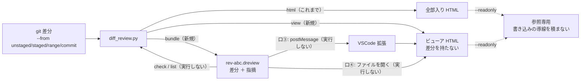

# レビューガイド: バンドルとビューアの分離

> 新規 0 ファイル・既存 7 ファイルの変更（`diff_review.py` ＋ `templates/` ＋ 文書 ＋ テスト）。
> **VSCode 拡張の土台**が目的で、拡張そのものはこの work では作らない。

## 変更概要 / 目的

これまでは「差分 ＋ 画面 ＋ 指摘」を 1 枚の HTML に焼き固めるだけだった。
そこに **「中身（バンドル）」と「画面（ビューア）」を分ける**出し方を足した。

## 重要ポイント（非自明な判断）

1. **`file://` で隣のファイルを読める手段は `<script src>` だけ**（`research.md` F1 で実測。
   `fetch`・XHR・モジュール import はすべて CORS で落ちる）。だから**バンドルは JS でなければならない**。
   一方、拡張（Node）と `check`/`list`（Python）は**実行せずに読めなければならない**。
   前後を固定することで両立させた——**Python・Node・ブラウザの 3 者で実測済み**（`research.md` F2）。
2. **取り込み口は「手動」と「埋め込み」の 2 系統だけ**（D9・D10）。
   外部ファイルを読む口（`<script src>`）も、外から押し込む口（`postMessage`・グローバル変数）も
   持たない。決め手は危険ではなく**決定性**——前者は「どのバンドルを読むのか」がファイル名任せになり、
   後者は「同じ HTML を開いても外からの操作で表示が変わりうる」。
   結果として **「その HTML の中身」と「人が選んだファイル」だけで表示が決まる**。
   ホストは `view` の出力にある**空の `#bundle-data`** に書き込んで渡す
   （VSCode の webview の標準的な作り方そのもの）。
3. **バンドルは記録を内側にそのまま持つ**（D2）。`target` が二重になるが、
   **検証を 1 本に保てる**（`validate_bundle` は既存 `validate()` へ委譲）。
   形式が 2 つに分かれて片方だけ直す事故を防ぐほうが大事。
4. **参照専用は「隠す」ではなく「積まない」**（D4）。`hidden` を外せば戻る形にはしない。
   ただし **容量はほとんど減らない**（実測 −2,256 B ＝ 0.1%）——目的は容量ではなく
   「書き換えて再配布されない」こと。SKILL.md にそう書いた。
5. **`--from github-pr` は「ある。まだ動かない」**（D6）。黙って未コミットの差分を出すのが最悪で、
   選択肢に無いと将来対応するのかどうかが伝わらない。

## 主要な変更箇所

| 場所 | 見どころ |
|---|---|
| `diff_review.py:bundle_text` / `parse_bundle` | 前後固定。`js_safe` が `U+2028`/`U+2029` を退避（**JS の行終端文字**） |
| `diff_review.py:validate_bundle` | 外側だけ見て、内側は既存 `validate()` へ**委譲** |
| `diff_review.py:read_record` | `check`/`list` が**中身で判別**（拡張子を変えられても動く） |
| `diff_review.py:normalize_source` | `--from` と従来フラグを 1 つに。**併用は落とす**（黙って優先しない） |
| `diff_review.py:strip_write_ui` | 参照専用は中身ごと、通常は印だけ落とす。**置換より前に**走る |
| `diff_review.py:cmd_view` | `--load` を焼き込んだら **CLI が警告を出す**。rich は常に積む |
| `templates/app.js:initialSource` / `boot` | 取り込み口の優先順。埋め込み JSON は**1 回だけ** parse |
| `templates/app.js:adoptBundle` | **必ず検証 → 差し替え → 再描画 → フォーカス**。失敗しても今の表示を壊さない |
| `templates/app.js:applyDiffData` | 画面の中だけの状態（展開・折りたたみ・ツリー）を**全部作り直す** |
| `templates/app.js:parseBundleText` | 画面側も**実行しない**（前後を剥がして `JSON.parse`） |
| `templates/app.js` の `readonly` 分岐 | `+` ボタン・返信・解決・`c`/`Enter`/`r` を**作らない・受け付けない** |
| `templates/page.html` | `<!-- rw:begin/end -->`・`__BUNDLE_SRC__`・`#open-prompt`・「ファイルを開く」ボタン |

## リスク / 確認したい点

- **VSCode は実機未検証**（この環境に VSCode が無い）。webview の CSP で inline script が
  nonce 無しに走るかは確かめていない。契約は「`<script` への nonce 挿入 1 か所」に留めてあるので
  どちらに転んでも拡張側の 1 行で済むが、**実機で確かめること**。
- **`<script src>` が Firefox / Safari の `file://` で動くかは未検証**（Chromium でのみ実測）。
  動かなくても「ファイルを開く」は使えるので全損にはならない。
- **`html` の出力はバイト単位では変わった**（テンプレートに口が増えたため）。
  意味は変わらず、既存 60 件のテストは通ったまま。以前の出力と `cmp` する運用があれば壊れる。
- **拡張子 `.dreview`** が既存のツールとぶつからないかは調べていない。
- 大きなバンドル（10MB 超）の読み込み時間は測っていない。
- **CI に載っていない**（前 work から継続）。
