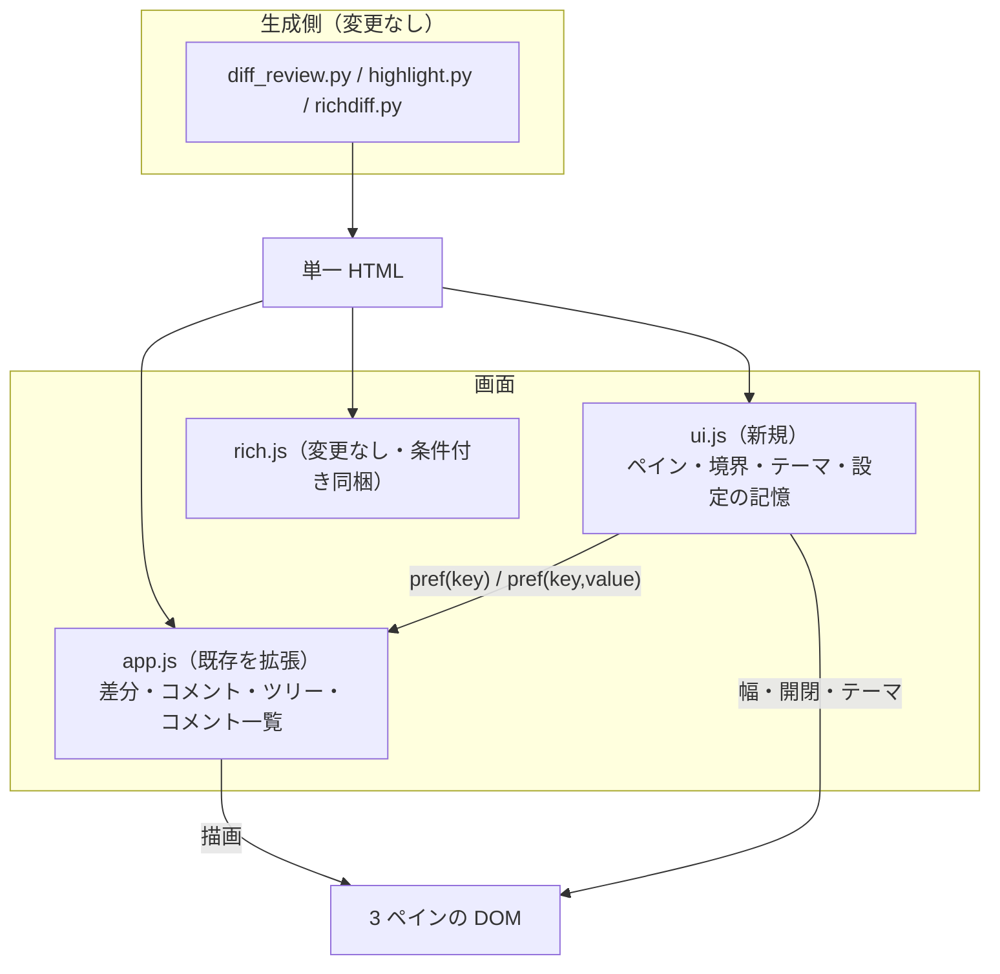

# 設計: 3 ペイン・split・ツリー・テーマ

> 前提は research.md の実測（F1〜F10）。**生成側（Python）は一切触らない**——
> 足すのは画面（CSS / JS / HTML の骨格）だけ。要件のスコープ「生成側の出力形式は変えない」と対。

## 全体像



**分け方の理由**（research R6）: ペイン・境界・テーマは**レビューの状態を一切知らない**
（DOM と `localStorage` だけで完結する）。だから別ファイルに切り出せる。
ツリー・split・コメント一覧は差分とスレッドの状態を使うので app.js に残す。

## ファイル構成

| ファイル | 変更 | 中身 |
|---|---|---|
| `templates/page.html` | 変更 | `<main>` を 3 ペインの骨格に。左/右ペイン・境界・切り替えボタンを追加。<br>`<head>` にテーマ復元の極小スクリプト（§1） |
| `templates/style.css` | 変更 | テーマ変数の二層化、3 ペインの Grid、split の行、ツリー、コメント一覧 |
| `templates/ui.js` | **新規** | ペインの開閉・幅（ドラッグ / キー）・テーマ・設定の記憶。`window.DiffReviewUI` |
| `templates/app.js` | 変更 | split 描画・ツリー描画・コメント一覧・移動時のフォーカス |
| `diff_review.py` | 変更（最小） | `__UI_JS__` の差し込み口を 1 つ増やすだけ |
| `SKILL.md` / `schema.md` | 変更 | 画面の操作とキーの追記（`schema.md` は「画面設定は JSON に入らない」の明記のみ） |

## 画面の骨格（page.html）

```html
<div class="shell" id="shell" data-left="open" data-right="open">
  <nav class="pane pane-left" id="pane-left" aria-label="変更ファイル">
    <div class="pane-head">変更ファイル <button id="btn-tree" aria-pressed="false">ツリー</button></div>
    <div id="filelist"></div>
  </nav>
  <div class="sep" id="sep-left" role="separator" tabindex="0"
       aria-orientation="vertical" aria-controls="pane-left"
       aria-valuenow="260" aria-valuemin="0" aria-valuemax="600" aria-label="ファイル一覧の幅"></div>

  <main class="pane pane-center" id="pane-center">
    <!-- 「全体へのコメント」は**書く**ための場所なので中央に置く。
         右ペインは書かれたものを**読んで辿る**ための一覧で、役割が違う。 -->
    <section id="overall">…全体へのコメント（既存）…</section>
    <section id="files"></section>
  </main>

  <div class="sep" id="sep-right" role="separator" tabindex="0" …aria-controls="pane-right"…></div>

  <aside class="pane pane-right" id="pane-right" aria-label="コメント一覧">
    …絞り込み… <div id="commentlist"></div>
  </aside>
</div>
```

ボタンの置き場所は「**何を操作するものか**」で決める——
画面全体に効くものはトップバー、そのペインの中身にしか効かないものはペインの中。

| id | 置き場所 | 役割 | 状態の出し方 |
|---|---|---|---|
| `btn-split` | トップバー | unified ↔ split | `aria-pressed`（split のとき `true`）・文言も変わる |
| `btn-theme` | トップバー | ライト → ダーク → OS に従う（巡回） | 文言 ＋ `aria-label`（押しボタンで 3 状態なので `aria-pressed` は使わない） |
| `btn-pane-left` / `btn-pane-right` | トップバー | ペインの開閉 | `aria-expanded` ＋ `aria-controls` |
| `btn-tree` | **左ペインの見出し** | フラット ↔ ツリー | `aria-pressed` |

`btn-tree` だけがペインの中にあるのは、**ファイル一覧の形だけを変える**ボタンだから。
左ペインを畳むと届かなくなるが、そのとき一覧自体が見えていないので困らない。

> `aria-pressed` は 2 状態のもの限定。テーマは 3 状態なので**文言で現在値を示す**
> （「テーマ: ダーク」など）。要件 AC-I1 の「状態が属性で分かる」は
> `aria-pressed`（2 状態）と `aria-expanded`（開閉）で満たす。

## 1. テーマ（F4・AC6・AC7）

**値は 1 か所、割り当ては 2 か所**という形にする。既存の `:root` を「明の値の隣に暗の値を置く」形へ広げ、
暗への割り当てだけを 2 つのセレクタに書く。

```css
:root {
  color-scheme: light;
  --bg: #ffffff;   --d-bg: #0d1117;
  --fg: #1f2328;   --d-fg: #e6edf3;
  …（以下同じ形で全色）…
}

/* OS がダーク。ただし「明るくする」と選ばれていたら降りる */
@media (prefers-color-scheme: dark) {
  :root:not([data-theme="light"]) { color-scheme: dark; --bg: var(--d-bg); --fg: var(--d-fg); … }
}
/* OS が明るくても暗くする */
:root[data-theme="dark"] { color-scheme: dark; --bg: var(--d-bg); --fg: var(--d-fg); … }
```

- `data-theme` **無し** = OS に従う / `light` = 明 / `dark` = 暗。research F4 で 4 通り実測済み。
- `color-scheme` を添えるのは、**入力欄とスクロールバーの色**を OS 任せにしないため。
- **二重に書いた割り当てがずれる**のが唯一の危険。→ **テストで機械的に潰す**:
  `style.css` を読み、2 つの割り当てブロックの宣言列が**文字列として一致**することを検査する（T12）。
- **`light-dark()` は使わない**（decisions D3）。

テーマは `<html>` の属性なので、**app.js の起動前に決まっていないと一瞬明るく光る**。
`page.html` の `<head>` に**極小の同期スクリプト**を置き、保存値があれば属性を付ける
（`try/catch` で囲む。`localStorage` が使えない環境でも落ちない）。

## 2. 3 ペイン（F2・F3・AC11〜AC14）

```css
.shell { display: grid; grid-template-columns: var(--left, 260px) 6px 1fr 6px var(--right, 320px); }
.shell[data-left="collapsed"]  { grid-template-columns: 0 6px 1fr 6px var(--right, 320px); }
.shell[data-right="collapsed"] { grid-template-columns: var(--left, 260px) 6px 1fr 6px 0; }
.shell[data-left="collapsed"][data-right="collapsed"] { grid-template-columns: 0 6px 1fr 6px 0; }
@media (max-width: 900px) { .shell, .shell[data-left="collapsed"], … { grid-template-columns: 1fr; } .sep { display: none; } }
```

**畳む指定を `--left: 0` と書いてはいけない**（research F3・実測で「黙って効かない」）。
幅はインラインの custom property に入るので、**属性側は `grid-template-columns` そのものを宣言する**。

高さ: `.shell { height: calc(100vh - トップバー) }`、各ペインは `overflow: auto`。
中央ペインが独立したスクロール領域になるので:

- `.topbar` の `position: sticky` は**そのまま**（ペインの外側なので影響なし）。
- `.file-head` の sticky は**中央ペインを基準に**動く（今も `.file` の中なので変わらない）。
- 「該当箇所へ飛ぶ」は `scrollIntoView` がペインだけを動かす（research F6 で実測）。

### 境界（separator）

`ui.js` が担当。research F1 の規範どおり:

| 操作 | 動き |
|---|---|
| ドラッグ | `pointerdown` → `setPointerCapture` → `pointermove` で幅を更新 → `pointerup` で確定 |
| `←` `→` | 10px 単位。`Shift` 併用で 50px |
| `Home` / `End` | 最小（0）／最大（600px） |
| `Enter` / `Space` | 畳む ↔ 戻す |

幅は `[0, 600]` に丸め、`aria-valuenow` を追従させ、**離した時点で保存**する
（ドラッグ中に毎回書くと `localStorage` への書き込みが多すぎる）。

## 3. 設定の記憶（F5・AC7・AC13・AC15）

`ui.js` が持つ小さな保存庫。**下書きと違って差分ごとではない**（research F5）。

```
キー: "diff-review-html/ui/v1/<name>"
name: theme | split | filetree | pane-left | pane-right | left-width | right-width
      | cl-unresolved | cl-severity | cl-notes      （コメント一覧の絞り込み）
```

- `window.DiffReviewUI.pref(name)` / `pref(name, value)`。読めない・書けない環境では
  **既定値を返し、書き込みは黙って捨てる**（既存の `storageOk` と同じ姿勢。バナーは出さない——
  下書きが消えるのと違い、画面の形が既定に戻るだけなので害が小さい）。
- **レビュー記録の JSON には一切入らない**（AC15）。`canonicalRecord()` には触らない。
  テストで「書き出した JSON にこれらのキーが出ない」ことを検査する。

## 4. split 表示（F8・AC1〜AC3）

### 行の対応づけ

research F8 の規則をそのまま `pairLines(lines)` として実装する（88 ハンク・4,036 行で実測済み）。

```
del を溜める / add を溜める / ctx か終端で吐き出す
吐き出し: max(dels, adds) 行ぶん dels[k] と adds[k] を左右に並べ、足りない側は null
ctx: 左右とも同じ行
```

### 行の DOM

1 つの `.row` に左右 2 セル。**キーボードの現在行は 1 行に 1 つ**でないと `j` / `k` が壊れるので
（research R3）、`data-key` は**右（新側）を優先**し、右が無ければ左を使う。

```html
<div class="row split" data-key="line:path:RIGHT:120" data-kind-left="del" data-kind-right="add" tabindex="-1">
  <div class="cell cell-left">  … gutter / mark / code / コメントボタン … </div>
  <div class="cell cell-right"> … 同上 … </div>
  <div class="slots" data-side="LEFT">  <div class="threads" data-threads="line:path:LEFT:118"></div>
                                        <div class="composer-slot" data-composer="line:path:LEFT:118"></div></div>
  <div class="slots" data-side="RIGHT"> … 同上（RIGHT） … </div>
</div>
```

- `.slots` は**両列にまたがる**（`grid-column: 1 / -1`）。入力欄が半分の幅になると書きにくいため。
- 左右どちらの側か分かるよう、split のときだけ `.slots` に「変更前 / 変更後」の小見出しを添える。
- **`slotFor()` は変更不要**——鍵で `[data-threads="…"]` を引くだけなので、片側ずつ入れ物があれば当たる。
- unified の `.row` は**今のまま**（`data-key` ひとつ、`.threads` ひとつ）。split は別の描画関数。

### 切り替え

- `splitMode()` は**画面全体で 1 つ**（ファイルごとではない）。`rich ↔ source` とは独立（F3）。
- 切り替えたら開いているファイルを描き直し、`renderThreads()` を呼ぶ。
  **現在行とフォーカスを指し直す**（既存 `redrawFile` / `expandAll` と同じ手当て。前 work で実測した落とし穴）。
- 展開した文脈行は、**両側に同じ本文**を出す。展開データは片側しか持たないので
  （前 work D3）、**知らない側の行番号は空**にする。これは SKILL.md に限界として書く。

## 5. ファイル一覧のツリー（F9・AC4・AC5）

パスを `/` で割って木にする。**ディレクトリが 1 つしか子を持たない連なりは畳んで 1 行にする**
（`docs/ClaudeCode/skills/other` が 4 段になるのを避ける）。

```html
<div id="filelist" role="tree" aria-label="変更ファイル">
  <div role="treeitem" aria-expanded="true" tabindex="0" class="tree-dir">docs/…/diff-review-html</div>
  <div role="group">
    <div role="treeitem" tabindex="-1" class="tree-file">diff_review.py <span>+12 -3</span></div>
  </div>
</div>
```

- フォーカスは**ローミング**（木の中で `tabindex="0"` は 1 つだけ）。
- `↑` `↓` は**見えている項目**を深さ優先で辿る。`→` は閉じていれば開き、開いていれば最初の子へ。
  `←` は開いていれば閉じ、閉じていれば親へ。`Home` / `End` は先頭 / 末尾。
- `Enter` / `Space` は、ディレクトリなら開閉、ファイルなら**移動**。
- フラット表示は**今の `<a>` の一覧を残す**（既存の見た目を壊さない）。
- 移動は**必ず `focus()` を伴う**（research F7 の落とし穴）。移動先（`section.file`）に
  `tabindex="-1"` を付け、`scrollIntoView` ＋ `focus()`。フラット側の `<a>` も同じ扱いにする。

## 6. コメント一覧（AC8〜AC10）

右ペイン。`renderThreads()` の最後に `renderCommentList()` を呼ぶ（**状態の出所を 1 つにする**）。

| 出すもの | 内容 |
|---|---|
| 位置 | `locationLabel(thread)`（既存関数を再利用） |
| 重大度 | 先頭コメントの `severity` をバッジで（`.sev-must` などの既存クラス） |
| 状態 | 未解決 / 解決済 / 説明（`kind === "note"`） |
| 本文 | 先頭コメントの冒頭（`textContent` で 80 字まで） |

絞り込み（AC9）:

- 「未解決のみ」（チェックボックス）
- 「重大度」（`<select>`: すべて / must / should / nit / 未設定）
- 「説明を含める」（チェックボックス・既定は含める）

選択は `pref()` に保存。件数は「表示 n 件 / 全 m 件」を `aria-live="polite"` で出す。

移動（AC10・AC-I4）: 項目は `<button>`。押すと——

1. 対象のスレッドが**折りたたみ中のファイル**にあれば先に開く。
2. スレッドの DOM（`renderThread` が返す要素に `tabindex="-1"` と `data-thread-id` を付ける）へ
   `scrollIntoView({block:"center"})` ＋ `focus()`。
3. 行に紐づくスレッドなら、その行を**現在行にする**（`setCurrentRow`）。`j` / `k` が続けられる。

## 7. キー割り当て（AC-I1・AC-I3・AC-I5）

**足すのは 3 つだけ**。テーマ・ツリー・絞り込みはボタンなので `Tab` で届く（AC-I1 の要求はそれで満たす）。
キーを増やすほど既存操作を奪う危険が増える（前 work の must がまさにそれ）ので、最小にする。

| キー | 働き |
|---|---|
| `s` | unified ↔ split |
| `[` | 左ペインの開閉 |
| `]` | 右ペインの開閉 |

- 既存の `onKeyDown` の `isTyping` ガードと修飾キーガードの**内側**に足す（入力欄では効かない）。
- `Enter` / `Space` は**境界とツリーの上でだけ**扱う（それぞれの要素のリスナ内。`document` では扱わない）。
  ページ全体で横取りしない——前 work の must の再発防止。
- ヘルプ表（`#help`）に 3 行足す。

## AC ごとの実現方法

- AC1: `splitMode()`（画面全体で 1 つ・`pref("split")` に記憶）で描画関数を切り替える。入力は既存の `file.hunks`。
- AC2: `pairLines()`（§4）。削除と追加の連なりを溜め、文脈行と終端で `max(dels, adds)` 行に吐き出す。
- AC3: 左のガター＝`line.old`、右のガター＝`line.new`。unified と同じ値をそのまま使う（新しい番号を作らない）。
- AC4: パスから木を作り `role="tree"` / `treeitem` / `group` で描く。ディレクトリは `aria-expanded` で開閉。
- AC5: `btn-tree`（左ペインの見出し・`aria-pressed`）で切り替え。どちらの形でも移動は
  `scrollIntoView` ＋ `focus()` の同じ関数を通す。
- AC6: `data-theme` 属性の 3 状態（無し / `light` / `dark`）＋ §1 の CSS。巡回ボタンは `btn-theme`。
- AC7: `pref("theme")` に保存し、`<head>` の同期スクリプトが起動前に属性へ戻す。
  保存できない環境では属性を付けず、OS 追従（既定）になる。
- AC8: `renderCommentList()` を `renderThreads()` の末尾から呼ぶ。出典は `state.threads` ひとつ。
- AC9: 絞り込み 3 種（未解決のみ / 重大度 / 説明を含める）。選択は `pref("cl-*")` に記憶。
- AC10: 一覧の項目は `<button>`。折りたたみを開く → `scrollIntoView({block:"center"})` → `focus()` →
  行に紐づくなら `setCurrentRow()`。
- AC11: `.shell` の CSS Grid（左 / 境界 / 中央 / 境界 / 右）。
- AC12: `data-left` / `data-right` 属性と、**`grid-template-columns` を宣言する** 4 つのルール（D4）。
  幅はインラインの custom property に残るので、戻すと同じ幅に戻る。
- AC13: `role="separator"` ＋ Pointer Events（§2）。`pointerup` で `pref("left-width")` に保存。
- AC14: `@media (max-width: 900px)` で 1 列に積み、境界を消す。閾値は test 工程で確かめて確定する。
- AC15: `ui.js` の保存庫は `localStorage` だけを触り、`canonicalRecord()` には一切関与しない。
  テストで「書き出した JSON に `theme` / `split` などのキーが出ない」ことを検査する。
- AC16: 既存の描画関数（`renderRow` / `renderGap` / `renderThread` / `openComposer`）は
  **unified 経路では変更しない**。入れ物が変わるだけ。test 工程で既存 28 件を再実行する。
- AC17: 追加するのは CSS と JS だけで、外部資源を参照しない。2 回生成のバイト一致（生成側テスト）と、
  headless での `page.on("request")` 件数（画面テスト）で担保する。
- AC-I1: 開閉は `aria-expanded`（ペイン・ディレクトリ）、2 状態の切り替えは `aria-pressed`（split・ツリー）。
  すべて `<button>` か `role="separator"` で `Tab` 到達可能。
- AC-I2: `pointermove` のたびに幅を更新（ドラッグ中に反映）、`pointerup` で保存（確定）。
  矢印キーは 10px、`Shift` 併用で 50px。
- AC-I3: ツリー（`Tab` → 矢印 → `Enter`）→ 差分（`j` / `k`）→ コメント一覧（`Tab` → `Enter`）→
  コメント（`c` → `Ctrl+Enter`）が、いずれもキーだけで通る。
- AC-I4: 移動は必ず `focus()` を伴う（research F7 の実測。リンクだけではフォーカスが動かない）。
- AC-I5: 足すキーは `s` / `[` / `]` の 3 つだけ。`isTyping` と修飾キーのガードの内側に置き、
  `Enter` / `Space` は境界とツリーの要素のリスナ内でのみ扱う（`document` では扱わない）。

## 既存への影響と回帰

| 既存の性質 | 影響 | 手当て |
|---|---|---|
| `textContent` だけで描く | 変わらず（新規描画もすべて `el()` 経由） | テストで `innerHTML` の不使用を検査（既存） |
| 決定論 | 変わらず（**画面の状態は生成物に入らない**） | 2 回生成のバイト一致（既存） |
| 記録の JSON | 変わらず | 画面設定が JSON に出ないことを検査（新規） |
| 段階展開 / rich / コメント / 重大度 / 返信 / 提出 | 描画の入れ物が変わる | test 工程で全部を 3 ペインで再実測（AC16） |
| `--rich off` / 差分 0 件 | 右ペインが空・左ペインが空 | 空でも列と説明文が出る（既存の「差分がありません」を活かす） |
| `#filelist` の `<a href="#file-N">` | ペインの中でも動く（F7 で実測） | ただし**フォーカスが動かない**ので `focus()` を足す |

## テスト方針

- **生成側（unittest）**: `__UI_JS__` が埋まること、`style.css` の暗の割り当て 2 ブロックが一致すること、
  書き出した JSON に画面設定が出ないこと、**同じ入力から 2 回生成してバイト一致すること（AC17 前半）**。
- **画面（test 工程・headless Chromium・`file://`）**: AC1〜AC14 と AC-I1〜AC-I5 を実測。
  とくに research で見つけた 2 つの落とし穴を**回帰として固定**する——
  **(a) 畳んで戻したら幅が戻る**、**(b) 一覧から飛ぶとフォーカスが移る**。
- **AC17 後半（外部リクエスト 0 件）**: 追加するのは CSS と JS だけで外部資源を増やさないが、
  「増やしていない」ことは目視では担保できない。headless で `page.on("request")` を数え、
  `file://` の本体 1 件以外が 0 であることを実測する（前 work と同じ検査を 3 ペインの画面で再実行）。
- 既存 51 件の unittest と 28 件の画面確認は**全部通ったままにする**。

## 未解決 / design では決めない

- 狭い画面の閾値（900px）は仮。実測して読める幅を確かめてから確定する（test 工程）。
- ツリーの「1 つしか子が無いディレクトリを畳む」の見せ方（`a/b/c` と 1 行にするか）は実装時に確認。
