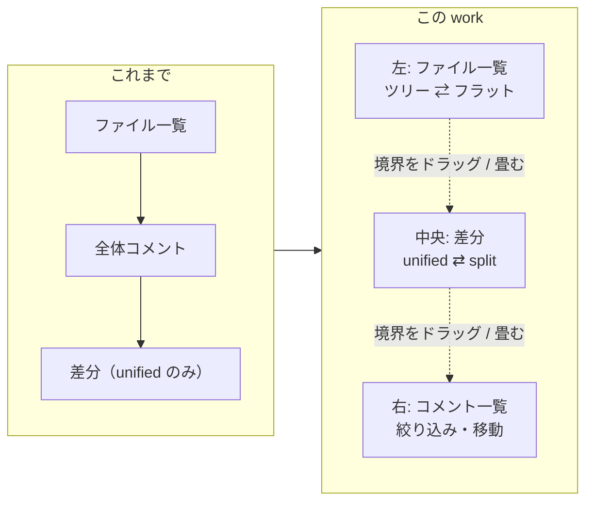

# レビューガイド: 3 ペイン・split・ツリー・テーマ

> 新規 1 ファイル（`templates/ui.js`）＋既存 7 ファイルの変更。
> 変更の大半は**画面**（`app.js` +539 / `style.css` +315 / `page.html` +83）で、
> **生成側（Python）は 7 行しか変わっていない**。差分が大きいので用意した。

## 変更概要 / 目的

`diff-review-html` に「**画面の形**」を足した。読む機能も指摘を書く機能も揃っていたが、
**差分の見比べ方が unified 1 通り**・**ファイル一覧が平ら**・**色が環境任せ**・
**指摘が差分の中に散らばったまま**・**縦一列**、という 5 つが残っていた。



## 重要ポイント（非自明な判断）

1. **split は画面だけで作った**（D1）。生成側のデータ形式は 1 バイトも変えていない。
   既存の `{kind, old, new, text}` だけで左右の対応づけが作れることを、
   **この repo 自身の履歴 88 ハンク・4,036 行**に当てて確かめてから決めた（`research.md` F8）。
2. **畳む指定を CSS 変数で書くと黙って効かない**（D4）。幅はドラッグでインラインに入るので、
   属性側が変数を再定義しても勝てない。**試作して実際に「何も起きない」のを見てから**
   `grid-template-columns` の宣言に切り替えた（`research.md` F3）。回帰テストで固定してある。
3. **`light-dark()` を採らなかった**（D3）。1 か所で書けて実測でも 6 通り正しく動いたが、
   対応していないブラウザでは**差分の追加 / 削除の色ごと消える**（custom property は値を検査せずに
   格納するので、フォールバックの二重宣言も効かない）。**今動いている範囲を狭めない**ほうを採り、
   代償の「割り当てが 2 か所」は**テストで機械的に潰した**（変異で落ちることも確認済み）。
4. **記憶はレビュー記録に入れない**（D5・AC15）。記録は「どこに何を指摘したか」の器であって、
   見る人の画面の器ではない。split で見ている人と unified で見ている人が
   **同じバイト列**を扱えることが、人 → AI → 人の往復の前提になる。
5. **キーは 3 つしか足していない**（D8）。前 work の must（`Enter` の横取り）は
   キーを足したこと自体が原因だった。ただし **`[` / `]` の意味は実測で変えた**——
   「畳む」に割り当てていたが、差分の奥から **`Tab` 60 回でもコメント一覧に届かない**ことが
   分かったので「**移動**」に充てた（`review.md` ラウンド 1 の must）。

## 主要な変更箇所

| 場所 | 見どころ |
|---|---|
| `templates/ui.js`（新規） | **レビューの状態を一切知らない層**。DOM と `localStorage` だけ。app.js との接点は `pref()` ほか 3 本 |
| `ui.js:wireSeparator` | `setPointerCapture` でドラッグ。**離した時点で保存**（毎フレーム書かない） |
| `style.css` の `.shell[data-*="collapsed"]` | 畳むのを**変数ではなく `grid-template-columns` で**宣言（上記 2） |
| `style.css` の `dark-assign:begin/end` | この印の 2 ブロックが**文字列として一致**することをテストが見ている |
| `app.js:pairLines` | split の対応づけ。削除と追加を溜め、文脈行と終端で吐き出す |
| `app.js:anchorOf` / `cellAnchor` | **コメントの位置づけを unified と同一にする**。ここがずれると、表示形式を変えた瞬間に指摘が「位置不明」へ落ちる |
| `app.js:collapseSingles` | 子が 1 つだけのディレクトリを `a/b/c` と 1 行に畳む（畳まないとファイルまで 5 段） |
| `app.js:focusPane` | セレクタを**順に**試す（カンマ区切りは優先順位ではなく文書順で解決される） |
| `app.js:onKeyDown` 冒頭の `defaultPrevented` | ツリーの `↑` `↓` が**差分の行送りも同時に起こす**のを 1 か所で止める（D12） |
| `app.js:gotoFile` / `gotoThread` / skip リンク | 移動は**必ず `focus()` を伴う**。リンクだけではフォーカスが動かない（`research.md` F7 で実測） |
| `richdiff.py:markdown_nodes` | **無限ループの修正**（下記） |

## ついでに直した、前 work から残っていた欠陥

この repo の差分を HTML にしようとすると、**生成が永久に終わらなかった**（CPU 100% のまま返らない）。
`markdown_nodes` の段落取り込みが 0 行を返す入力——```` ```gantt ```` のように
**行の途中にフェンス記号がある行**——で位置が進まず、`while` が回り続けていた。
取り込みが 0 行なら 1 行を段落として消費して**必ず前へ進める**ようにした。
修正後、同じ入力の生成は **0.3 秒**で終わる。回帰テスト 2 件を追加（`decisions.md` D11）。

> 要件の外だが、**サンプルを 1 つも作れない**ため直した。範囲は「進行の保証」だけで、
> フェンス記法の解釈そのものには手を付けていない。

## リスク / 確認したい点

- **固定費が 42KB 増えた**（`ui.js` 8.9KB ＋ CSS 9.2KB ＋ `app.js` 20.9KB）。
  差分の大きさに比例しては増えない（生成側のデータは増えていない）が、
  最小の差分でも 71KB → 114KB になる。
- **split で前後を展開した行は、片側の行番号が空になる**（D9）。展開用の全文を片側しか
  持たないため。本文は両側に同じものを出す（文脈行は定義上どちらの側でも同じ内容）。
- **Firefox / Safari / Windows は実機未検証**（前 work から継続）。とくに Firefox の `file://` は
  `localStorage` が例外を投げるので、画面の設定が毎回既定に戻るはず——
  コードはその経路を握り潰さず既定値へ落とすが、**実機では確かめていない**。
- **タッチ操作でのドラッグは未検証**（`touch-action: none` は入れてあるが実機なし）。
- ツリーの ARIA 規範は WebSearch の要約に基づく（一次資料は egress 制限で取得できず）。
  **キーで辿れること・状態が属性に出ることは実測した**が、支援技術での読み上げは未検証。
- 狭い画面の閾値 900px は、700px での実測 1 点で決めている。
- **CI に載っていない**（前 work から継続）。`.github/workflows/aidev-cli.yml` は aidev 配下限定。
