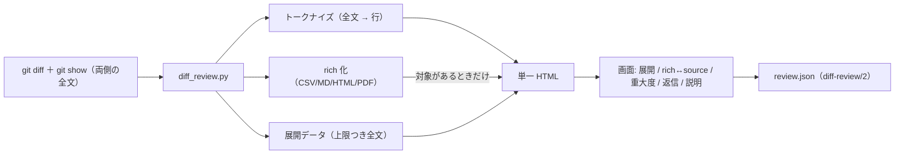

# 仕様: 読むための表示（ハイライト / rich diff / 文脈展開）とレビューの語彙（重大度 / 返信 / 説明）

## 概要

`diff-review-html` に 3 つの層を足す。**重い処理はすべて生成時（Python）に寄せ、画面には
「描けるだけの構造」だけを渡す**——これが容量と安全性の両方を同時に満たす唯一の形になる。

1. **読むための表示**: シンタックスハイライト（生成時にトークン化）、rich diff（CSV / Markdown /
   HTML / PDF を生成時に構造化）、文脈の段階展開（全文を上限つきで同梱）。
2. **レビューの語彙**: 重大度（must / should / nit）、コメント単位の返信、レビューの明示的な開始、
   提出（Approve / Request changes / Comment）。
3. **作者の説明**: 指摘とは別種の `note` スレッド（提出対象外・未解決に数えない）。



## 設計方針

- **ブラウザに解析器を積まない**（`decisions.md` D4）。Markdown も mermaid も PDF も CSV も、
  解析は Python 側。画面側は「ノード木 → DOM」「表」「iframe」「img」の 4 つだけを知っている。
- **描画は引き続き `textContent` と `createElement`**。rich diff で HTML 文字列を
  `innerHTML` に入れる経路は作らない。唯一の例外が **HTML ファイルの描画**で、
  そこは `<iframe sandbox="" srcdoc="…">`（`research.md` F3 で実測）に閉じ込める。
- **容量は「払う量を選べる」形にする**（D3）。展開データはファイル単位の上限つき、
  rich は対象が無ければブロックごと落とす。
- **既存の性質を回帰させない**: 決定論・UTF-8/LF・XSS 非解釈・標準ライブラリのみ。
  前 work のレビューで must になった **Enter の横取り**を再発させないため、
  追加するキー割り当ては「入力欄・ボタンの標準操作を奪わないか」を実測で確認する。

## 対象範囲

| パス | 変更内容 |
|---|---|
| `diff_review.py` | 全文取得・トークナイズ・rich 化・展開データ・`--expand-max-lines` / `--rich` / `list --severity` / `/2` の検証 |
| `templates/app.js` | 展開ボタン・rich↔source・重大度・コメント単位の返信・レビュー開始・説明コメント・`/1` 互換 |
| `templates/rich.js`（新規） | rich diff の描画（**対象が無ければ埋め込まない**） |
| `templates/page.html` | `__RICH_JS__` / `__RICH_DATA__` の差し込み口、レビュー開始ボタン |
| `templates/style.css` | ハイライト配色・表・alert・mermaid・展開ボタン・重大度バッジ |
| `schema.md` | `diff-review/2`（`kind` / `severity`）と `/1` からの移行 |
| `SKILL.md` | 新しいフラグ・rich の対応範囲と限界・キー操作 |
| `tests/test_diff_review.py` | 追加分のテスト（ハイライト / rich / 展開 / 検証 / 互換 / 容量） |

## 依拠する既存の事実

- 差分収集と行の構造化: `diff_review.py:collect_diff` / `parse_hunks`（前 work で実装、テスト済み）。
- テンプレート差し込みは**1 回走査**で行う: 同 `render_html` / `PLACEHOLDER_RE`
  （順次 `str.replace` は自己参照で壊れる。前 work の deliver 後に修正済み）。
- 画面の描画は `textContent` のみ: `templates/app.js:renderRow` ほか。
- `file://` の制約（`fetch` 不可・localStorage は origin 共有・Blob ダウンロード可）:
  前 work `research.md` F1〜F4（実測）。
- 本 work の新規事実は `research.md` F1〜F7（実測）。
- **流用元のコードは無い**（ハイライト・Markdown・mermaid・CSV・PDF の実装は新規）。

## インターフェース / データ構造

### CLI（追加分）

```
python3 diff_review.py html   [既存のオプション]
                              [--expand-max-lines <N>]   # 既定 2000 / 0 で展開データを埋めない
                              [--rich auto|off]          # 既定 auto（対象があれば同梱）
python3 diff_review.py list   <review.json> [--severity must,should,nit,none] [--notes]
```

- `--expand-max-lines N`: 1 ファイルの行数が N を超えたら、そのファイルの全文（展開データ）を埋めない。
  埋めなかったファイルは**ハイライトも行わない**（D7: トークナイズは全文に対して行うため）。
- `--rich off`: rich 化を行わず、`__RICH_JS__` / `__RICH_DATA__` を空にする。
- `list --severity`: 指定した重大度だけを出す（`none` は重大度なし）。`--notes` で説明コメントも出す。

### 差分データ（生成時 → 画面）

```jsonc
{
  "target": { /* 変更なし */ },
  "rich_enabled": true,              // rich データを積んだか（AC9 の検証点）
  "files": [
    {
      "path": "src/app.py", "status": "M", "additions": 4, "deletions": 1, "binary": false,
      "language": "python",          // 未対応なら null
      "hunks": [ { "header": "@@ …", "lines": [
          { "kind": "add", "old": null, "new": 12, "text": "…",
            "tokens": [["kw","def"],["plain"," "],["name","main"]] }   // 無い場合は text だけで描く
      ] } ],
      "expand": {                    // 展開データ。無い場合は null
        "side": "new",               // 展開に使う側（削除ファイルは "old"）
        "lines": ["…", "…"],         // 1 行目からの全文
        "truncated": false           // 上限超過で埋めなかったら true（lines は空）
      },
      "rich": {                      // rich 対象でなければ null
        "kind": "table" | "doc" | "html" | "pdf",
        "note": "…",                 // 制限や失敗の理由（無ければ null）
        "payload": { /* kind ごと。下記 */ }
      }
    }
  ]
}
```

**`rich.payload` の形**

| kind | payload | 画面での描き方 |
|---|---|---|
| `table` | `{header: [[cell]], rows: [{kind: "equal"\|"add"\|"del"\|"change", cells: [{text, changed}]}]}` | `<table>` を組み立て、`changed` のセルに印 |
| `doc` | `{before: <ノード木>\|null, after: <ノード木>\|null}` | ノード木 → DOM（`createElement` ＋ `textContent`） |
| `html` | `{before: "<html…>"\|null, after: "…"\|null}` | `<iframe sandbox="" srcdoc="…">` |
| `pdf` | `{pages: {before: 2, after: 3}, bytes: {before, after}, text: [{kind, text}]\|null}` | ページ数の見出し＋テキスト差分の行 |

**ノード木**（Markdown の描画結果。`doc` の中身）

```jsonc
["h2", {}, ["見出しのテキスト"]]
["p", {}, ["段落 ", ["code", {}, ["inline"]], " のように入れ子にできる"]]
["div", {"class": "alert alert-warning"}, [["p", {}, ["注意の本文"]]]]
["img", {"src": "data:image/svg+xml;base64,…", "alt": "mermaid: flowchart"}, []]
```

- **属性は白名簿**（`class` / `href` / `src` / `alt` / `colspan`）。画面側でも白名簿を適用する。
- `href` は生成時に検査し、`http:` / `https:` / `mailto:` / `#` / 相対パス以外は**リンクにしない**
  （`javascript:` を弾く。画面側でも同じ検査を通す）。
- `src` は `data:image/svg+xml;base64,` で始まるものだけ許す（mermaid の図）。

### レビュー記録 JSON（`diff-review/2`）

```jsonc
{
  "schema": "diff-review/2",
  "target": { /* 変更なし */ },
  "reviews": [ { "id": "r1", "author": "human", "state": "CHANGES_REQUESTED", "body": "…" } ],
  "threads": [
    {
      "id": "t1",
      "kind": "review",              // "review"（指摘）または "note"（作者の説明）
      "path": "src/app.py", "line": 12, "side": "RIGHT",
      "start_line": null, "start_side": null,
      "resolved": false,
      "comments": [
        { "id": "c1", "review_id": "r1", "author": "ai", "body": "…",
          "severity": "must",        // "must" / "should" / "nit" / null
          "in_reply_to": null },
        { "id": "c2", "review_id": null, "author": "human", "body": "直した",
          "severity": null, "in_reply_to": "c1" }
      ]
    }
  ]
}
```

- **`/1` からの移行**（D8）: `kind` が無ければ `review`、`severity` が無ければ `null` を補う。
  読み込みは `/1` も受けるが、**書き出しは常に `/2`**。
- **`note` の制約**: `review_id` は常に `null`（提出されない）。`resolved` は持つが画面では操作させない。
- 正規形（キー昇順・インデント 2・末尾改行・時刻なし）は前 work と同じ。

## 振る舞いの詳細

### 生成（Python 側）

1. 差分を取る（既存）。あわせて**両側の全文**を取る（`research.md` F6）:
   - `unstaged`: 旧＝`git show HEAD:<path>` / 新＝作業ツリーのファイル
   - `staged`: 旧＝`git show HEAD:<path>` / 新＝`git show :<path>`
   - `range` / `commit`: 旧＝`git show <A>:<path>` / 新＝`git show <B>:<path>`
   - **バイト列で受け、NUL を含めばバイナリ**として扱う（全文もハイライトも rich も行わない）。
2. **ハイライト**（D7）: 拡張子 → 言語。全文を 1 回トークナイズし、行に切って各差分行に `tokens` を付ける。
   対応言語は python / javascript / typescript / json / yaml / shell / css / html / markdown / sql。
   未対応は `language: null` で `tokens` を付けない。
3. **展開データ**（D3）: 行数が `--expand-max-lines` 以下なら全文を `expand.lines` に入れる。
   超えたら `truncated: true` で空にする。
4. **rich 化**（対象拡張子のみ）:
   - `.csv` / `.tsv` → `csv` モジュールで両側を読み、`difflib.SequenceMatcher` で行を対応付け、
     `replace` の組はセル単位で比較（`research.md` F4）。
   - `.md` / `.markdown` → 自前パーサでノード木に。**GitHub alert 記法**（`> [!NOTE]` ほか 5 種）を
     `div.alert.alert-<種別>` に。**mermaid** ブロックは D6 の 4 図種を SVG 化して `img` に、
     それ以外は `pre.code` ＋ 「この図種は描画対象外」の注記。
   - `.html` / `.htm` → 生の文字列をそのまま payload に（描画は iframe 側の責務）。
   - `.pdf` → `zlib` でストリーム展開 → ToUnicode CMap でテキスト復元（`research.md` F2）。
     取れたら `difflib` で行差分、取れなければ `note` に理由（D5）。ページ数とバイト数は常に出す。
5. **条件付き同梱**（D4）: `rich` が 1 件でもあれば `__RICH_JS__` に `templates/rich.js`、
   `__RICH_DATA__` に `true` を入れる。無ければ空文字と `false`。
6. テンプレートへ**1 回走査で差し込む**（既存の `PLACEHOLDER_RE` に 2 つ追加）。

### 画面（追加分）

- **文脈展開**: ハンクとハンクの間・ファイルの先頭と末尾に「展開行」を置く。
  - 1 回押すと **20 行**広がる。押すたびに広がり、端に達したらボタンが消える。
  - ハンクの間が 20 行以下なら 1 回で埋まり、間の展開行は消える。
  - ファイル見出しの **「すべて展開」** で、そのファイルの全行を一度に描く（AC12）。
  - `expand.truncated` のファイルでは展開行を出さず、理由を 1 行出す。
  - **展開行の行番号は全文の行番号**（`research.md`「実装時の注意」）。展開した行にもコメントを付けられる。
- **rich ↔ source**: `rich` を持つファイルの見出しに切り替えボタン（既定は **rich**）。
  切り替えは `aria-pressed` で状態を示す。
- **重大度**: コメント入力欄に `must` / `should` / `nit` / なし の選択を置く（`<select>`）。
  確定したコメントには重大度バッジが付く。
- **コメント単位の返信**: 各コメントに「返信」。押すとそのコメントを親にした入力欄が開く
  （返信への返信も同じ経路。`in_reply_to` はその返信の id）。
- **レビューの開始と提出**: 「レビューを開始」を押すと提出バーが出て、未提出の件数が見える。
  提出時に Approve / Request changes / Comment ＋ サマリ。**開始していなくてもコメントは書ける**
  （書いた時点で未提出として溜まる。GitHub と同じ）。
- **説明コメント**: 入力欄に「説明として残す（レビュー対象外）」のチェック。
  チェックすると `kind: "note"` のスレッドになり、バッジ「説明」が付き、解決ボタンは出ない。

### キー割り当て（追加分）

| キー | 動作 | 既定操作を奪わないこと |
|---|---|---|
| `e` | 現在行の**下側**の展開行を 1 回押す | 入力欄では無効（既存の早期 return が効く） |
| `Shift` + `e` | そのファイルを**すべて展開** | 同上 |
| `t` | 現在のファイルの rich ↔ source | 同上 |

`Enter` は**差分の行にフォーカスがあるときだけ**扱う（前 work の must の再発防止）。
新しいキーもボタン・リンク・入力欄の標準操作を奪わないことを test で実測する。

## エラー処理 / 異常系

| 事象 | 扱い |
|---|---|
| 全文が取れない（新規追加ファイルの旧側など） | その側を `null` にして続行（片側だけの rich / 展開） |
| バイナリ | 全文・ハイライト・rich をすべて行わない（既存の表示のまま） |
| ファイルが `--expand-max-lines` 超 | `expand.truncated = true`、画面に理由を 1 行 |
| CSV の列数が行ごとに違う | 短い側を空セルで埋めて比較（落とさない） |
| Markdown の未対応記法 | 段落として出す（壊さない）。mermaid の未対応図種はコード＋注記 |
| PDF からテキストが取れない | ページ数・バイト数だけ出し、`note` に理由（D5） |
| HTML の rich | 常に `sandbox=""`。`srcdoc` に入れる前に**属性値としてエスケープ** |
| `/1` の記録を読み込み | `kind` / `severity` を補って続行。`check` は「旧版です」と注意 |
| 重大度の値が不正 | `check` が exit 3（値域は `must` / `should` / `nit` / `null`） |

## 受け入れ基準との対応

- AC1: 生成時に言語別トークナイザを掛け、行に `tokens` を持たせる。入力は**全文**（`git show` / 作業ツリー）。
  画面は `tokens` があれば `span.tok-<クラス>` で描く（背景色は行の `data-kind` が持つので両立する）。
- AC2: 拡張子が未対応 / バイナリ / 全文が無い場合は `tokens` を付けない。画面は `text` で描く（現行と同じ）。
- AC3: トークン化は生成時に完結。画面側に追加のスクリプト取得は無い（外部リクエスト 0 を維持）。
- AC4: `rich.kind = "table"`。入力は両側の CSV/TSV 全文。セルの `changed` を画面が印で示す。
- AC5: `rich.kind = "doc"`。入力は両側の Markdown 全文。alert 記法は `div.alert.alert-<種別>` に落とす。
- AC6: mermaid ブロックは D6 の 4 図種を SVG 化して `img`（`data:image/svg+xml;base64,`）に。
  対象外の図種は `pre` ＋ `note` に理由。
- AC7: `rich.kind = "html"` を `<iframe sandbox="" srcdoc>` で描く（`research.md` F3 の実測に基づく）。
- AC8: `rich.kind = "pdf"`。ページ数・バイト数は常に、テキスト差分は取れたときだけ。取れなければ `note`。
- AC9: 生成時に rich 対象が無ければ `__RICH_JS__` を空・`__RICH_DATA__` を `false` にする。
  検証は「`rich.js` の目印文字列が HTML に無いこと」と「バイト数が rich ありより小さいこと」。
  **+15% は rich 機構に対する基準**として読む（`decisions.md` D3）。展開データは
  `--expand-max-lines 0` で前 work と同等に戻せることで確かめる。
- AC10: `rich` を持つファイルの見出しに rich/source の切り替えボタン（`aria-pressed`）。
- AC11: ハンク間・前後に展開行。1 回 20 行、端に達したら消える。入力は `expand.lines`。
- AC12: ファイル見出しの「すべて展開」で全行を描く。
- AC13: 展開行の行番号は `expand.lines` の添字（全文基準）。コメントの `line` にその番号を使う。
- AC14: 既存の `LAZY_LINE_LIMIT`（2,000 行超は既定で折りたたみ）を維持し、「すべて表示」を
  AC12 の「すべて展開」と同じ導線に統合する。
- AC15: 入力欄の `<select>` → `comments[].severity`。画面はバッジ、JSON は値として持つ。
- AC16: `list` が重大度を出し、`--severity` で絞る。入力は JSON の `severity`。
- AC17: 各コメントの「返信」が、そのコメントの id を `in_reply_to` にして新しいコメントを作る。
- AC18: 「レビューを開始」で提出バーを開き、Approve / Request changes / Comment で提出（既存の submit を流用）。
- AC19: 入力欄のチェックで `kind: "note"` のスレッドを作る。提出時に `review_id` を付けない。
- AC20: `note` も `threads` に入るので、書き出し・`--import`・読み込みで往復する（`kind` が保たれる）。
- AC21: `/1` を読んだら `kind` / `severity` を補って `/2` として扱う（`check` は注意を出すが通す）。
- AC22: 既存のテスト（決定論・XSS・LF/UTF-8・標準ライブラリのみ）をそのまま回し、
  追加分にも同じ検査を掛ける（rich データも `<` の退避を通す）。
- AC-I1: 展開行・rich/source・重大度はいずれも `<button>` / `<select>` で Tab 到達可能。
  コメント欄を `Esc` で閉じても本文と重大度の選択が残る。
- AC-I2: 重大度を選んでから確定でき、「取り消し」で重大度ごと記録から消える。
- AC-I3: 「行へ移動（`j`/`k`）→ 展開（`e`）→ コメント（`c`）→ 重大度を選ぶ（Tab＋矢印）→ 確定
  （`Ctrl`/`⌘`+`Enter`）→ 提出（`r`）」がマウス無しで通る。
- AC-I4: 展開してもフォーカスは押したボタン（または次の展開行）に残る。コメント欄を閉じたらトリガへ戻る。
- AC-I5: 追加した `e` / `Shift+e` / `t` は入力欄では無効。ボタン上の `Enter` / `Space` を奪わない
  （前 work の must の再発を test で検知する）。

## 申し送り（tasks / 後続）

- **テストの入力に「自分自身」を含める**。前 work の deliver 後に踏んだ欠陥（プレースホルダの自己参照）は、
  合成リポジトリだけを入力にしていたことが原因だった。今回も **この skill 自身の差分**を
  受け入れ確認の入力に含める。
- rich の各形式は**小さな実物**（CSV / Markdown（mermaid ＋ alert）/ HTML / PDF）を
  テスト用リポジトリに置いて回す。PDF は Chromium で生成できる（`research.md` F2 の手順）。
- CI 未搭載は前 work から引き継ぐ（この work でも解消しない）。
