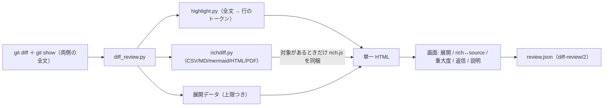

# レビューガイド: rich diff・ハイライト・文脈展開・レビューの語彙

> 新規 3 ファイル（`highlight.py` / `richdiff.py` / `templates/rich.js`）＋既存 6 ファイルの大きな変更。
> 差分が大きいので用意した（`aidev-60-review`「レビュー補助」条件1）。

## 変更概要 / 目的

`diff-review-html` に「**読むための表示**」と「**レビューの語彙**」を足した。

- 読むため: シンタックスハイライト、rich diff（CSV / Markdown＋mermaid＋alert / HTML / PDF）、
  前後の段階展開（押した分だけ広がる）＋ファイル全体の展開。
- 語彙: must / should / nit の重大度、コメント**1 件ごと**の返信（返信への返信）、
  レビューの明示的な開始、**説明コメント**（提出されず未解決にも数えない）。

要望 9 件のうち **resolve ボタン・大きい差分の折りたたみ・返信・Approve/Request changes は既に動いていた**ので、
足りない差分だけを埋めた（`decisions.md` D2）。

## 重要ポイント（非自明な判断）

1. **ブラウザに解析器を積まない**（D4）。Markdown も mermaid も PDF も CSV も**生成時に Python が解析**し、
   画面へ渡すのは「描けるだけの構造」だけ。だから画面側の rich コードは `templates/rich.js` の数十行で済み、
   **rich の対象が 1 件も無ければそれごと埋め込まない**（実測: 対象なしの生成物に `rich.js` は入らない）。
2. **第三者ライブラリを 1 つも同梱していない**。mermaid は 4 図種だけを自前で SVG に描く（D6）。
   **公式とは絵が違う**——「読める図」が上限で、忠実再現は狙っていない。
3. **PDF は標準ライブラリだけでテキストを取る**（`zlib` ＋ ToUnicode CMap。`research.md` F2 で実測）。
   取れない PDF は普通にあるので、**ページ数だけ出して理由を書く**二段構え（D5）。
4. **容量は「払う量を選べる」形**（D3）。展開データはファイル単位の上限つき（`--expand-max-lines`、既定 2,000 行）。
   さらに **トークンの二重持ちを排除**して 2.49MB → 1.86MB にした（D14）。
   `--expand-max-lines 0 --rich off` まで落とすと 84.5KB（この work 前と同等）。
5. **ハイライトは全文を 1 回トークナイズしてから行に切る**（D7）。差分行に個別に正規表現を当てると、
   docstring の途中行が壊れる。

## 処理フロー

## 主要な変更箇所

| 場所 | 見どころ |
|---|---|
| `highlight.py:tokenize_lines` | 全文を 1 回で切ってから行に割る。**連結すると元の行に戻る**（テストが不変条件として検査） |
| `richdiff.py:table_payload` | `difflib` で行を対応付け、`replace` の組だけセル比較（変わったセルに印） |
| `richdiff.py:markdown_nodes` | Markdown → ノード木。**属性は白名簿・`href` はスキーム検査**（`javascript:` はアンカーにしない） |
| `richdiff.py:mermaid_svg` | 4 図種を自前レイアウト。対象外は `(None, 理由)` を返してコードのまま出す |
| `richdiff.py:_pdf_text` | ToUnicode CMap を読んでグリフ → Unicode。**位置決め演算子で行に区切る**（しないと 1 文字ずつの行になる） |
| `diff_review.py:collect_diff` | 全文取得 → ハイライト → 展開データ → rich を 1 本にまとめる |
| `diff_review.py:attach_tokens` | **展開データが持つ側の行にはトークンを付けない**（二重持ちの排除。画面 `tokensFor` と対） |
| `diff_review.py:render_html` | `__RICH_JS__` を対象があるときだけ埋める（AC9 の検証点） |
| `templates/app.js:renderGap` / `expander` | 段階展開。`gapsOf` がハンクの隙間を出し、`top`/`bottom` の 2 方向で広がる |
| `templates/app.js:redrawFile` / `expandAll` | **再描画で現在行を指し直す**（指さないとキー操作が黙って死ぬ／フォーカスが落ちる。どちらも実測で検出して修正） |
| `templates/rich.js:buildNode` | ノード木 → DOM。タグ・属性の白名簿、`src` は `data:image/svg+xml` のみ |
| `schema.md` | `diff-review/2`（`kind` / `severity`）と `/1` からの移行 |

## リスク / 確認したい点

- **既定の容量**: `--expand-max-lines 2000` の既定では、展開データが生成物の大半を占める
  （このリポジトリ自身の差分で 1.86MB のうち約 1.1MB）。**既定値の妥当性は使ってみないと分からない**——
  重いと感じたら `--expand-max-lines` を下げるか `0` にできる。
- **mermaid の見た目**: 単純な `flowchart` / `sequenceDiagram` しか実測していない。
  subgraph の入れ子・スタイル指定・長いラベルは崩れうる。
- **PDF**: 実測は Chromium が生成した PDF のみ。ToUnicode を持たない PDF では理由が出る。
- **Firefox / Safari / Windows は実機未検証**（前 work から継続）。
- **CI に載っていない**（前 work から継続）。`.github/workflows/aidev-cli.yml` は aidev 配下限定。
