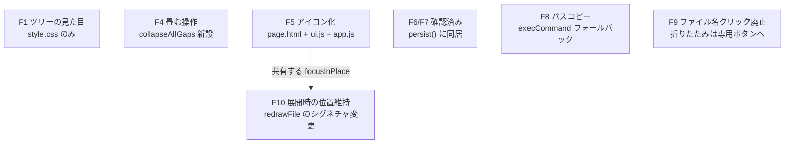

# 設計: 画面まわりの不備 7 件

> 前提は research.md の実測。**生成側（Python）は一切触らない**——`templates/` の 4 ファイル
> （`page.html` / `style.css` / `ui.js` / `app.js`）だけを変更する。

## 全体像



各項目はほぼ独立に実装できる。共有するのは 1 つだけ——**`focusInPlace(el)`** という
新しいヘルパー（G の中核）で、F4（畳む）にも流用する（`expandAll` の既存の焦点処理も
同じ関数に寄せる）。

## F1: ツリーのインデント（`style.css` のみ）

```css
.tree-group {
  margin: 0 0 0 6px;
  padding-left: 16px;
  border-left: 1px solid var(--line);   /* 接続線。research.md F1 で実測した通り複合する */
}
```

JS は変更しない（`appendTreeChildren` の入れ子構造は既に正しい）。

## F4: 畳む操作（`app.js`）

```js
function collapseAllGaps(section, file) {
  // expandAll の対。展開量をすべて 0 に戻す（隙間自体は変わらない——gapsOf は常に同じ範囲を返す）。
  expandState[file.path] = {};
  var currentKey = currentRow && currentRow.getAttribute ? currentRow.getAttribute("data-key") : null;
  var body = section.querySelector(".file-body");
  clear(body);
  fillFileBody(body, file);
  renderThreads();
  var again = currentKey ? section.querySelector('.row[data-key="' + cssEscape(currentKey) + '"]') : null;
  setCurrentRow(again);
  // 押した本人（.collapse-all）に留まるのが素直——畳んだ結果、直前の行は
  // たいてい画面から消えるため、`again` へ寄せるより自然（expandAll と違い、
  // 「戻ってきた行」を探す意味が薄い）。
  focusInPlace(again || section.querySelector(".collapse-all"));
}
```

「すべて展開」（`.expand-all`）の隣に、対になる「畳む」（`.collapse-all`）を常に並べて置く
（`hasGap` が真のときだけ両方表示。「畳む」だけを展開量に応じて活性/非活性にする作り込みは
しない——**押しても既に畳まれていれば無害な no-op**で、要件が求める以上の複雑さを避ける）。

アイコン: 展開 = `⏷`（U+23F7, 二重山形下）、畳む = `⏶`（U+23F6, 二重山形上）。
ツリーの twisty（▸/▾）とは系統を分ける——ツリーは「単一階層の開閉」、
こちらは「ファイル全体の展開量」で意味が違うため、混同を避ける。
`title`/`aria-label` = 「このファイルをすべて展開」/「このファイルを折りたたむ」。

## F5: アイコン化

### 置き換え表（グリフ・意味・対象）

| 要素 | 旧 | 新（アイコン） | title / aria-label |
|---|---|---|---|
| `#btn-tree` | "ツリー"/"フラット" | `⊞`（ツリーへ）/ `☰`（フラットへ） | 「ツリー表示に切り替え」/「フラット表示に切り替え」 |
| `#btn-pane-left` | `◧ 一覧` | `◧` のみ | 「ファイル一覧を開く/閉じる」（開閉状態に応じ動詞を変える） |
| `#btn-pane-right` | `◨ 指摘` | `◨` のみ | 「コメント一覧を開く/閉じる」 |
| `#btn-theme` | `テーマ: …`（全文） | `☀`/`☾`/`◐` | 既存の `THEME_LABEL` 文言をそのまま title/aria-label に使う |
| `#btn-help-open` | "キー操作" | `?` | 「キー操作」 |
| ファイルの折りたたみ（`.file-toggle`） | ファイルパスがボタン兼務 | `▸`/`▾` のみ（**パス表示から分離**。F9 参照） | 「ファイルの折りたたみを切り替え」 |
| すべて展開/畳む（新設） | "すべて展開"（新設ぶんは畳むボタンが無かった） | `⏷`/`⏶` | 上記 F4 参照 |
| パスコピー（新設） | 無し | `⧉` | 「パスをコピー」 |

AC8: **アイコンだけでは分かりにくいものは文字のまま**（`#btn-split`・`.view-toggle`・
`#btn-submit-open`・`#btn-export-open`・`#btn-open-file`・`#btn-start-review`・
コメント関連ボタン・展開の個別ボタン「↑ 20 行」——これは残り行数という**動的な情報**を
含むので削れない）。F5 の置き換え表の「文字のまま」列がそのまま AC8 の対象。

### 実装場所

- `page.html`: `btn-pane-left/right` のテキストを削り、`title` 属性を追加。
- `ui.js`: `applyTheme()` がテーマの `textContent` をアイコンにし、`title`も設定。
  `setPane()` が開閉ラベルを動詞つきで更新（「開く」/「閉じる」）。
- `app.js`: `renderFileList()` の `btn-tree` 文言・`btn-help-open` の初期文言（`page.html` で `?` に）・
  ファイルヘッダー組み立て（`renderFiles()`）でアイコンボタンを生成。

## F6・F7: 確認済みチェックボックスと件数

### 状態の持ち方

```js
var viewedFiles = {};   // path -> true。applyDiffData でリセット（research R4）
```

`persist()` の保存物に同居させる:

```js
window.localStorage.setItem(storageKey, JSON.stringify({ state: state, drafts: drafts, viewed: viewedFiles }));
```

`restore()`/`boot()` で `viewedFiles = saved.viewed || {}` を読み戻す。
**書き出す JSON（`exportText()`）には触れない**——`canonicalRecord()` は `state` だけを見るので、
`viewedFiles` を混ぜなければ自動的に記録から除外される（AC12 はテストで固定する）。

### 表示

- ファイルヘッダーに `<input type="checkbox" class="file-viewed">` ＋ 可視ラベル「確認済み」。
- クリックで `viewedFiles[file.path] = checkbox.checked`（false なら削除して保存を軽くする）。
  `persist()` を呼ぶ。**ファイル本体の再描画はしない**（チェック状態だけの変更で `fillFileBody`
  を呼ぶと F10 で直した「動かない」を無駄に試すことになる。ファイルヘッダー内の見た目
  ——後述の打ち消し線——だけを直接更新する）。
- ファイル一覧（フラット `<a>`・ツリー `.tree-item`）にも反映: 確認済みなら
  `.file-viewed-mark`（小さいチェック `✓`）をファイル名の前後に付け、`tree-name`/`stat` に
  `text-decoration: line-through`（打ち消し線。research 未確定事項の解として
  「淡色化」ではなく「打ち消し線」を採用——一覧は等幅フォントで詰まっており、
  淡色化より打ち消し線のほうが小さい文字でも判別しやすいため）。
- 件数は `#pane-left` の `.pane-head` に `<span id="viewed-count" aria-live="polite">` を置き、
  `renderFileList()` の最後に「`N`/`M` 確認済み」を書く（`M`=全ファイル数、`N`=viewedFiles の数。
  ただし検索で絞り込んでいても**全体の件数**を出す——絞り込み中だけ母数が変わると
  「進んだのか絞られただけなのか」を見誤る）。

## F8: パスコピー（`app.js`）

```js
function copyText(text) {
  // Clipboard API を試し、使えなければ execCommand へ（research.md F8 で実測: file:// では
  // クリック起点でも Clipboard API が権限拒否で失敗し、execCommand が実質の本経路になる）。
  function legacy() {
    var ta = document.createElement("textarea");
    ta.value = text;
    ta.style.position = "fixed";
    ta.style.opacity = "0";
    document.body.appendChild(ta);
    ta.focus();
    ta.select();
    var ok = false;
    try { ok = document.execCommand("copy"); } catch (err) { ok = false; }
    document.body.removeChild(ta);
    return ok;
  }
  if (navigator.clipboard && navigator.clipboard.writeText) {
    return navigator.clipboard.writeText(text).catch(function () {
      return legacy() ? Promise.resolve() : Promise.reject(new Error("clipboard"));
    });
  }
  return legacy() ? Promise.resolve() : Promise.reject(new Error("clipboard"));
}
```

呼び出し側（コピー・ボタンのハンドラ）:

```js
copyButton.addEventListener("click", function () {
  copyText(file.path).then(function () {
    copyButton.textContent = "✓";                 // 一時的な確認表示
    setTimeout(function () { copyButton.textContent = "⧉"; }, 1200);
  }, function () {
    banner("コピーできませんでした。パスを選択してあるので手動でコピーしてください: " + file.path, []);
  });
});
```

成否はボタン自身の一時的な絵文字変化で伝える（research 未確定事項の解）。
失敗時のみバナーを出す（成功のたびにバナーを積むと F の「同種バナーは置き換え」既存機構を
むやみに使うことになるため、**成功は視覚的なマイクロフィードバックに留める**）。

## F9: ファイル名クリックの整理

`renderFiles()` のファイルヘッダー組み立てを変更:

```
旧: [ .file-toggle（クリックで開閉・文字はファイルパス） ] [tags] [actions...]
新: [ .file-toggle（▸/▾ のみ・クリックで開閉。クラス名は据え置き） ] [ .path-text（非クリック） ]
    [ .copy-path（⧉） ] [ .file-viewed チェックボックス ] [tags] [actions...]
```

- `.file-toggle` クラスは**開閉アイコンボタンに残す**（既存の `f` キー・`redrawFile` 等が
  `.file-toggle` をセレクタに使っているため、クラス名は変えずに中身だけ絞る。
  `querySelector(".file-toggle")` の参照箇所を壊さない）。
- パス文字列は `<span class="path-text">` に移し、クリックでは何も起きない
  （選択してコピーは相変わらず可能——ブラウザ標準のテキスト選択は妨げない）。

## F10: 展開時の位置維持（`app.js`）

### 共有ヘルパー

```js
function focusInPlace(el) {
  // 展開などの「その場の操作」で焦点を移すとき、**既に見えているなら画面を動かさない**。
  // 見えていない時だけ最小限（nearest）で寄せる（research.md F10 の実測に基づく）。
  if (!el) { return; }
  el.focus({ preventScroll: true });
  var pane = el.closest(".pane");
  if (!pane) { return; }
  var er = el.getBoundingClientRect();
  var pr = pane.getBoundingClientRect();
  var visible = er.top >= pr.top && er.bottom <= pr.bottom;
  if (!visible) { el.scrollIntoView({ block: "nearest" }); }
}
```

### `redrawFile` にギャップの手がかりを渡す

```js
function redrawFile(file, focusHint) {
  // focusHint: { gap: index, dir: "up"|"down" } | null
  var section = ...;
  var currentKey = ...;
  clear(body); fillFileBody(body, file); renderThreads();
  var again = currentKey ? section.querySelector(...) : null;
  setCurrentRow(again);

  var next = null;
  if (focusHint) {
    next = section.querySelector('.expander[data-gap="' + focusHint.gap + '"] .expand-' + focusHint.dir);
  }
  if (!next) { next = again; }                                       // 同じ行に居続けられるなら最優先
  if (!next) { next = section.querySelector(".expander button"); }   // 最後の手段（旧来の挙動）
  if (!next) { next = section.querySelector(".file-toggle"); }
  focusInPlace(next);
}
```

`expander()` の `up`/`down` ハンドラが `redrawFile(file, {gap: index, dir: "up"|"down"})` を渡す
（現状は引数なしで呼んでいる）。**優先順位**: (1) 同じギャップの同じボタンがまだあるなら
そこへ（展開が部分的にしか進んでいないとき）。(2) 無ければ、直前にいた行（`currentKey`）——
全部読み込まれてギャップ自体が消えたとき、自然に「自分が読んでいた行」に留まる。
(3) それも無ければ最初に見つかる展開ボタン（旧来の挙動。ここまで落ちるのは稀）。

`expandAll`/新設 `collapseAllGaps` も同じ `focusInPlace` を使うよう置き換える
（既存の `again ? again.focus() : button.focus()` を `focusInPlace(again || button)` に統一）。

## AC ごとの実現方法

- AC1: `.tree-group` の `padding-left`/`border-left`。実測で複合を確認済み（research F1）。
- AC2: `compileQuery(q)` が返す判定関数で `renderFileList()` が `diffData.files` をフィルタしてから
  `buildTree`/フラット表示へ渡す（インデックスは元の `diffData.files` の位置を保持——
  `gotoFile(index)` の整合を壊さない）。
- AC3: `compileQuery` が `*`/`?` を含む入力をワイルドカードとして正規表現に変換する
  （`*`→`.*`、`?`→`.`、他の記号はエスケープ）。
- AC4: `compileQuery` が `/…/フラグ` の形を素の正規表現として `new RegExp(...)` に渡す。
- AC5: `compileQuery` が上記どちらにも当たらない入力を、正規表現の特殊文字をエスケープした上で
  大小文字無視の部分一致にする。
  以上 4 つの判定は 12 通りのケースを scratch で実測済み（research 直前の検証。すべて期待どおり）。
- AC6: `collapseAllGaps`（F4）。
- AC7: F5 の表のとおり実装し、各要素に `title`/`aria-label` を必須で付ける。
- AC8: F5 の表の「文字のまま」列（split/unified・rich/source・主要な操作）に手を付けない。
- AC9: F6。`viewedFiles` の状態を `persist()`/`restore()` に同居させ、再読み込み後も残す。
- AC10: F6。ファイル一覧（フラット・ツリー）にも確認済みを打ち消し線などで反映する。
- AC11: F7。「確認済み／全体」の件数を `#pane-left` の `.pane-head` に表示する。
- AC12: F6。`exportText()`/`canonicalRecord()` に一切触れないので、レビュー記録 JSON に
  `viewedFiles` は混ざらない。いずれもテストで固定する。
- AC13: F8（`copyText`）。
- AC14: F9。`.file-toggle` はアイコンのみのボタンとして残り、パス文字列はクリックしても
  何も起きない `<span>` にする。
- AC15: F10（`focusInPlace` ＋ `redrawFile` へのヒント渡し）。個別の展開（↑/↓）で、
  操作前に見えていた行が操作後も画面内に留まることを、research F10 のシナリオ
  （4 ギャップ中 3 番目の展開）で実測済み。
- AC16: 同じ `focusInPlace` を `expandAll`／新設 `collapseAllGaps`（F4）にも適用し、
  ファイル単位の全展開・畳むでも同じ性質を持たせる。
  実測: `preventScroll:true` でビューポート外要素への focus でも `scrollTop` が
  変化しないことを確認済み（research F10）。

## 相互作用の実現方法（AC-I1〜AC-I4）

- AC-I1: 検索欄は `<input>`、確認済みは `<input type=checkbox>`、コピーと畳むは `<button>`——
  すべて自然な `Tab` 順に乗る通常のフォーム/ボタン要素で、到達性のために特別な仕込みは要らない。
- AC-I2: アイコン化したボタンも属性は既存のまま保つ（`btn-tree` の `aria-pressed`、
  `btn-pane-left/right` の `aria-expanded`、`file-toggle` の `aria-expanded` 等）。
  文言を `textContent`（アイコン）に絞るだけで、状態を運ぶ属性には触れない。
- AC-I3: 検索欄は `<input>` なので、既存の `isTyping(event)` ガード（`onKeyDown` 冒頭）が
  自動的に対象にする——**新しい仕込みは不要**。既存の仕組みがそのまま適用される。
- AC-I4: `.file-toggle`（`f` キー）・`.expand-down`/`.expand-up`/`.expand-all`（`e`/`Shift+E`）・
  `.view-toggle`（`t` キー）のクラス名とキー割り当てのコードは変更しない
  （F5・F9 で中身は変えてもクラス名とセレクタは残す設計にしている）。

## 既存への影響と回帰

| 既存の性質 | 影響 | 手当て |
|---|---|---|
| `f` キー（ファイル折りたたみ） | `.file-toggle` は残る（中身だけ変わる） | `section.querySelector(".file-toggle").click()` は変更不要 |
| `e`/`Shift+E`（展開） | `.expand-down`/`.expand-up`/`.expand-all` セレクタは変えない | 新設 `.file-fold`（畳む）はキー割り当てを増やさない（要件: 新キー追加なし） |
| `t`（rich/source） | 無関係 | 変更なし |
| 記録 JSON の形 | 変わらない | `viewedFiles` は `state`/`canonicalRecord` に入れない。テストで固定 |
| 決定論 | 変わらない | 画面の状態はすべて `localStorage` 側。生成物（HTML そのもの）は前 work までと不変 |
| 参照専用（`--readonly`） | 検索・確認済み・コピー・ツリー・畳むは動く | いずれも `readonly` 分岐の外（既存方針どおり） |

## テスト方針

- **画面（test 工程・headless Chromium・`file://`）**: 固定入力（`tests/fixture_repo.py`）で HTML を
  生成し——
  - ツリーのインデントが深さに応じて増えること（`getBoundingClientRect().x` の比較）。
  - 検索: 部分一致・ワイルドカード・正規表現の 3 種、フラット・ツリー両方で一致件数を確認。
  - 畳む: 全展開 → 畳む → 行数が元に戻ることを確認。
  - アイコン化した各ボタンに `aria-label`/`title` があること。
  - 確認済み: チェック → 件数表示の更新 → リロード（同じバンドルを再度開く）で状態が残ること →
    書き出した JSON に `viewed` 関連のキーが無いこと。
  - パスコピー: `execCommand` 経路が使われる環境（`file://`）でクリップボードの中身を確認
    （`navigator.clipboard.readText()` で読み戻せない制約があるため、**execCommand が呼ばれたこと**と
    **ボタンの一時表示が変わること**を検査の代替指標にする）。
  - F10 の核心: research で再現した「3 番目のギャップを展開してスクロール位置が飛ぶ」シナリオを
    そのまま回帰として固定（`scrollTop` の差が閾値内であること）。
- **回帰**: 既存の画面確認（レイアウト・バンドル）を再実行する。

## 未解決 / design では決めない

- 「確認済み」のマークを一覧側でどこに置くか（前置/後置）の最終的な見た目は実装時に調整する。
- ツリーの接続線の色・太さは実装時に既存の `--line` 変数を使うことだけ決め、微調整は実装時。
