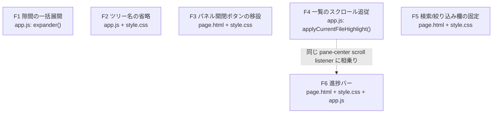

# 設計: ナビゲーションまわりの改善 6 件



## F1: 隙間の一括展開ボタン

`expander(file, index, gap, shown, remaining)`（app.js）に 3 番目のボタンを追加する。
`expandAll` が使っている手法（`shown.top` を隙間の全長にする）をそのまま再利用する。

```js
var all = el("button", { type: "button", class: "expand-gap-all", text: "すべて表示" });
all.addEventListener("click", function () {
  shown.top = gap.end - gap.start + 1;   // shown.bottom は使わない（expandAll と同じ前提）
  redrawFile(file, { gap: index, dir: "gap-all" });
});
row.appendChild(label);
if (index < (file.hunks || []).length) { row.appendChild(up); }
row.appendChild(all);                     // up と down の**あいだ**に置く（GitHub と同じ並び）
if (index > 0) { row.appendChild(down); }
```

`all` は常に出す（up・down のどちらか片方しか無い端の隙間でも、1 クリックで済ませる意味がある）。
クラス名は既存の `.expand-all`（ファイル単位の「すべて展開」ヘッダーボタン）と紛れないよう
`.expand-gap-all` にする。`redrawFile` の焦点探索は `.expand-' + dir` を組み立てるので、
`dir: "gap-all"` は自動で `.expand-gap-all` に一致する——**新しいコードを足す必要がない**。
展開後はその隙間の `.expander` 自体が消えるので、既存の優先順位（現在行 → 最初の展開ボタン →
折りたたみボタン）にそのまま落ちる（`redrawFile` は無改造）。

テキストは「すべて展開」（ファイル単位）と紛れないよう「すべて表示」にする
（既存の `↑ 20 行`/`↓ 20 行` と同じ短い日本語ラベルの並びに揃える。アイコン化はしない——
「隙間全体を表示する」という一回性の動作をアイコン 1 文字で表すと、20 行ずつのボタンと
見分けが付きにくくなる）。

## F2: ツリー名の省略とツールチップ

```css
.tree-name {
  flex: 1 1 auto;
  min-width: 0;             /* 無いと縮まずに折り返す（実測済みの落とし穴） */
  overflow: hidden;
  text-overflow: ellipsis;
  white-space: nowrap;
}
```

`appendTreeChildren`（app.js）の 2 箇所（ディレクトリ・ファイル）で `.tree-name` を作るとき、
`text` と同じ文字列を `title` にも渡す:

```js
el("span", { class: "tree-name", text: dir.name, title: dir.name })
el("span", { class: "tree-name", text: entry.name, title: entry.name })
```

中間階層を連結した名前（`collapseSingles` が作る `a/b/c` 形式）も `dir.name` に入っているので、
連結後の全体がそのまま `title` に出る（追加のコードは要らない）。

## F3: パネル開閉ボタンの移設

**ボタンは 1 個のまま、DOM 上の位置だけを変える。** `ui.js` の `setPane`/`togglePane`/`wireSeparator`/
`init` は `document.getElementById("btn-pane-" + which)` で参照するだけで、位置に依存しない
（research.md F3）——**`ui.js` は無改造**。

`page.html`:
- `.topbar .actions` から `#btn-pane-left`/`#btn-pane-right` を削除する。
- `#pane-left` の `.pane-head` の最後に `#btn-pane-left`（`class="icon-btn pane-toggle"`）を追加する。
- `#pane-right` の `.pane-head` の最後に `#btn-pane-right`（同上）を追加する。
- 両方の属性（`aria-expanded`/`aria-controls`/`title`/`aria-label`/文字）は今のボタンのものを
  そのまま持ってくる（変えない）。

`style.css`（閉じたときの見た目——**パネル自体は隠さず、ボタン以外の子要素だけ隠す**）:

```css
.shell[data-left="collapsed"] { grid-template-columns: 40px 6px minmax(0, 1fr) 6px var(--right, 320px); }
.shell[data-right="collapsed"] { grid-template-columns: var(--left, 260px) 6px minmax(0, 1fr) 6px 40px; }
.shell[data-left="collapsed"][data-right="collapsed"] { grid-template-columns: 40px 6px minmax(0, 1fr) 6px 40px; }

.shell[data-left="collapsed"] .pane-left,
.shell[data-right="collapsed"] .pane-right { border: none; }
.shell[data-left="collapsed"] .pane-left > *:not(.pane-sticky),
.shell[data-right="collapsed"] .pane-right > *:not(.pane-sticky) { display: none; }
.shell[data-left="collapsed"] .pane-left .pane-sticky > *:not(.pane-head),
.shell[data-right="collapsed"] .pane-right .pane-sticky > *:not(.pane-head) { display: none; }
.shell[data-left="collapsed"] .pane-left .pane-head > *:not(.pane-toggle),
.shell[data-right="collapsed"] .pane-right .pane-head > *:not(.pane-toggle) { display: none; }
.shell[data-left="collapsed"] .pane-left .pane-head,
.shell[data-right="collapsed"] .pane-right .pane-head { justify-content: center; padding: 8px 4px; }
```

（旧: `.shell[data-left="collapsed"] .pane-left, .shell[data-right="collapsed"] .pane-right
{ visibility: hidden; border: none; }` は削除する。`.pane-sticky` は F5 で新設するラッパー。）

40px は `.icon-btn` の `min-width: 30px`（`box-sizing: border-box`）に対し、片側 5px の余白を残す値。

**モバイル幅（900px 以下）への影響（見落としやすい副作用）**: 既存の `@media (max-width: 900px)`
は「閉じたパネルは `display: none` で丸ごと消す」ため、ボタンをパネルの中へ移すと
**モバイルでは閉じたパネルを二度と開けなくなる**（トップバーにあった今のボタンなら、
パネルが `display:none` でも押せていた）。これは今回の移設そのものが生む退行なので、
（スコープ外の「モバイル向けの作り直し」とは別に）最小限だけ直す:

```css
/* 900px 以下でも、閉じたパネルは（display:none ではなく）中身を隠してボタンだけ残す。
   ボタンをパネルへ移したことで、置いたまま display:none にすると再度開く手段が無くなる
   （このズレは移設そのものが生む退行なので、モバイル再設計とは別に最小限だけ直す）。 */
.shell[data-left="collapsed"] .pane-left,
.shell[data-right="collapsed"] .pane-right { display: block; max-height: none; }
```

（既存の「閉じたら `display: none`」の行をこの1行に置き換える。上の「ボタン以外を隠す」
ルールはメディアクエリの外にあるので、900px 以下でもそのまま効く。）

## F4: ファイル一覧のスクロール追従

`applyCurrentFileHighlight()`（app.js）の末尾、`data-current` を付けた直後に 1 行足す:

```js
if (entry) {
  entry.setAttribute("data-current", "true");
  entry.scrollIntoView({ block: "nearest" });
}
```

`scrollIntoView({block:"nearest"})` は**すでに表示範囲内なら何もしない**——AC6 の
「すでに見えている場合は一覧を余計に動かさない」をそのまま満たす（`focusInPlace` のように
`focus()` を伴わないので、可視判定を自前で書く必要がない）。

## F5: 検索欄・絞り込み欄の固定

`page.html` で、`.pane-head` とその直後の道具欄を 1 個のラッパーに包む:

```html
<!-- 左 -->
<div class="pane-sticky">
  <div class="pane-head">...（既存 + F3 のボタン）</div>
  <div class="filelist-tools">...（既存のまま）</div>
</div>
<div id="filelist"></div>

<!-- 右 -->
<div class="pane-sticky">
  <div class="pane-head">...（既存 + F3 のボタン）</div>
  <div class="cl-filters">...（既存のまま）</div>
</div>
<div id="commentlist"></div>
```

`style.css`:

```css
.pane-sticky { position: sticky; top: 0; z-index: 2; background: var(--surface); }
```

`.pane-head` からは `position`/`top`/`z-index` の 3 つだけを外す（ラッパーが担うので二重に
持たない）。`display: flex`・`padding`・`border-bottom`・`background` はそのまま残す
（`background` はラッパーと同じ色なので残しても重複が見えるだけで害はない）。
高さをまたいだ `top` の計算（`--topbar-h` のような JS 実測）は不要——**ラッパー自身が
sticky なので、中の高さが変わっても一緒に動く**。

## F6: 進捗バー

`page.html` の `<body>` 直後（`.skip` リンクより前）に追加:

```html
<div class="progress-track" id="progress-track" title="クリックした位置へ移動" aria-hidden="true">
  <div class="progress" id="progress-bar"></div>
</div>
```

`aria-hidden="true"`: 本物のスクロールバーで同じ操作ができる補助的な機能なので、
`md-to-doc` の前例に対し 1 点だけ足す（この画面はアイコンボタン全数に `title`/`aria-label` を
付ける方針だが、この要素はボタンではなく操作の主経路でもないため、支援技術には**存在を
知らせない**扱いにする）。

`style.css`（`md-to-doc` の値をそのまま流用。requirements「未確定事項」のとおり）:

```css
.progress-track { position: fixed; top: 0; left: 0; right: 0; height: 6px; z-index: 200;
                   cursor: pointer; background: transparent; }
.progress-track:hover { background: color-mix(in srgb, var(--accent) 14%, transparent); }
.progress { position: absolute; top: 0; left: 0; height: 3px; width: 0;
            background: var(--accent); transition: width .1s; pointer-events: none; }
```

`app.js`: 新しい関数を 1 つ足し、既存の `#pane-center` scroll リスナー（前 work
20260916-diff-review-current-file で追加済み・`requestAnimationFrame` で間引き済み）に
呼び出しを 1 行追加する（**2 本目の scroll リスナーを増やさない**）。

```js
function updateProgressBar() {
  var pane = document.getElementById("pane-center");
  var bar = document.getElementById("progress-bar");
  if (!pane || !bar) { return; }
  var max = pane.scrollHeight - pane.clientHeight;
  bar.style.width = (max > 0 ? (pane.scrollTop / max * 100) : 0) + "%";
}
```

`wire()` の既存の scroll リスナー内（`applyCurrentFileHighlight();` の直後）に
`updateProgressBar();` を足す。クリックで移動するハンドラを新設:

```js
var progressTrack = document.getElementById("progress-track");
if (progressTrack) {
  progressTrack.addEventListener("click", function (event) {
    var pane = document.getElementById("pane-center");
    if (!pane) { return; }
    var rect = progressTrack.getBoundingClientRect();
    var ratio = rect.width ? (event.clientX - rect.left) / rect.width : 0;
    ratio = Math.max(0, Math.min(1, ratio));
    var max = pane.scrollHeight - pane.clientHeight;
    pane.scrollTo({ top: max * ratio, behavior: "smooth" });
  });
}
```

`renderAll()` の末尾（既存の `applyCurrentFileHighlight();` の隣）に `updateProgressBar();` を足し、
読み込み直後（スクロール前）でもバーの長さが正しい状態（差分が短ければ 0%）で始まるようにする。

## 対象範囲

- `templates/page.html`: F3（ボタン移設）・F5（ラッパー div）・F6（進捗バーの HTML）。
- `templates/style.css`: F2（省略）・F3（閉じたパネルの見た目・モバイルの退行防止）・
  F5（sticky ラッパー）・F6（進捗バーの見た目）。
- `templates/app.js`: F1（隙間の一括展開）・F2（`title` 属性）・F4（スクロール追従）・
  F6（進捗バーの更新とクリック）。
- `templates/ui.js`: **無改造**（F3 の理由は上記のとおり）。

対象外: 生成側（Python）・レビュー記録の JSON・新しいキー操作・`wireSeparator`（ドラッグ）本体・
モバイル向けのレイアウト再設計（F3 の退行防止だけは例外的に直す。上記参照）。

## AC ごとの実現方法

- AC1: F1。`expander()` に `.expand-gap-all` を追加し、up/down と同じ行に並べる。
- AC2: F2。`.tree-name` に `min-width:0; overflow:hidden; text-overflow:ellipsis; white-space:nowrap;`。
- AC3: F2。`.tree-name` 生成時に `title` 属性を同じ文字列で付ける。
- AC4: F3。`page.html` でボタンをトップバーから各 `.pane-head` へ移す。
- AC5: F3。閉じたときに `.pane-sticky`/`.pane-head`/`.pane-toggle` だけを残し、他を隠す CSS。
- AC6: F4。`applyCurrentFileHighlight()` の末尾で `entry.scrollIntoView({block:"nearest"})`。
- AC7: F5。`.filelist-tools` を `.pane-head` と同じ `.pane-sticky` ラッパーに入れる。
- AC8: F5。`.cl-filters` を `.pane-head` と同じ `.pane-sticky` ラッパーに入れる。
- AC9: F6。`updateProgressBar()` が `#pane-center` の scrollTop/scrollHeight から幅を計算する。
- AC10: F6。`#progress-track` の click ハンドラが `pane.scrollTo()` を呼ぶ。
- AC11: すべての変更が `readonly` を参照しない（F1〜F6 のコードのどこにも `readonly` の分岐が
  無い——既存の「読む機能は隠さない」方針をそのまま継続するだけで、新しい分岐を書かない）。
- AC12: `ui.js` を無改造にしたことで（F3）、`focusPane`/`wireSeparator`/`{`/`}`/`[`/`]` の対象・
  挙動は変わらない。`#btn-tree` のセレクタ（`app.js` の `focusPane`）も同じ ID のまま。

## 既存への影響と回帰

| 変更 | 影響を受けうる既存機能 | 確認方法 |
|---|---|---|
| F1（`expander` に 3 番目のボタン） | 段階展開のキー操作は無い（ボタンのみ）ので `e`/`Shift+E` キーには影響しない | 既存の隙間展開の回帰を再実行 |
| F2（`.tree-name` の CSS） | ツリーの字下げ（前 work）・確認済みの打ち消し線（`data-viewed`）・いま表示中のハイライト（`data-current`）は別のプロパティなので独立 | ツリー表示の既存回帰を再実行 |
| F3（ボタン移設・`.pane-sticky`） | `focusPane`（`[`/`]`）・`wireSeparator`（ドラッグ・矢印キー）・`btn-tree` の参照 | キー操作の既存回帰（`[`/`]`/`{`/`}`）を再実行 |
| F4（`scrollIntoView`） | 検索で絞り込んでいるときの一覧（要素が存在しない場合は何もしない、既存の分岐のまま） | 検索中のハイライトの既存回帰を再実行 |
| F5（`.pane-sticky`） | `#file-search`/`#cl-unresolved` 等の ID・イベント配線は変えない | 検索・絞り込みの既存回帰を再実行 |
| F6（進捗バー） | `#pane-center` の既存 scroll リスナー（前 work）に処理を追加するだけ | いま表示中のファイルのハイライトの既存回帰を再実行 |

## テスト方針

- headless Chromium（`file://`・固定入力 `tests/fixture_repo.py`）:
  - AC1: 隙間のある行で「すべて表示」を押すと、その隙間の行数分だけ `.row` が増え、
    `.expander` がその隙間から消えること。
  - AC2・AC3: パネル幅を狭めた状態（または長い名前を持つ固定入力）で `.tree-name` の
    `scrollWidth` が `clientWidth` を超えないこと、`title` 属性が元の文字列と一致すること。
  - AC4・AC5: `#btn-pane-left`/`#btn-pane-right` が `.topbar` の外・`.pane-head` の中にあること。
    パネルを畳んだとき、そのボタンの `getBoundingClientRect()` が幅 0 でないこと（= 見えている）。
  - AC6: ファイル数の多い固定入力で一覧を意図的にスクロールさせておき、中央をスクロールして
    ハイライトを一覧の表示範囲外のファイルへ移し、一覧が自動でスクロールしてそのファイルの
    項目が表示範囲内に入ること。すでに表示範囲内のときは一覧の `scrollTop` が変わらないこと。
  - AC7・AC8: 一覧をスクロールしても `#file-search`/`.cl-filters` の `getBoundingClientRect().top`
    が変わらないこと（`.pane-head` の下端付近に留まる）。
  - AC9・AC10: `#pane-center` をスクロールして `#progress-bar` の `style.width` が変わること。
    `#progress-track` をクリックして `#pane-center` の `scrollTop` が変わること。
  - AC11: `--readonly` で生成した画面で AC1〜AC10 を再実行。
  - AC12: `[`/`]`/`{`/`}` キーの既存動作（前 work までの回帰スクリプト）を再実行。
- `python3 -m unittest tests.test_diff_review` の既存回帰（無関係のはずだが確認）。

## 未解決

なし。requirements「未確定事項」（進捗バーの色・太さ）はそのまま `md-to-doc` の値を採用して解決した。
