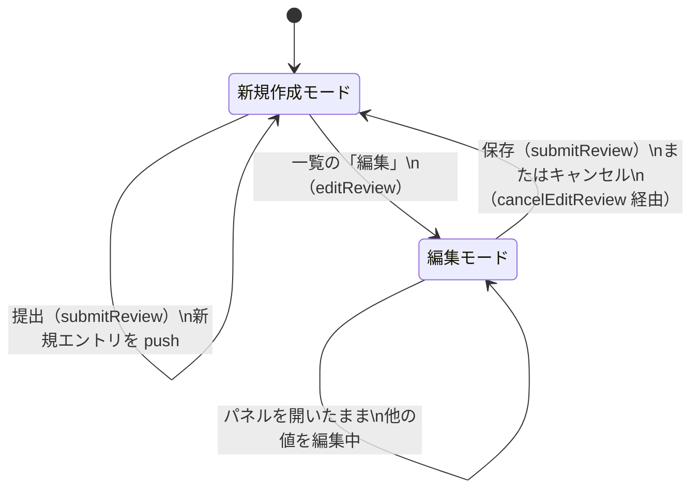

# レビューガイド: レビュー操作性の改善（ツリー見た目・レビュー提出フロー・固定ヘッダー・コメント折りたたみ・通知ベル）

## 変更概要 / 目的

`docs/ClaudeCode/skills/other/diff-review-html`（生成される差分レビュー用 HTML）に対する
5件のユーザー指摘（ツリー表示の見た目・レビュー操作ボタンの整理・ファイルヘッダー固定・
コメント折りたたみ・通知のベル化）を実装した。詳細は `requirements.md`/`design.md` 参照。

## 重要ポイント

- **`.file` の `overflow: hidden` を外した**（`templates/style.css`）。これが sticky な
  ファイルヘッダーの前提（decisions.md には残していないが research.md F1〜F3 で検証済み:
  `overflow: hidden` があると `.file` 自身がスクロールコンテナ化し、`position: sticky` の
  基準が `#pane-center` ではなく `.file` になって効かなくなる）。角丸のクリップ責務を
  `.file-head`（上2角）/`.file-body`（下2角）に分割した。
- **レビュー提出フローは3ボタン→1ボタンに統合**（`#btn-submit-open` 撤去）。パネルを
  閉じる経路（ボタン・キー `r`・`Escape`）を `closeSubmitPanel()` に一本化した
  （decisions.md D6）。編集中に閉じると暗黙にキャンセルされる。
- **提出済みレビュー結果の編集は「新規作成モードと編集モードを同じフォームで切り替える」**
  実装（`editingReviewId` というモジュール変数が2モードを分ける）。専用の「キャンセル」
  ボタンは新設せず、パネルを閉じる操作＝キャンセルにしている。
- **通知ベルは「対応不要のお知らせ」2箇所だけを対象**にした（`templates/app.js:110` の
  読み込み成功、`submitReview()` の提出/更新成功）。エラー系バナーは従来どおり画面上部。
  対象範囲の判断根拠は research.md F7 の表。
- **review 工程で2回差し戻しが発生した**（decisions.md D9/D10）。1回目は「折りたたむと
  重大度バッジが消える」（`.thread-head` に無かった）。その修正が「展開時に重大度が
  二重表示される」という新しい欠陥を生み、2回目の差し戻しで直した。**この経緯は
  `templates/app.js` の該当箇所のコメントにも残してある**ので、なぜ「先頭コメントだけ
  `.who` の重大度バッジを省く」という一見不自然な条件（`comment !== thread.comments[0]`）
  になっているかはそこで追える。

## 処理フロー（レビュー結果の新規作成 / 編集の切り替え）

## 主要な変更箇所

- `templates/style.css:317-345`（`.file`/`.file-head`/`.file-body`） — sticky 化と角丸の
  クリップ責務の分割。
- `templates/app.js:1952-2094`（`renderReviewList`/`reviewEntry`/`editReview`/
  `cancelEditReview`/`deleteReview`/`submitReview`/`closeSubmitPanel`） — レビュー結果の
  一覧・編集・削除の中心。
- `templates/app.js:1564-1650`（`renderThread`/`renderComment`） — コメント折りたたみと、
  D9/D10 で調整した重大度バッジの表示箇所。
- `templates/app.js:315-360`（通知ベル本体） — `notify`/`renderNotifList`/
  `updateNotifBadge`/`toggleNotifPanel`。

## リスク / 確認したい点

- **jsdom による headless DOM 検証**（`test-result.md` 参照。51件）で主要な操作フローは
  実際にクリック/入力して確認しているが、**実ブラウザでの見た目**（sticky の追従・
  ポップオーバーの表示位置・配色）は未確認（test-result.md「未検証の穴」）。可能であれば
  一度ブラウザで `diff_review.py html --repo .` の出力を開いて目視確認してほしい。
- readonly ビルド（`--readonly`）でも壊れていないことは確認済みだが、提出済みレビュー
  結果の一覧（`#review-list`）自体が readonly では出力されない仕様（rw ブロック内）のまま
  据え置いている。将来「readonly でも過去のレビュー結果を読めるようにしたい」という
  要望が出た場合は、この一覧を rw ブロックの外へ出す設計変更が必要（decisions.md D9 の
  「影響」に理由を記載）。
