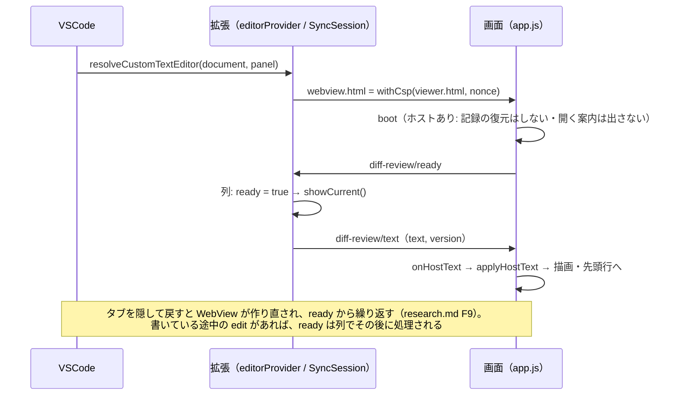
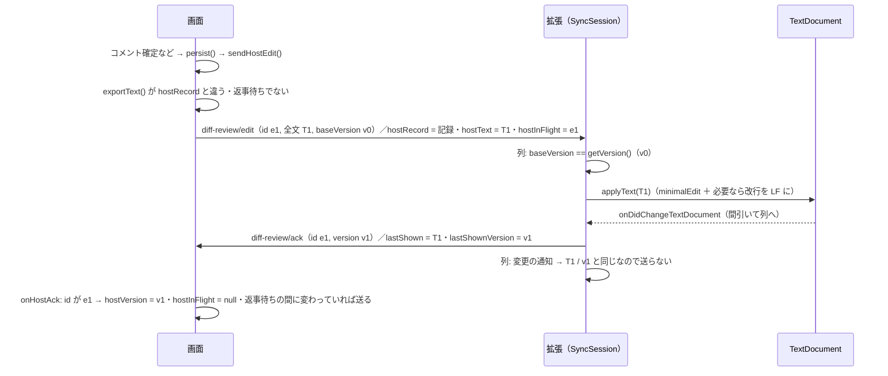

# 仕様: `.dreview` を VSCode で開いて読み書きする拡張機能

## 概要

VSCode の `CustomTextEditorProvider` で `.dreview` を開き、`diff_review.py view` が生成したビューアを
WebView に載せる。**拡張はファイルと画面をつなぐだけ**で、バンドルの解析・検証・描画・正規形の書き出しは
すべて**ビューアの JS（HTML 版と共通）**が行う。

- 開く: 拡張は CSP と nonce を付けたビューアを WebView に出す。画面が「用意できた」と知らせたら、
  拡張は**文書のテキストをそのまま**（文書の版を添えて）渡す。画面がそれを解析して描く。
- 書く: 画面で**記録**が変わるたびに、画面が**正規形のバンドル全文**を作って（編集 id と、基にした版を添えて）拡張へ送る。
  拡張は版が今のものと同じときだけ文書へ書き、その編集への返事を 1 つだけ返す。
  VSCode の未保存・保存・元に戻す・閉じるときの確認がそのまま効く。
- 追従する: 文書が変わったら（元に戻す・外部変更）、拡張はテキストを画面へ送る。画面は、差分が同じなら
  **記録だけ差し替え**（スクロール・現在行・展開・行とファイルの入力欄を保つ）、差分が変わっていれば作り直す。

## 設計方針

- **同期方式**: 裏の文書は `TextDocument`（decisions.md D3。research.md F1, F2, F12-F14）。
- **同期の整合**（D10）: 文書の版（`document.version`）で古い内容を基にした編集を退ける。画面の編集には id を付け、
  拡張は**その編集への返事を 1 つだけ**（`ack` か、今の文書を `conflict: true` 付きで）返す。画面は返事が来るまで
  次の編集を送らない。拡張は `ready`・編集・文書の変更の通知を**1 本の列で順に**処理する。
  画面は「記録が変わったとき」だけ送り（記録の正規形 `exportText()` で比べる）、拡張は「画面に出ている文書」
  （`lastShown` のテキストと版）と違うときだけ送る。これで更新ループ（公式ガイドの注意。research.md F2）も作らない。
- **橋渡しの置き場所**: 画面側は `templates/app.js` の「ホストがいるとき」の分岐（D4）。配色は `templates/ui.js`。
  拡張は**スクリプトを差し込まない**。拡張の同期の判断は VSCode に依存しない `src/sync.ts` に置く（D10）。
- **同梱するビューア**: ビルド時に `python3 ../diff_review.py view --out media/viewer.html` で生成。コミットしない（D5）。
- **言語・置き場所**: `docs/ClaudeCode/skills/other/diff-review-html/vscode/`、TypeScript、実行時依存ゼロ（D6）。
- **正規形**: 既存の `sortDeep` + `JSON.stringify(…, null, 2)` に U+2028/2029 の退避を足す（D8）。
- **HTML 版だけの操作**: ホストがいるときは出さない（D9）。

## 対象範囲

- 変更: `templates/app.js`
  - ホストとの橋渡し（`ready` / `text` / `edit` / `ack`）と、正規形のバンドル全文の書き出し
  - 文書の差し替え（差分が同じならその場で記録だけ・違えば作り直し・壊れていれば空にして理由）
  - `persist()`: ホストがいるときは `localStorage` に下書きと「確認済み」だけを書き、記録の変化を拡張へ送る
  - 起動: ホストがいるときは記録を `localStorage` から復元せず、開く案内も出さない
  - HTML 版だけの操作の出し分けと、入力欄の `Ctrl+Z` / `Ctrl+Y` の保護
- 変更: `templates/ui.js`（「自動」テーマを VSCode の配色に合わせる）
- 変更: `tests/test_diff_review.py`（橋渡しが HTML 版で眠っていることの静的な検査・`view` の出力の縛りの維持）
- 変更: `SKILL.md`（「エディタ拡張から使う」節を、書き込みを含む契約に更新。拡張の場所を案内）
- 新規: `vscode/`（拡張一式）
  - `package.json` / `tsconfig.json` / `.gitignore` / `.vscodeignore` / `README.md`
  - `scripts/build-viewer.mjs`（`media/viewer.html` を生成）
  - `src/extension.ts`・`src/editorProvider.ts`・`src/sync.ts`・`src/viewerHtml.ts`・`src/minimalEdit.ts`
  - `test/unit/*.test.ts`（`node:test`）・`test/e2e/*.ts`（実機の VSCode を CDP で操作）
- 変えない: `diff_review.py`・`templates/page.html`・`templates/style.css`、レビュー記録とバンドルの形式。
  `view` の出力の**形**（空の `#bundle-data`・`<script src>` が無い・決定論的）も変えない
  （テンプレートの JS が増えるので、出力のバイト列そのものは変わる）。

## 依拠する既存の事実

- 画面の描画は `textContent` だけで、`innerHTML` を使わない（`templates/app.js:3-5` の約束）。
- ビューアの `message` リスナーは形で検査し、関係の無いメッセージは無視する（`templates/app.js:2763-2770`）。
- `adoptBundle` は `validateBundle`（`templates/app.js:78-93`）で検査し、`applyDiffData` で画面の状態を
  すべて作り直し、`adoptRecord` → `persist` → `renderAll` → `focusFirstRow` の順に呼ぶ（`templates/app.js:95-114`,
  `:57-76`）。
- `adoptRecord(record, note)` は記録を画面の `state` に写し、id の採番を記録の最大値から続ける
  （`templates/app.js:384-428`）。`persist` を呼ばない。
- `renderThreads` はスレッドの置き場（`[data-threads]`）を作り直し、コメント一覧・提出済みレビューの一覧・
  未提出の件数・未解決のバッジも描き直す（`templates/app.js:1605-1621`）。行とファイルの入力欄の置き場
  （`[data-composer]`）は行・ファイルの描画で作られる（`templates/app.js:1045, 1449, 1551`）ので、
  `renderThreads` では消えない。**返信と編集の入力欄の置き場はスレッドの中**（`templates/app.js:1801-1802`）なので、
  `renderThreads` で作り直される。
- 入力欄の中身は `drafts[key]` に入り、入力のたびに `persist()` が呼ばれる（`templates/app.js:2044-2048`）。
  入力欄を開くと `drafts[key]` から中身が戻る（`templates/app.js:2011-2025` の `draftOf` / `openComposer`）。
- 書き込みの操作はすべて `persist()` を通る（`templates/app.js:265-277`。呼び出し 13 か所——`grep -c "persist()"`）。
- 「確認済み」（`viewedFiles`）は記録に入らない: `canonicalRecord`（`templates/app.js:225-257`）は `viewedFiles` を
  読まず、`persist` のコメントもそう明記している（`templates/app.js:269-270`）。
- 差分が空でも操作できる書き込み: 全体へのコメント（`#overall .comment-open`、`templates/app.js:2735-2740`）と
  レビューの提出（`#btn-start-review`、`templates/app.js:2594-2614`）。
- 記録の正規形は `sortDeep` / `canonicalRecord` / `exportText`（`templates/app.js:205-261`）。`exportText` は
  `JSON.stringify(sortDeep(…), null, 2) + "\n"`（`:259-261`）。前置きは `BUNDLE_PREFIX`
  （`"window.__DIFF_REVIEW_BUNDLE__ = "`）/ `BUNDLE_SUFFIX`（`";\n"`）（`templates/app.js:2343-2344`）、
  解析は `parseBundleText`（`:2346-2353`）、スキーマ名は `BUNDLE_SCHEMA`（`:26`）、ファイルの描画は `renderFiles`（`:915`）。
- ビューアは受け取った `files` のオブジェクトに書き込まない（`templates/app.js`・`rich.js` に `file.<名前> =` の
  代入が無いことを grep で確認）。
- `wire()` は多くの要素を「あれば繋ぐ」形で結線する（`templates/app.js:2588-2590`）が、`#file-import` は
  **無条件に** `getElementById(...).addEventListener` している（`templates/app.js:2662`）ので、外すと例外になる。
- HTML 版だけの要素: `#btn-reset-draft`（`templates/page.html:61`）・`#btn-open-file` / `#file-import`（`:64-65`）・
  `#btn-download`（`:144`）・`#open-prompt`（`:196`）。`<body>` にはクラスが付いていない（`templates/page.html:17`）。
- テーマは `ui.js` の `applyTheme`（`templates/ui.js:68-79`）で `data-theme` を付け外しし、無ければ
  `prefers-color-scheme` に従う（`templates/style.css:40-41`）。
- Python の正規形は `dumps_canonical` = `json.dumps(obj, ensure_ascii=False, indent=2, sort_keys=True) + "\n"`
  （`diff_review.py:72-78`）。バンドルは `bundle_text` = `BUNDLE_PREFIX + js_safe(dumps_canonical(…).rstrip("\n")) + ";\n"`
  （`diff_review.py:114-117`）、`js_safe` は U+2028/2029 を退避する（`diff_review.py:90-96`）。書き出しは UTF-8・LF で
  BOM を付けない（`write_out`、`diff_review.py:171-177`）。検証は `check` サブコマンド（`diff_review.py:1332`, `:1864`）。
- `view` の出力の `<script` は、`templates/page.html:7, 240-245` の 7 か所が行頭のタグで、残る 1 か所は
  `templates/app.js:2828` のコメント内（research.md の調査中に `grep -n "<script"` で確認）。
- Python の unittest は現在 140 件（このセッションで `python3 -m unittest discover -s tests` が報告）。
- VSCode の振る舞い（既定で開く・CSP・保存・元に戻す・外部変更・キー・配色・WebView の作り直し・`localStorage` の
  永続）は research.md F3-F20, F25-F26 を実機（VSCode 1.138.0 linux-x64）で確認済み。**Windows 版 VSCode は未確認**。
- `document.version` は開いたとき 1、編集で 2、**保存では増えず** 2、元に戻すで 3（実機。design 中の追加の計測）。
  **未保存の文書は、外でファイルが書き換わっても読み直されない**（同じ計測。VSCode 標準の衝突の扱いになる）。
- **CRLF の文書に LF のテキストを入れると CRLF に揃えられる**。同じ `WorkspaceEdit` に
  `TextEdit.setEndOfLine(EndOfLine.LF)` を入れると LF になり、保存しても LF（同じ計測）。
- BOM 付きファイルの保存の扱いは**未確認**。
- `view` の出力の縛り（`#bundle-data` が空・`__DIFF_REVIEW_BUNDLE__` を含む行が 1 行・`<script src=` が無い）
  （`tests/test_diff_review.py:932-972`）。

## インターフェース / データ構造

### 画面 ⇄ 拡張のメッセージ（新しい契約）

| 向き | メッセージ | いつ |
|---|---|---|
| 画面 → 拡張 | `{ type: "diff-review/ready" }` | 画面が起動し終えたとき（**WebView が作り直されるたびに**毎回） |
| 画面 → 拡張 | `{ type: "diff-review/edit", id, text, baseVersion }` | 画面で**記録**が変わったとき（正規形のバンドル全文。返事待ちでないときだけ） |
| 拡張 → 画面 | `{ type: "diff-review/ack", id, version }` | その編集を文書へ書けた、または全文が既に文書と同じだったとき（そのあとの版） |
| 拡張 → 画面 | `{ type: "diff-review/text", id, text, version, conflict: true }` | その編集を**書かなかった／書いたが直後に文書が別物になった**とき（今の文書で答える） |
| 拡張 → 画面 | `{ type: "diff-review/text", text, version }` | `ready` を受けたとき／文書の中身か版が `lastShown` と違うとき（id は付かない） |

- 編集の id は画面ごとに一意（画面の起動時の乱数 ＋ 連番）。**1 つの編集には `ack` か `conflict` 付きの `text` の
  どちらか 1 つだけ**が返る。
- 既存の `{ type: "diff-review/bundle", bundle }` とバンドルそのものの受け取り（HTML に埋めて使うホスト向け）は残す。
- `diff-review/text` と `diff-review/ack` は**ホストがいるときだけ**受ける（HTML 版の取り込み口は増やさない）。

### ビューア（`templates/app.js`）に足すもの

```text
var host = null;            // acquireVsCodeApi() の戻り値。HTML 版では null のまま
var hostPage = "";          // 画面ごとの乱数（編集 id の頭）
var hostSeq = 0;            // 編集 id の連番
var hostText = null;        // 最後に受けた文書のテキスト、または最後に送った全文（壊れていても入れる）
var hostVersion = null;     // いまの表示が基にしている文書の版（text / ack で更新）
var hostRecord = null;      // いま表示している記録の正規形（exportText()）。null = 送らない（未読込・採用中・壊れている）
var hostDiffKey = null;     // 差分部分の同一性: JSON.stringify(sortDeep([target, files, !!rich_enabled]))。壊れたら null
var hostBroken = false;     // 文書が壊れている（差分を空にして理由を出している）
var hostBrokenRecord = null;// 壊れたときの（空の）記録の正規形。これと違えば「保存されない変更」がある
var hostInFlight = null;    // 返事待ちの編集 id（無ければ null）
var hostResend = false;     // 返事待ちの間に記録がさらに変わった

function bundleText()            // 正規形のバンドル全文
function onHostText(msg)         // 拡張から文書を受けた（返事でも、知らせでも）
function onHostAck(msg)          // 拡張が編集を書いた
function applyHostText(text)     // 文書のテキストを採用（壊れ・同じ差分・違う差分の 3 通り）
function sendHostEdit()          // 記録が変わっていれば、返事待ちでなければ全文を送る
function wireHost()              // ホストがいるときだけ: 操作の出し分け・Ctrl+Z 保護・ready の送信
```

- `bundleText()` = `BUNDLE_PREFIX + 退避(JSON.stringify(sortDeep({ schema: BUNDLE_SCHEMA, target: diffData.target,
  files: diffData.files, rich_enabled: !!diffData.rich_enabled, review: canonicalRecord() }), null, 2)) + BUNDLE_SUFFIX`。
  `JSON.stringify` は末尾に改行を付けないので、Python の `dumps_canonical(…).rstrip("\n")` と同じ本体になり、
  `BUNDLE_SUFFIX`（`";\n"`）で `bundle_text` と同じ終わり方になる。退避は U+2028 → `\u2028`、U+2029 → `\u2029`（`js_safe` と同じ）。
- `__DIFF_REVIEW_BUNDLE__` は `BUNDLE_PREFIX` の定義行でしか書かない（`tests/test_diff_review.py:955-957` の縛り）。
- `acquireVsCodeApi` を呼ぶのは `typeof acquireVsCodeApi === "function"` の分岐の中の 1 か所だけ（research.md F11）。

### 拡張（`vscode/`）

```text
src/extension.ts       activate(context): media/viewer.html を読み、DreviewEditorProvider を登録する
src/editorProvider.ts  class DreviewEditorProvider implements vscode.CustomTextEditorProvider
                       （WebView の設定・SyncSession の生成・VSCode のイベントとの結線だけ）
src/sync.ts            class SyncSession（VSCode に依存しない。下記）
src/viewerHtml.ts      withCsp(template: string, nonce: string): string   // CSP の meta と nonce を付ける
                       makeNonce(): string
src/minimalEdit.ts     minimalEdit(oldText: string, newText: string): { start: number; end: number; insert: string } | null
```

```text
interface SyncHost {
  getText(): string;
  getVersion(): number;
  applyText(next: string): Thenable<boolean>;   // 文書を next にする（最小の範囲の置き換え＋改行を LF に）
  post(message: object): void;                  // WebView へ送る
  warn(message: string): void;                  // 書けなかったときの通知
}
class SyncSession {
  constructor(host: SyncHost, debounceMs = 50)
  onWebviewMessage(message: unknown): void      // ready / edit → 列に積む
  onDocumentChanged(): void                     // その文書の onDidChangeTextDocument → 間引いて列に積む
  dispose(): void
}
```

- `package.json`:
  - `contributes.customEditors`: `viewType: "diffReview.editor"`、`selector: [{ filenamePattern: "*.dreview" }]`、
    `priority: "default"`。
  - `capabilities.untrustedWorkspaces.supported: true`（実行しないので安全。要件の非機能）。
  - `engines.vscode: "^1.90.0"`、`publisher: "local"`、`main: "./out/src/extension.js"`。
  - `scripts`: `build:viewer`（`node scripts/build-viewer.mjs`）／`compile`（`tsc -p .`）／`build`（両方）／
    `test:unit`（`build` → `node --test out/test/unit/`）／`test:e2e`（`build` → `node out/test/e2e/run.js`）／
    `package`（`build` → `vsce package`）。
  - `devDependencies`: `typescript`・`@types/vscode@1.90.0`・`@types/node`・`@vscode/test-electron`・`@vscode/vsce`・
    `playwright-core`。`dependencies` は持たない。
- `.vscodeignore`: `node_modules/**`・`src/**`・`test/**`・`out/test/**`・`scripts/**`・`.vscode-test/**`・`tsconfig.json`・`*.vsix`
  （`.vsix` に入るのは `package.json`・`README.md`・`out/src/**`・`media/viewer.html`）。
- CSP: `default-src 'none'; img-src data:; style-src 'unsafe-inline'; script-src 'nonce-<N>'; frame-src 'self';`
  （research.md F4 の方針から、使っていない `${cspSource}` を除いた形。`connect-src` を持たないので通信は起きない）。
  `<meta charset="utf-8">` の直後に置く。
- nonce は**行頭の `<script`** にだけ付ける（`/^<script/gm`）。本物のタグはすべて行頭にあり、`app.js` のコメント内の
  `<script src>` を書き換えない。
- `webview.options = { enableScripts: true, localResourceRoots: [] }`（ファイルを読ませない）。
  `retainContextWhenHidden` は使わない（作り直しは `ready` で吸収する。メモリを持ち続けない）。

## 振る舞いの詳細

### 拡張の `SyncSession`（1 本の列）

`ready`・`edit`・文書の変更の通知を **Promise の鎖（1 本の列）**に積み、前のものが終わってから次を処理する。

- `lastShown` / `lastShownVersion`: 画面に出ているはずの文書のテキストと版。`showCurrent(extra)` は
  `lastShown = getText()`、`lastShownVersion = getVersion()` にして `{ type: "diff-review/text", text, version, ...extra }` を送る。
- `ready`: `ready = true` にして `showCurrent()`。
- 文書の変更: `onDocumentChanged()` は **50ms 間引いて**から列に積む。順番が来たら、`ready` でなければ何もしない。
  `getText() === lastShown` かつ `getVersion() === lastShownVersion` なら何もしない。どちらかが違えば `showCurrent()`
  （中身が同じで版だけ進んだときも送る——画面の `hostVersion` を今の版に揃えるため）。
- `edit`（`id`, `text`, `baseVersion`）:
  1. `baseVersion !== getVersion()` → 書かずに `showCurrent({ id, conflict: true })`。
  2. `text !== getText()` なら `applyText(text)`。`false` → `warn` で知らせ、`showCurrent({ id, conflict: true })`。
     書けたが `getText() !== text`（書いている間に別の変更が入った）→ `showCurrent({ id, conflict: true })`。
  3. それ以外（書けた・もともと同じ）→ `lastShown = getText()`、`lastShownVersion = getVersion()` にして
     `{ type: "diff-review/ack", id, version: lastShownVersion }`。
- 自分が書いた変更の通知は、間引きのあと `edit` の処理が終わってから列で順番が来るので、そのときには
  `lastShown` / `lastShownVersion` が書いたあとのものになっていて、送られない。
- `applyText` は `minimalEdit` で共通の前後を除いた範囲だけを置き換える（公式ガイドの「最小の変更」。形式は知らない）。
  文書の改行が CRLF なら同じ `WorkspaceEdit` に `setEndOfLine(LF)` を入れる（VSCode は挿入した改行を文書の改行に
  揃えるため。design 中の計測で確認）。これで正規形でない文書も最初の編集で全文が正規形になる（D2）。
  `minimalEdit` はサロゲートペアと CRLF の途中で範囲を切らない。

### 開く・作り直し



- 差分が変わった（初回・壊れていた後を含む）ときの採用: `applyDiffData`（バンドルから）→ `localStorage` から**下書きと
  「確認済み」だけ**を戻す（`storageKey` は差分の digest ごと。`templates/app.js:62`）→ `adoptRecord(review)` →
  `renderAll` → `focusFirstRow`。`persist` は呼ばない。**書きかけは下書きとして残り、入力欄を開き直すと戻る**
  （タブを隠して戻したときも同じ。F7 で `localStorage` が残ることを確認済み）。

### 書く



- 画面の `sendHostEdit()`:
  1. `host` が無ければ何もしない。
  2. `hostBroken` なら送らない。`exportText() !== hostBrokenRecord`（壊れている間に書いた）なら
     「文書が壊れているため、画面での変更は保存されません」をバナー（置き場 `host-broken`）に出す。
  3. `hostRecord === null`（未読込・採用中）なら何もしない。
  4. `exportText() === hostRecord` なら何もしない（**記録が変わらない `persist()` は送らない**: 入力欄への入力・
     「確認済み」の切り替えは記録に入らないので、文書に触れない。F4・decisions.md D2）。
  5. 返事待ち（`hostInFlight !== null`）なら `hostResend = true` にして終わる。
  6. 全文を作って送る（`id = hostPage + ":" + (++hostSeq)`、`baseVersion = hostVersion`）。`hostRecord`・`hostText`・
     `hostInFlight` を更新。
- 画面の `onHostAck(msg)`: `msg.id !== hostInFlight` なら何もしない（別の画面の編集への返事）。一致したら
  `hostInFlight = null`・`hostVersion = msg.version`。`hostResend` なら下ろして `sendHostEdit()`（最新の全文。間の変更はまとまる）。

### 追従する（元に戻す・外部変更・すれ違い）

- 画面の `onHostText(msg)`:
  1. `msg.id` があって `hostInFlight` と一致したら**自分の編集への返事**: `hostInFlight = null`・`hostResend = false`。
     `msg.conflict` なら「文書が同時に変更されたため、直前の画面での変更は反映されませんでした（文書の内容で
     表示し直しました）」をバナー（置き場 `host-conflict`）に出す。
  2. 返事でない（id が無い・一致しない）ときに返事待ちなら、その編集はこのあと退けられる（版が進んでいるため）。
     返事待ちの間に重ねた変更はこの採用で消えるので `hostResend = false`（知らせは 1. の返事が来たときに出る）。
  3. `hostVersion = msg.version`。
  4. `msg.text === hostText` なら、ここで終わる（同じ文書を表示済み。壊れていたものが同じまま、も含む）。
  5. `applyHostText(msg.text)`、そのあと `hostText = msg.text`（**壊れていても入れる**。D10）。
- `applyHostText(text)`:
  1. 今の `hostDiffKey` を `prevKey` に取っておき、`hostRecord = null`・`hostDiffKey = null` にする
     （**採用の途中で `persist()` が呼ばれても送らない**）。
  2. 先頭の BOM を剥がして `parseBundleText` → `validateBundle`。
  3. 失敗 → `hostBroken = true`。差分を**空にして**（`applyDiffData` に空の差分）`renderAll`、バナー（置き場
     `host-load`）に理由（「テキストエディタで開き直して直してください」を添える）。`hostBrokenRecord = exportText()`。
     `hostRecord`・`hostDiffKey` は `null` のまま。差分が空なので行・ファイルへの書き込みはできず、全体へのコメントと
     レビューの提出で書いたものは 2 の知らせが出る（送らない）。
  4. 成功 → `hostBroken = false`、置き場 `host-load` と `host-broken` のバナーを消す（`host-conflict` は消さない）。
     キーが `prevKey` と同じ（差分が同じ）なら **記録だけ差し替え**: `adoptRecord(bundle.review || 空の記録)` →
     `renderThreads()`。行・展開・スクロール・現在行・行とファイルの入力欄はそのまま（`renderFiles` を呼ばない）。
     コメント一覧・提出済みレビューの一覧・件数も `renderThreads` が描き直す。**返信・編集の入力欄はスレッドと一緒に
     作り直されて閉じる**（書きかけは下書きに残り、開き直すと戻る）。提出の編集中だったレビューが消えていれば
     編集を取り消す。キーが違えば（初回・壊れていた後で `prevKey` が `null` を含む）「開く・作り直し」の採用（先頭行へ。
     AC8 の例外）。最後に `hostRecord = exportText()`・`hostDiffKey` = 新しいキー。

### ホストがいるときだけの振る舞い

- `wireHost()`: `#btn-open-file`・`#btn-reset-draft`・`#btn-download` を DOM から外す（D9）。`#file-import`（隠れた
  ファイル入力）は `wire()` が無条件に結線するので残す（`#btn-open-file` が無いので辿り着けない）。
  D&D は取り込まない（`drop` で何もしない。ドラッグ中の目印も出さない）。`beforeunload` の確認はしない。
  開く案内（`#open-prompt`）は出さない。
  入力欄（`textarea`・文字の `input`・`contenteditable`）を起点とする `Ctrl/⌘+Z`・`Ctrl/⌘+Y`（Shift を含む）の keydown を
  `stopPropagation()` する（`preventDefault()` はしない。research.md F18, F19）。最後に `diff-review/ready` を送る。
- `persist()`: `localStorage` に**下書きと「確認済み」だけ**を書き（記録 `state` は書かない）、`sendHostEdit()` を呼ぶ。
- 起動（`boot`）: `localStorage` の記録（`state`）は復元しない（文書と食い違うため）。
- それ以外の `Ctrl+S`・`Ctrl+Z`（行の上）・`Ctrl+P` は VSCode へ届く（research.md F16, F17, F20）。

### 配色（`ui.js`）

- 「自動」のとき、`<body>` に `vscode-dark` / `vscode-high-contrast` があれば `data-theme="dark"`、`vscode-light` /
  `vscode-high-contrast-light` があれば `data-theme="light"` を付ける。どれも無ければ今どおり外す（OS に従う）。
- `<body>` の `class` の変化を `MutationObserver` で見て、「自動」の間だけ付け直す（配色を切り替えるとその場で変わる。F25）。
- 「自動」のボタンの説明は、VSCode の配色が取れているときは「テーマ: VSCode に従う」にする。
- 「ライト」「ダーク」を手で選んだときは今どおりそれに従う。
- この分岐は `host` ではなく **`<body>` の `vscode-*` クラスの有無**で閉じる（HTML 版の `<body>` にはクラスが無い。
  `templates/page.html:17`）。

## ドメイン固有の考慮

- **HTML 版の性質を壊さない**: `app.js` に足す分岐は `host`（`acquireVsCodeApi` の有無）で、`ui.js` の配色は
  `<body>` の `vscode-*` クラスの有無で閉じ、どちらも HTML 版では動かない。`view` / `html` の出力の形
  （決定論・外部参照 0・`#bundle-data` が空）は保つ。
- **XSS 非解釈**: 画面の描画は今どおり `textContent`（`templates/app.js:3-5`）。拡張は文書のテキストを HTML に埋めない
  （メッセージで渡す）ので、文書の中身が HTML として解釈される経路が無い。
- **実行しない**: 拡張も画面も、文書のテキストを JS として評価しない（`parseBundleText` は前後を剥がして
  `JSON.parse` するだけ）。CSP で nonce の無いスクリプトは動かない。
- **文字コード**: 改行は LF に揃える（上記）。BOM は VSCode のファイルの文字コードの設定が決めるので拡張からは変えない
  （`diff_review.py` は BOM を付けない。`diff_review.py:171-177`）。BOM 付きで保存されたファイルの扱いは未確認で、
  README に既知の制約として書く。
- **未保存の文書と外部変更**: 未保存の間に外でファイルが書き換わっても VSCode は読み直さない（計測）。保存時の衝突は
  VSCode 標準の扱いに任せる（AC8 は未保存でない文書が対象）。

## エラー処理 / 異常系

- 文書が壊れている・別形式・版違い → 差分を空にして、画面のバナーに理由（`validateBundle` / `parseBundleText` の文言）。
  VSCode の「エディターを開き直す」でテキストエディタに切り替えられる（VSCode 標準の機能を塞がない）。
  直ると次の `diff-review/text` で作り直す（D10）。壊れている間に画面で書いたものは保存されないと知らせる。
- 編集が退けられた・書いた直後に文書が別物になった（すれ違い）→ バナーで知らせ、文書の内容で表示し直す。
- 文書へ書けない（`applyText` が `false`）→ `showWarningMessage` と、`conflict: true` 付きの送り直し。
- `media/viewer.html` が無い（ビルド忘れ）→ `activate` で読み込めず例外。README の手順で防ぐ（unit テストでも検出）。
- `ready` の前には送らない。列の途中で例外が出ても、次の処理は続ける（`warn` で知らせる）。

## 受け入れ基準との対応

- AC1: `customEditors` の `*.dreview`・`priority: default`（F3）＋ `ready` → `diff-review/text` → 描画。
  入力は VSCode が開いた `.dreview` の文書のテキスト。
- AC2: 画面は HTML 版と同じビューア（同じ `view` の出力）で、同じ `validateBundle` / `adoptRecord` / `renderAll` の経路で描く。
  入力は同じバンドル。
- AC3: 書き込みの操作はすべて `persist()` → `sendHostEdit()` → `SyncSession` → `applyText` で文書が未保存になる。
  入力は画面の操作（既存のボタン・キー）。
- AC4: 送る全文は `bundleText()`（`bundle_text` と同じ規則。上の「ビューアに足すもの」）、改行は LF（`applyText`）。
  保存は VSCode（F13）。入力は保存したファイル。e2e で `diff_review.py check` に通し、Python の
  `bundle_text(target, files, rich_enabled, review)` で作り直したものとバイト一致を比べる。
- AC5: 記録が変わらなければ送らない（`sendHostEdit` の 4.）ので、開いただけでは文書に触れない。元に戻すは VSCode の
  文書の元に戻す（F12）なので、元のテキストに戻る。入力は正規形の `.dreview` と CRLF の `.dreview`。
- AC6: VSCode の元に戻す → 文書の変更 → `SyncSession` が `diff-review/text` → その場の差し替え（F12, F17）。
  入力は VSCode の元に戻す・やり直しのコマンド。
- AC7: `TextDocument` の未保存を VSCode が扱う（閉じるときの確認は VSCode 標準）。入力は未保存の文書を閉じる操作。
- AC8: 差分が同じなら記録だけ差し替え（行を作り直さない）ので、スクロールと現在行が残る。入力は外部で
  `diff_review.py comment` 等が書き換えた文書（VSCode が読み直す。F14）。
- AC9: `applyHostText` の解析・検証の失敗で、差分を空にして理由をバナーに出す。入力は壊れた・別形式・版違いの文書。
- AC10: CSP（nonce・`default-src 'none'`・`connect-src` 無し）。拡張も画面も文書を評価しない。
  `untrustedWorkspaces.supported: true`。入力は生成した WebView の HTML と、e2e での CSP 違反・通信の観測。
- AC11: `media/viewer.html` はビルドで `view` から生成（コミットしない）。unit テストで「同梱物 == `view` の出力」を確かめる。
  拡張のソースには解析・検証・描画・正規形の処理が無い（テキストと版を運ぶだけ）。入力は `view` の出力と拡張のソース。
- AC12: 既存の Python の unittest を回す。加えて Python の unittest で**静的に**、`acquireVsCodeApi` の呼び出しが
  `typeof acquireVsCodeApi === "function"` の分岐の中の 1 か所だけであること、`ui.js` の配色の分岐が `vscode-` クラスで
  閉じていることを検査する。実行時は test 工程で HTML 版を headless Chromium で開き、ホスト向けのメッセージが
  出ないこと・書き込みの流れが今どおりであることを確かめる。入力は `html` / `view` / `bundle` の出力とテンプレートのソース。
- AC13: `npm run package` で `.vsix`。README に手順。`SKILL.md` の節を更新。入力は `vscode/` のソース。
- AC14: e2e（実機の VSCode を CDP で操作）で開く・編集・保存・外部変更を確かめる。2MB 以上のバンドルで、
  コメント確定から画面反映までの時間を測る（目安 1 秒以内。research.md F27 の見込み）。`SyncSession` のすれ違い・
  元に戻す → やり直し・壊れる → 戻る・作り直しの順序は unit テストで確かめる。入力は fixture とこのリポジトリから作ったバンドル。
- AC15: `ui.js` の配色の判定（`vscode-dark` / `vscode-light`）。入力は VSCode の配色の設定。e2e で切り替えて `data-theme` を見る。
- AC16: `.vscodeignore`（上の一覧）で `.vsix` の中身を絞る。`vscode/.gitignore` で `node_modules`・`out`・
  `media/viewer.html`・`.vscode-test`・`*.vsix` を外す。入力は `vsce ls` の一覧と `git status`。
- AC-I1: 既定で開く（F3）。「エディターを開き直す」は VSCode 標準。閉じるときの確認は VSCode 標準（AC7）。
  入力はエクスプローラーからの操作。
- AC-I2: 確定は既存の操作（ボタン／`Ctrl+Enter`）→ 文書が未保存に。`Esc` で入力欄を閉じても記録は変わらないので
  文書に触れない。確定した操作は VSCode の元に戻すで取り消せる（AC6）。入力はキー操作。
- AC-I3: `j`/`k`・`c`・`Ctrl+Enter`・`Ctrl+S` が WebView の中で効く（F15, F16）。入力は実キー入力（e2e）。
- AC-I4: 開いたら先頭行（`focusFirstRow`）。差し替えでは行を作り直さないので現在行が残る。入力は開く操作と外部変更。
- AC-I5: 入力欄の `Ctrl+Z` / `Ctrl+Y` の伝播を止める（F19）。`Ctrl+S`・`Ctrl+P` は VSCode に届く（F16, F20）。
  入力は入力欄の中と行の上での実キー入力（e2e）。
