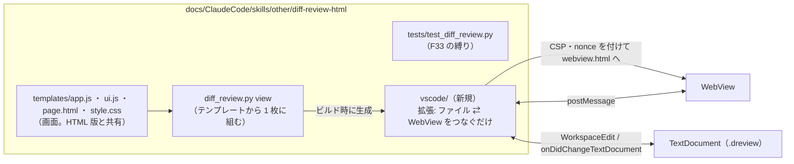

# 調査: `.dreview` を VSCode で開いて読み書きする拡張機能

調査に使ったもの（すべてセッションのスクラッチ上。成果物には含めない）:

- **実機の VSCode 1.138.0（linux-x64）**を `@vscode/test-electron` の `downloadAndUnzipVSCode('stable')` で取得し、
  WSLg（`DISPLAY=:0`）上で起動した。**利用者の VSCode（Windows 側）には一切触れていない**。
- 調査用の最小拡張（`CustomTextEditorProvider`・`*.dreview`・`priority: default`）に、`diff_review.py view` の
  出力をそのまま載せ、WebView 内に**計測用スクリプト**（`acquireVsCodeApi` でホストへ報告する）を差し込んだ。
- 拡張ホスト側の検査は `@vscode/test-electron` の `runTests`、**実キー入力**は VSCode を
  `--remote-debugging-port` 付きで起動して playwright-core の `connectOverCDP` で操作した
  （`_electron.launch` では WebView の iframe が frames に現れなかったため）。
- 入力: `tests/fixture_repo.py` の固定リポジトリから作った `sample.dreview`（90,246 バイト・6 ファイル）と、
  このリポジトリの `HEAD~12..HEAD` から作った `big.dreview`（3,854,448 バイト・10 ファイル・rich あり）。

## 調査の問い

- Q1: どのエディタ API を使うべきか（テキスト文書を裏に持つか、独自の文書モデルか）。
- Q2: WebView で CSP をかけたとき、ビューアはそのまま動くか。CSP 無しだと何が起きるか。
- Q3: WebView の中で `localStorage`・状態保存・クリップボードはどう振る舞うか。タブを隠す／閉じると何が起きるか。
- Q4: 元に戻す・やり直し・保存・外部変更は、どこまで VSCode が面倒を見てくれるか。
- Q5: WebView の中のキー入力（ビューアのキー・`Ctrl+S`・`Ctrl+Z`・`Ctrl+P`）はどこへ届くか。
- Q6: 画面の JS で、Python と**バイト一致する**正規形のバンドルを書き出せるか。
- Q7: 配色を VSCode に合わせる手掛かりは何か。
- Q8: 大きなバンドルでの所要時間。
- Q9: ビューア側のどこを変えれば、ホストと書き込みを往復できるか（既存の口と、それを縛っているテスト）。
- Q10: UI の規範（VSCode のカスタムエディタで確立したやり方）。

## 判明した事実

### Q1 エディタ API

- F1: **`CustomTextEditorProvider` は `TextDocument` をデータモデルに使い、元に戻す・バックアップを
  エディタ側が扱う**。一次資料: `@types/vscode@1.90.0` の `index.d.ts:9633-9662`
  （「Text based custom editors use a TextDocument as their data model. This considerably simplifies
  implementing a custom editor as it allows the editor to handle many common operations such as undo and backup.
  The provider is responsible for synchronizing text changes between the webview and the TextDocument.」）。
  独自の文書モデル（`CustomEditorProvider`）は元に戻す・やり直しを `CustomDocumentEditEvent.undo/redo` で
  自前実装する形（同 `index.d.ts:9690-9721`）。
- F2: 公式ガイド（https://code.visualstudio.com/api/extension-guides/custom-editors）は
  「テキスト形式なら `CustomTextEditorProvider`、バイナリなら `CustomEditorProvider`」とし、
  テキスト形式は「保存とホットエグジット用のバックアップを VS Code が実装できる」と書く。
  同期は「WebView → メッセージ → 拡張が `WorkspaceEdit` で文書へ書く」「文書の変更 → WebView へ新しい状態を
  post」で、**「WebView の編集 → `onDidChangeTextDocument` → WebView 更新 → さらに編集」という更新ループを
  作らないこと**、不正な状態を**エラーとして表示すること**を求めている。
- F3: `package.json` の `contributes.customEditors` に `selector: [{ filenamePattern: "*.dreview" }]`・
  `priority: "default"` を書くと、`vscode.open` で**このエディタが既定で開く**（実機: 開いたタブの
  `input.viewType === "diffReviewProto.editor"`）。

### Q2 CSP

- F4: 次の CSP で、`view` の出力（インライン `<script>` 4 本・インライン `<style>` 1 本・JSON ブロック 3 本、
  `templates/page.html:7,15,240-245`）が**エラー 0 件・CSP 違反 0 件**で起動し、埋め込んだバンドルから
  6 ファイル・265 行を描いた（実機の計測用スクリプトの報告）:
  `default-src 'none'; img-src ${webview.cspSource} data:; style-src 'unsafe-inline'; script-src 'nonce-<N>'; frame-src 'self';`
  ——nonce は **`<script` を `<script nonce="<N>"` に置き換える 1 回の文字列置換**で全ブロックに付いた
  （当初案の契約 `SKILL.md:464` どおり）。
- F5: **CSP を付けないと、VSCode は何も制限しない**（インラインスクリプトがそのまま動く。実機で
  CSP 無しの版でも 6 ファイルを描いた）。**CSP は拡張の責任**。`index.d.ts:9252-9255` も CSP の設定を求めている。
- F6: `rich.js` は `data:image/svg+xml;base64,` の画像（`templates/rich.js:22`）と
  `<iframe sandbox="" srcdoc>`（`templates/rich.js:10,106`）を使う。上の CSP の `img-src data:` と
  `frame-src 'self'` で違反は出なかった（`sample.dreview` は rich を含む）。

### Q3 WebView の保存領域・ライフサイクル

- F7: WebView の `localStorage` は**使える**（`setItem`/`getItem` が往復）。**タブを隠して戻しても、
  エディタを閉じて開き直しても値が残る**。WebView の origin は開き直しても同じだった
  （`vscode-webview://17tqe5t6…`）。
- F8: `acquireVsCodeApi().setState()` の値は**隠して戻したときは残り、閉じて開き直すと消える**（`null`）。
- F9: **タブを隠して戻すと WebView は読み込み直される**（`retainContextWhenHidden: false` の既定。
  戻したときに `load` の報告がもう一度来た）。読み込み直しは **`resolveCustomTextEditor` の時点で設定した
  `webview.html` から**起動し直す——**その後に `postMessage` で渡した内容は失われる**。
  `index.d.ts:9337-9353` も同じ（隠すと iframe の内容は破棄され、見えるようになると作り直される）。
- F10: `navigator.clipboard.writeText` は WebView で**関数として存在する**（実際にコピーできるかは未確認）。
- F11: `acquireVsCodeApi` は**1 ページで 1 回しか呼べない**（`index.d.ts:9244` のコメント
  「acquireVsCodeApi can only be invoked once」）。

### Q4 元に戻す・保存・外部変更

- F12: `WorkspaceEdit` で文書全体を置き換える → `undo` コマンド → 文書が元のテキストに戻り **未保存でなくなる**
  → `redo` で再適用され未保存に戻る（実機。`onDidChangeTextDocument` は 3 回の操作で計 6 回飛んだ＝
  **自分の編集でも・元に戻すでも発火する**）。
- F13: `workbench.action.files.save` で保存すると、ディスクの中身が文書と一致し、**LF のまま**（CRLF は混ざらない）。
- F14: 編集していない文書のファイルを外から書き換えると、VSCode が**自動で読み直し**、
  `onDidChangeTextDocument` が 1 回飛ぶ（未保存にはならない）。

### Q5 キー入力（実キー入力。playwright-core で VSCode のウィンドウへ送った）

- F15: ビューアのキーは WebView の中で効く: `j` で現在行が 1 行下へ移った／`c` でコメント欄（`TEXTAREA`）が開いた／
  `?` でビューアのヘルプが開いた。
- F16: WebView の中で **`Ctrl+S` を押すと、そのカスタムエディタの文書が保存される**（ディスクに反映・未保存が消えた）。
- F17: WebView の中（行にフォーカス）で **`Ctrl+Z` を押すと、文書の元に戻すになる**（未保存が消えた）。
- F18: **コメント欄（`TEXTAREA`）に入力中に `Ctrl+Z` を押しても、入力欄の取り消しにならず、文書の元に戻すになる**
  （入力欄の値 `"abc"` はそのまま、文書の未保存が消えた）。**AC-I5 に反する既定の振る舞い**。
- F19: F18 は、WebView の中で**入力欄を起点とする `Ctrl+Z` / `Ctrl+Y`（`Ctrl+Shift+Z` を含む）の keydown を
  `stopPropagation()` する**だけで解消した（入力欄の値が `"xyz"` → `""` に戻り、文書は未保存のまま）。
  `preventDefault()` はしない（入力欄の既定の取り消しを生かすため）。
- F20: WebView の中で **`Ctrl+P` を押すと VSCode のクイックオープンが開く**（VSCode のキー割り当ては WebView からも効く）。

### Q6 正規形のバイト一致

- F21: `diff_review.py` の正規形は `json.dumps(obj, ensure_ascii=False, indent=2, sort_keys=True)`
  （`diff_review.py:72-78`）。バンドルは `BUNDLE_PREFIX + js_safe(本体) + ";\n"`、`js_safe` は
  U+2028 / U+2029 を `\u2028` / `\u2029` に退避する（`diff_review.py:90-96,114-117`）。
- F22: Node で `JSON.stringify(sortDeep(obj), null, 2)` に U+2028/2029 の退避を足したものは、
  **`sample.dreview`（90,246 バイト）と `big.dreview`（3,854,448 バイト、U+2028/2029 を含む文字列 4 か所）の両方で
  Python の出力とバイト一致した**。
- F23: ただし `JSON.stringify` と Python の `sort_keys` は、**整数に見えるキー**（`"10"` と `"2"` の順）と
  **BMP 外の文字を含むキー**（UTF-16 と符号位置の並び順）で食い違いうる。実データには**どちらも 0 件**
  （2 本のバンドルを走査）で、キーはすべて固定のスキーマ名。浮動小数も 0 件（`richdiff.py` の小数は SVG の
  文字列に `%` で埋めてあり、JSON の数値にはならない。`richdiff.py:410-490`）。
- F24: 画面には既に**記録（`diff-review/2`）の正規形**の書き出しがある（`templates/app.js:205-261` の
  `sortDeep` / `canonicalRecord` / `exportText`）。コメントには「script 側と同じ形なので書き出し → 読み込み →
  再書き出しでバイト一致する」とある（`templates/app.js:6-7`）。

### Q7 配色

- F25: WebView の `<body>` には VSCode の配色に応じて `class="vscode-dark"` / `"vscode-light"` と
  `data-vscode-theme-kind` が付き、**配色を切り替えるとその場で変わる**（実機で Light Modern ⇄ Dark Modern）。
- F26: **WebView の `prefers-color-scheme` は VSCode の配色に追従しなかった**（ダークにしても `false`）。
  ビューアの「自動」テーマは `prefers-color-scheme` に従う作り（`templates/style.css:40`、
  `templates/ui.js:68-71` は `data-theme` 属性が無ければ OS 任せ）ので、**このままでは VSCode のダークでも明るく出る**。

### Q8 所要時間

- F27: headless Chromium で、埋め込みから起動して描き終わるまで `sample` 592ms / `big` 1,321ms。
  起動後に `postMessage` でバンドルを渡して描き直すまで `sample` 123ms / `big`（3.85MB）691ms。
  Node での正規形の書き出しは `big` で 57ms。**要件の目安（2MB で 1 秒以内）には収まる見込み**。

### Q9 ビューア側の口と、それを縛るテスト

- F29: `adoptBundle`（`templates/app.js:95-114`）は `applyDiffData`（`:57-76`）で**画面の状態を全部作り直し**、
  `focusFirstRow()` で先頭行へフォーカスを移し、通知を積む。実機でもホストから渡すと
  フォーカスが先頭行へ移った。**外部変更への追従（AC8 のスクロール位置・現在行の維持）にはこのままでは使えない**。
- F30: 書き込みの操作はすべて `persist()` を呼ぶ（`templates/app.js` に 13 か所。本体は `:265-277` で
  `localStorage` へ下書きを書く）。
- F31: ホストからの取り込み口は `window.addEventListener("message", …)` 1 本（`templates/app.js:2763-2770`）。
- F32: 起動は `boot()`（`templates/app.js:2840-`）。`#bundle-data` を読み（`:2846`）、参照専用かどうかは
  `#diff-data` の `readonly` から取る（`:2851`）。
- F33: 既存テストの縛り: `test_intake_is_limited_to_the_three_agreed_paths`（`tests/test_diff_review.py:942-958`）は
  **`app.js` に `addEventListener("message"` があること**と、**`__DIFF_REVIEW_BUNDLE__` を含む行が
  `var BUNDLE_PREFIX =` の 1 行だけ**であることを検査する。`test_host_embed_slot_is_present_and_empty`
  （`:932-940`）は `view` の出力の `#bundle-data` が**空**であることを検査する。
  `test_never_loads_an_external_file`（`:960-972`）は `<script src=` が無いことを検査する。
- F34: HTML 版だけの操作: ファイルを開く（`#btn-open-file`、`:2658-2665`）・D&D（`:2773-2806`）・
  下書きの初期化（`#btn-reset-draft`、`resetDraft` `:299-304`）・JSON のダウンロード（`download` `:2329-2341`、
  `Blob` と `<a download>`）・`beforeunload`（`:2814-2819`）。

### Q10 UI の規範

- F35: VSCode のカスタムエディタで確立したやり方は F2 のとおり（`WorkspaceEdit` で文書へ書く／文書の変更を
  WebView へ流す／更新ループを作らない／不正な状態は表示する）。元に戻す・保存・未保存の印・閉じるときの確認は
  **VSCode 側の標準の部品が担う**（F1, F12, F13, F16）ので、拡張は**独自の保存ボタン・独自の元に戻すを作らない**のが
  規範に沿う。
- F36: キー入力の規範は「エディタのキー（保存・元に戻す・コマンドパレット）は WebView の中でも効く」（F16, F17, F20）。
  一方で**入力欄の中の元に戻すは入力欄のもの**であるのが、ブラウザ・VSCode のテキストエディタ・他の WebView
  エディタに共通の期待で、F18 の既定の振る舞いはそれに反する。F19 の対処で規範どおりになる。

## 影響範囲

- ビューア（`templates/`）: ホストへの書き込み通知、ホストからの**その場の差し替え**（UI 状態を保つ）、
  VSCode の配色への追従、入力欄の `Ctrl+Z` の保護、HTML 版だけの操作の出し分け。
- `diff_review.py`: `view` の出力は変えない想定（F33 の縛りを保つ）。
- 新規: 拡張一式（`package.json`・拡張本体・ビルド・テスト・README）。
- `SKILL.md`: 「エディタ拡張から使う」節（`SKILL.md:454-468`）。

## 実現性 / リスク

- 実現できる: 開く・CSP・編集の往復・元に戻す・保存・外部変更・配色の手掛かり・キー入力を、すべて実機で確かめた。
- リスク R1: **タブを隠すと WebView が作り直され、最初に設定した HTML から起動し直す**（F9）。
  最初に埋め込んだ内容のまま起動すると、隠す前の編集が画面から消えて見える。
- リスク R2: **自分の編集でも `onDidChangeTextDocument` が飛ぶ**（F12）。そのまま WebView へ流すと、
  ガイドの言う更新ループ・二重描画になる。
- リスク R3: **入力欄の `Ctrl+Z` が文書の元に戻すになる**（F18）。対処しないと書きかけの取り消しで
  確定済みの操作が消える。
- リスク R4: JS の正規形は、将来キーに整数風の文字列や BMP 外の文字が入ると Python とずれうる（F23）。
- リスク R5: Windows 側の VSCode（利用者の実環境）では試していない。Linux 版 1.138.0 のみ。
- リスク R6: `onDidChangeTextDocument` の間引き（ガイドの debouncing の勧め）をしないと、外部から連続で
  書き換えられたときに描き直しが重なる。

## 実装アンカー

- A1: 差分の差し替え（UI 状態を全部作り直す）（`templates/app.js:57` `applyDiffData`）
- A2: バンドルの採用（検証 → 差し替え → 記録 → 描画 → 先頭へフォーカス）（`templates/app.js:95` `adoptBundle`）
- A3: ホストからの取り込み口（`templates/app.js:2763-2770` の `message` リスナー）
- A4: 書き込みのたびに呼ばれる保存（`templates/app.js:265` `persist`。呼び出し 13 か所）
- A5: 記録の正規形（`templates/app.js:205` `sortDeep` / `:225` `canonicalRecord` / `:259` `exportText`）
- A6: バンドルの前置き・解析（`templates/app.js:2343-2353` `BUNDLE_PREFIX` / `parseBundleText`）
- A7: 起動（`templates/app.js:2840` `boot`、`:2822` `initialSource`）
- A8: HTML 版だけの操作（`templates/app.js:2658`・`:2773-2806`・`:299`・`:2329`・`:2814`）
- A9: キー処理（`templates/app.js:2466` `onKeyDown`、`:2459` `isTyping`）
- A10: 配色（`templates/ui.js:68` `applyTheme`、`templates/page.html:7-14` の先行適用、`templates/style.css:40`）
- A11: 生成（`diff_review.py:1185` `render_html`、`:1175` `strip_write_ui`、`:1255` `cmd_view`）
- A12: 正規形の定義（`diff_review.py:72` `dumps_canonical`、`:90` `js_safe`、`:114` `bundle_text`）
- A13: 縛っているテスト（`tests/test_diff_review.py:932-972`）
- A14: 当初案の契約（`SKILL.md:454-468`）
- A15: 拡張のソースの置き場所（未特定 — design で決める。skill ディレクトリ直下に `vscode/` を想定）

## 実装時の注意

- **`acquireVsCodeApi` は 1 回しか呼べない**（F11）。画面の JS と、拡張が差し込むスクリプトの両方で呼ぶと、
  後の方が例外になる。呼ぶ場所を 1 か所に決める。
- **`<script` の一括置換で nonce を付ける**と、`type="application/json"` のブロックにも nonce が付く（無害）。
  置換の前に `#bundle-data` を埋めると、バンドルの本文中の `<script` 文字列まで置換してしまう——
  **本文は `<` を `<` に退避してから埋める**（`SKILL.md:462`）ので本文に `<script` は現れないが、
  **置換は埋める前に行う**のが安全。
- 調査中、`_electron.launch` では WebView の iframe を frames として取れなかった。実キー入力の検査は
  `--remote-debugging-port` ＋ `connectOverCDP` で行う。また、ファイルを**起動引数で開くと、
  前回のユーザーデータに残った状態でテキストエディタが開くことがあった**——検査ではユーザーデータを毎回新しくし、
  起動後にクイックオープンで開く。
- WebView の幅が 900px 以下だと、ビューアは 1 段組になり**ページ全体がスクロールする**
  （`templates/style.css:280-289` で `.pane { overflow: visible }`）。実機の既定のウィンドウではこちらになった。
  **スクロール位置の保存は `#pane-center` とページ全体の両方を見る**必要がある。
- `adoptBundle` は通知ベルに「読み込みました」を積む。自分の編集や元に戻すのたびに積むとベルが埋まる。

## design への申し送り

- 裏の文書は **`CustomTextEditorProvider`**（F1, F2, F12-F14。元に戻す・保存・バックアップ・閉じるときの確認を
  VSCode に任せられる）。独自の文書モデルは採らない。
- **起動時に最新を取りに行く**（R1）。埋め込みに頼らず、画面が「用意できた」と知らせたらホストが
  現在の文書を渡す形にすると、隠して戻したときも最新になる。
- **更新ループと二重描画を避ける**（R2）。画面が送った内容と同じ文書の変更は、画面へ送り返さない
  （または画面側で同じなら何もしない）。
- **入力欄の `Ctrl+Z` / `Ctrl+Y` の伝播を止める**（R3, F19）。
- **ホストからの差し替えは 2 種類に分ける**: 同じ差分（`diff_digest` が同じ）なら記録だけ差し替えて UI 状態を保つ／
  差分が変わったら今の `adoptBundle` と同じく作り直す（AC8 の例外と一致）。
- **正規形のバンドルの書き出しは画面の JS に 1 つだけ置く**（HTML 版と VSCode 版で共有）。
  Python との一致はテストで固定する（F22）。R4 は、キーの並びを Python と同じ規則で決める
  自前の直列化にするか、テストで監視するかを design で決める。
- 配色は **`<body>` の `vscode-dark` / `vscode-light` を「自動」の判定に使う**（F25, F26）。
- HTML 版だけの操作（F34）の扱いを決める。ファイルを開く・D&D・下書きの初期化・ダウンロード・`beforeunload` は
  VSCode では文書が唯一の真実なので、意味が変わる。
- `view` の出力は変えずに（F33）、拡張がビルド時に取り込む形にする。
- 検査は 2 層になる見込み: 拡張ホスト上の自動テスト（`@vscode/test-electron`）と、実キー入力の e2e
  （`connectOverCDP`）。後者をリポジトリに置くかは design で決める。
