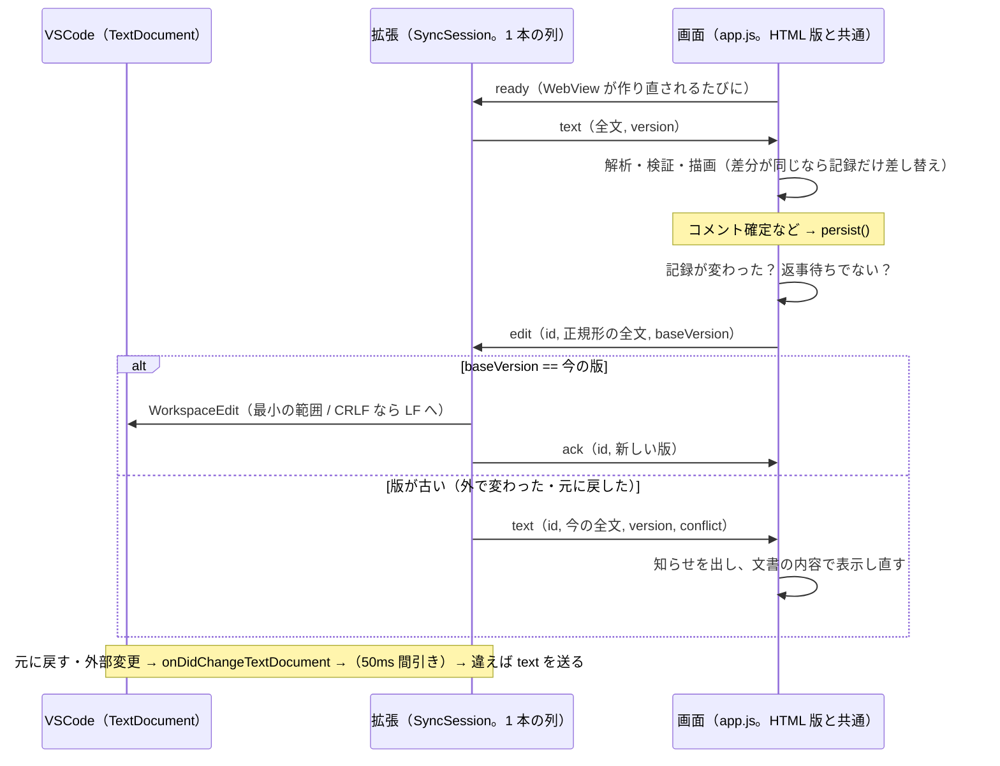

# レビューガイド: `.dreview` を VSCode で開いて読み書きする拡張機能

## 変更概要 / 目的

`diff-review-html` の `.dreview`（差分＋レビュー指摘）を VSCode で開き、HTML 版と**同じ画面**でコメントを書いて
`Ctrl+S` で保存できるようにした（requirements.md）。ユーザーの指示「HTML 版と VSCode 版でコードを共有し、同じ実装を
増やさない」に従い、**解析・検証・描画・正規形の書き出しは画面の JS（`templates/app.js`）にしか無い**。拡張
（`vscode/`）は「文書のテキストと版」と「画面」をメッセージでつなぐだけ。

## 重要ポイント

1. **拡張は画面の中身を知らない**（decisions.md D3, D4）。拡張が送るのは `.dreview` の全文、受け取るのは画面が作った
   正規形の全文だけ。バンドルの形式を解釈するコードは拡張側に 1 行も無い。
2. **同期は「版＋返事 1 つ」の約束**（D10）。画面の編集は基にした文書の版を持ち、拡張は版が古い編集を書かずに
   `conflict` で退ける。編集 1 つに返事（`ack` か `conflict` 付きの `text`）は 1 つだけ。設計の独立点検で 2 回、
   すれ違いの穴を指摘されて直した経緯がある。
3. **開いただけ・見ただけでは文書に触れない**（D2）。画面は「記録（`canonicalRecord(true)` の文字列）」が変わったときだけ
   送る。入力欄への入力や「確認済み」は記録に入らない。
4. **文書へ書く記録は Python の書き方に合わせる**（D14, D15, レビュー ラウンド1）: id を振り直さない・スレッドを並べ替えない・
   記録そのものの `target` を保つ。これで画面での解決が `diff_review.py resolve` とバイト一致し、打ち消し合う操作で元の
   バイト列に戻る。HTML 版の「JSON を書き出す」は今どおり振り直す（`canonicalRecord()` の引数なし）。
5. **VSCode の既定の振る舞いへの手当て**（research.md）: 入力欄の中の `Ctrl+Z` は VSCode の文書の元に戻すに化ける
   （F18）→ 入力欄起点の `Ctrl+Z`/`Ctrl+Y` の伝播だけ止める。WebView の `prefers-color-scheme` は VSCode の配色に
   追従しない（F26）→ `<body>` の `vscode-*` クラスを見る。CRLF の文書に入れた LF は CRLF に揃えられる →
   最初の編集で `setEndOfLine(LF)`。
6. **HTML 版は変わらない**。追加の分岐は `host`（`acquireVsCodeApi` の有無）と `<body>` の `vscode-*` クラスで閉じ、
   Python の unittest（`EditorHostBridgeTest`）が門の式そのものを押さえる（変異で落ちることを確認済み）。

## 処理フロー

## 主要な変更箇所

- `templates/app.js:244` `canonicalRecord(keepIds)` — 文書へ書くときは id・スレッドの順・記録の target を保つ。
- `templates/app.js:2426` `bundleText` — Python の `bundle_text` と同じバイト列（U+2028/2029 の退避を含む）。
- `templates/app.js:2444` `sendHostEdit` / `:2463` `onHostAck` / `:2474` `onHostText` — 画面側の同期（返事待ち・送り直し・知らせ）。
- `templates/app.js:2498` `applyHostText` / `:2536` `adoptHostBundle` — 壊れ（空にして理由）・同じ差分（記録だけ）・違う差分（作り直し）。
- `templates/app.js:290` `persist` / `:3009` `wireHost` / `:3056` `boot` の分岐 — ホストがいるときだけの振る舞い。
- `templates/ui.js:71` `hostThemeKind` — VSCode の配色への追従。
- `vscode/src/sync.ts:41` `SyncSession` — 拡張側の同期の判断（VSCode 非依存。`:108` 編集の処理、`:93` 変更の通知）。
- `vscode/src/editorProvider.ts:13`・`:38` — WebView の設定と文書の書き換え（最小の範囲 / CRLF）。
- `vscode/src/viewerHtml.ts:24` `withCsp` — CSP（`default-src 'none'`・nonce）。行頭の `<script` だけに nonce。
- テスト: `tests/test_diff_review.py` `EditorHostBridgeTest`（静的）、`vscode/test/unit/`（CSP・最小の範囲・同期の順序）、
  `vscode/test/viewer/protocol.ts`（画面＋本物の同期、9 場面）、`vscode/test/e2e/run.ts`（実機の VSCode、19 場面）。

## リスク / 確認したい点

- **Windows 版・macOS 版の VSCode では試していない**（Linux 版 1.138.0 のみ）。利用者の環境で一度 `.vsix` を入れて、
  開く・コメント・`Ctrl+S`・入力欄の `Ctrl+Z` を確かめてほしい（README の「ビルドとインストール」）。
- 画面での操作と外部での書き換えが同じ瞬間に重なると、画面の操作を捨てて文書に揃える（知らせを出す）。マージはしない。
- 正規形でない `.dreview` は最初の編集で全体が正規形に置き換わり、スキーマに無い項目は落ちる（README の既知の制約）。
- e2e・`test:protocol` は画面・VSCode の取得・Chromium を要するので、Python の unittest には入っていない。
- 調査中の最初の試作（ポータブル化の前）が、ホームの `~/.vscode/argv.json`（以前からあったファイル）を VSCode の既定の
  内容で書き換えていた。以降の実行では触れていないことを確認した。
