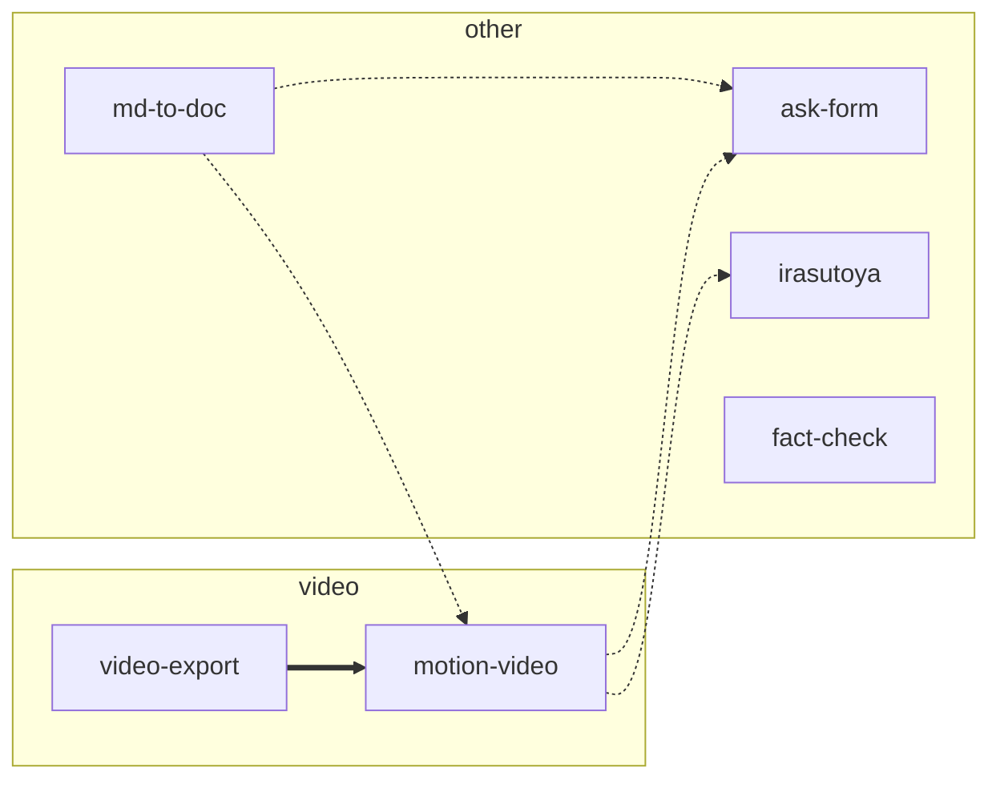

# スキルの置き場所と、スキル同士の関係

`other/` と `video/` のスキルの関係をまとめる（`aidev/`・`github/`・`wiki/` は、それぞれの中で閉じているので、ここでは扱わない）。

## 置き場所の決まり

- **必ず要る相手は、同じフォルダに置く**。隣のフォルダ（`../motion-video` など）として読み込む。
- **フォルダをまたぐのは「あれば使う」関係だけ**。相手が無くても動き、その機能だけが別の形に落ちる。
  相手は、隣 → 1 つ上の階層の別のまとまり → `~/.claude/skills` の順に探す（各スキルの `find_skill`）。

```
skills/
  video/   motion-video  video-export  tests
  other/   ask-form  md-to-doc  irasutoya  fact-check  create-devcontainer  diff-review-html  grill-me  grilling
```

## 関係の図



太い矢印は「必ず要る」（同じフォルダ）、点線は「あれば使う」。

## video/ — 動画を作る

| スキル | 役目 | 必ず要る相手 |
|---|---|---|
| motion-video | 動画のように再生できる単一 HTML を作る。プレイヤー・時間割・字幕・音楽・効果音・背景を持つ | なし（独立） |
| video-export | YouTube・YMM4・AviUtl 向けに書き出す | motion-video。yukkuri-kaisetsu の台本（`.txt`）を渡すときは、隣に yukkuri-kaisetsu も要る（下の「別のリポジトリへ移したスキル」） |

- `video/tests/` は、このまとまりの回帰テスト（`video/tests/README.md`）。

### 別のリポジトリへ移したスキル（2026-10-04）

掛け合いの解説動画のスキル（**yukkuri-kaisetsu・yukkuri-qa・yukkuri-publish**）と **youtube-upload** は、非公開のリポジトリ `yukkuri-work`（`skills/video/`）へ移した。
台本・部品・テーマと同じ場所で版をそろえるため（動画は「台本 × スキルの版」で決まる）と、素材（立ち絵・BGM など）が再配布できないため。それより前の版は、このリポジトリの履歴にある。

- 移したスキルは、今までどおり motion-video を「隣のフォルダ」として使う。`yukkuri-work/skills/link.sh` が、ここの `video/motion-video`・`video/video-export`・`other/` へのリンクを張る。
- **motion-video（`engine.js`・`build.py`・`voice.py`・`shoot.py`）を変えると、移したスキルの動画が変わる・壊れることがある**。ここのテストでは見つからないので、
  変えたら `yukkuri-work/skills/video` でも回帰テストを回す（あちらの CI は、このリポジトリの motion-video を取り出して回す）。

## other/ — 汎用・独立のもの

| スキル | 役目 | 必ず要る相手 |
|---|---|---|
| ask-form | 質問を 1 つのウィンドウにまとめて聞く | なし（独立） |
| md-to-doc | Markdown から単一 HTML の文書を作る | なし（独立） |
| irasutoya | いらすとやの絵を探して取り、SVG や動く絵にする | なし（独立） |
| fact-check | 文書の事実を、出典に当てて確かめる | なし（独立） |

create-devcontainer・diff-review-html・grill-me・grilling は、ほかのスキルと関係を持たない。

## フォルダをまたぐ関係（あれば使う）

| 使う側 | 相手 | 何に使うか | 相手が無いとき |
|---|---|---|---|
| md-to-doc・motion-video | ask-form | 作る前の指示を、1 つのウィンドウで聞く | `unavailable`・終了コード 3 が返る。端末の質問（`AskUserQuestion`）で聞く |
| md-to-doc | motion-video | 文書への動画の埋め込み・動く図 | その場所が注意の枠に置き換わる。文書は作れる |
| motion-video | irasutoya | 人物・しぐさ・場面の絵を取る | 手元の絵・ほかの素材で作る |

## 写しを持つもの

- **アイコン集（`icons.py`）**: 元は `video/motion-video/icons.py`。`other/md-to-doc/icons.py` は写し（motion-video が無くても、文書のアイコンが出るように）。
  足す・直すのは motion-video の側で行い、`cp video/motion-video/icons.py other/md-to-doc/icons.py` で写す。写し忘れは `video/tests/test_motion_build.py` が見つける。
- **Chrome を動かすテストの道具**: `video/tests/test_engine.py` の `Chrome` と、`other/ask-form/tests/chrome.py`（ask-form のテストを単独で回せるように）。

## スキルを足す・移すとき

- 必ず要る相手があれば、その相手と同じフォルダに置く。
- 別のフォルダのスキルを使うなら、無いときの動きを決め、`find_skill` で探す（`../名前` と決め打ちしない）。
- フォルダを動かしたら、`.github/workflows/video-skills.yml` の対象パスと、`~/.claude/skills` のリンクを直す。
