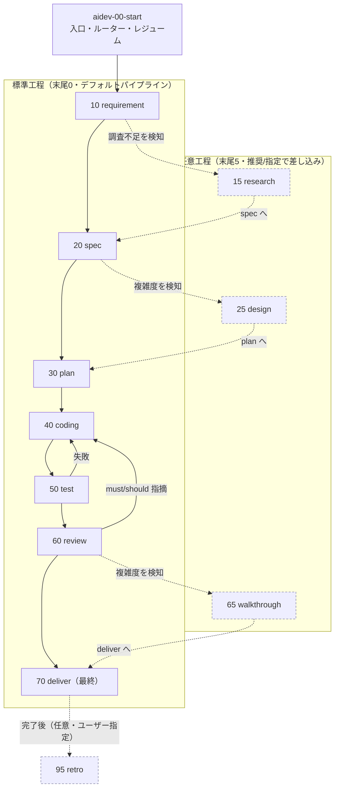
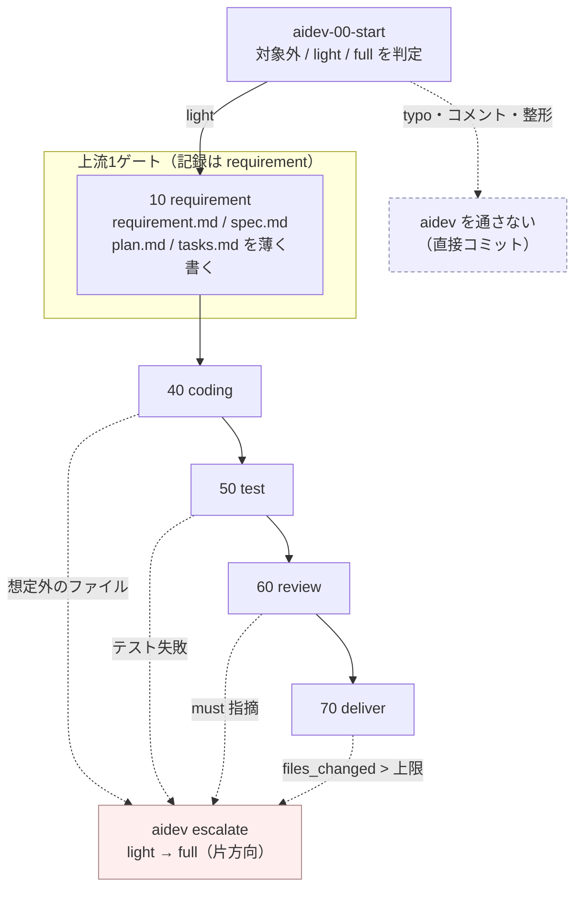
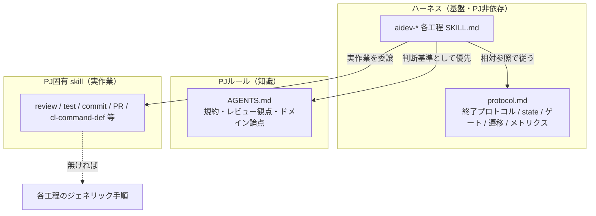
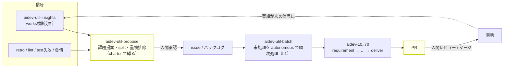
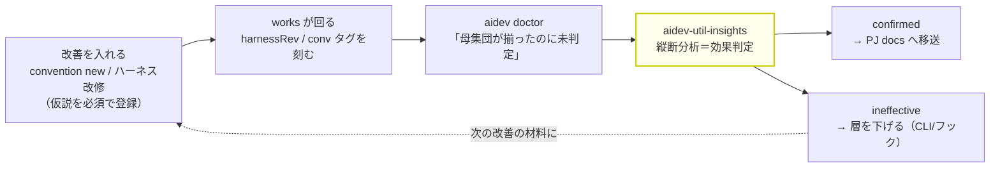

# aidev ハーネス 設計ノート（参照専用・skill実行では読まれない）

> このファイルは `SKILL.md` ではなく、どの skill / protocol からも参照されないため、
> skill 利用時には読み込まれない。**今後の aidev-* 改善のための設計記録**として残す。
> 「いま何があるか」は各 `SKILL.md` と `aidev-00-start/protocol.md` が正。
> ここには「なぜそうしたか・何を退けたか」を残す。

## 0. 全体像（図）

skill 群の関係と実行順を俯瞰するための地図。詳細な規約は `protocol.md` と各 `SKILL.md` が正。

### 0.1 工程パイプラインと差し戻し

標準工程（末尾0）を順に進み、任意工程（末尾5）は AI検知＋推奨かユーザー指定で差し込む。
各工程の末尾に承認ゲートがあり（interactive は人間 / autonomous は自動承認＋`humanGates`）、
test 失敗・review 指摘は coding へ差し戻す。



`profile: light`（「11.」）では上流3工程を1ゲートに畳む。成果物は4つとも作り（薄く）、
承認は `requirement` 1件として記録する。coding 以降は full と同一で、任意工程は使わない。



### 0.2 三層の責務分担

基盤（PJ非依存）／知識（AGENTS.md）／実作業（PJ固有 skill）を分離。各工程は実作業を PJ 資産へ
委譲し、無ければジェネリック手順にフォールバックする。ゲート・state・遷移は常に基盤が担う。



### 0.3 エコシステムと自己給餌ループ

番号なしユーティリティ（propose / batch / insights）が、パイプラインの上流・繰り返し・横断分析を担う。
両端（どの課題を起票するか・どの PR をマージするか）に人間ゲートを残し、間を自律化する。



> 黄色＝人間ゲート（前＝課題承認、後＝PR レビュー）。完全自動（発案→マージ）は高リスクのため採らない。

### 0.4 効果検証がループを閉じる（`protocol.md`「12.」）

0.3 の図の戻り（`done -.実績が次の信号に.-> insights`）は**次の課題を見つけるため**の経路で、
**入れた改善が効いたかを確かめる経路ではない**。両者は別物で、後者が無いと提案は入れっぱなしになる。
手元の指標は常に何かしら動いているため、後から見れば都合のいい説明がつく——それは検証ではなく
事後の物語作りになる。

閉じるのに要ったのは3つ。

1. **仮説を先に登録させる**。`aidev convention new` は `--hypothesis` を必須にして、
   「どの指標がどう動けば成功か」を書けない条項を**受け付けない**。書けない改修は
   そもそも効果を主張してはいけない改修なので、この関門自体が価値を持つ。
2. **母集団を特定できるようにする**。`aidev new` が `harnessRev` を刻み（手書きは忘れられる＝
   `schema:` を `new` に一本化したのと同じ理由）、条項は `introduced` を持つ。
   **またがり work**（着手時と着地時で版が違う）は効果を半分しか受けていないので母集団から外す。
3. **判定を機械が催促する**。母集団が増える瞬間は **`approve deliver` の1点**（着手しただけの work は
   review を通っておらず判定材料が無いので数えない）。そこで到達を一報し、`aidev doctor` も
   「母集団が揃ったのに未判定」を WARN する。**doctor だけでは足りない**——doctor は retro/insights の
   冒頭で回るので、**既に見に行った人にしか届かない**。判定できる状態になったことは、その瞬間に知らせる。



**陰性が結論にならない**のが PJ規約側の限界（ハーネス改修＝CLI 変更なら決定的に効くので対称ではない）。
遵守が LLM 依存で非決定的なので、指摘が減らなくても言えるのは「**散文では効かなかった**」まで。
その行き先は削除ではなく「2.6」三層モデルの**下の層**（CLI / フック）になる。

### 0.5 PJ規約は AGENTS.md に書かない（所有権と二重管理）

`protocol.md` 冒頭は「harness は PJ 固有ファイル（AGENTS.md / CLAUDE.md / docs 等）に依存しない」と
宣言しているのに、retro/insights の改善提案の宛先は長らく **AGENTS.md** だった——**依存しないと
宣言したファイルに harness が書き戻す**構造で、しかも AGENTS.md は PJ が所有し aidev を使わない人も
編集する。所有権の衝突が設計に埋まっていた。

- **生成物は `docs/aidev/` に置く**（`conventionsDir` で変更可）。AGENTS.md に触れるのは
  `<!-- aidev:conventions -->` マーカーの内側＝**読む条件つきの索引**だけ。導入時に人間が1回置き、
  以後は行の増減とリンクの張り替えのみ。aidev を使わない PJ は索引ごと消せば無害に切り離せる。
- **索引に「読む条件」を書くのは必須**。AGENTS.md は自動読込されるが `docs/aidev/` はされないので、
  移設は「確実に読まれる」を「リンクを辿れば読まれるかもしれない」に落とす。裸のリンクは辿られない。
  これは「0.」の付録テーブルが `protocol.md` 自身に対してやっているのと同じ形。
  - **索引漏れは検査対象**（`doctor` の WARN と `convention status` の `index` 列）。
    載っていない条項は読まれないので、**効果検証で「効かなかった」と誤判定される**——
    条項の内容の問題ではなく届いていないだけなのに。移設で新しく作り込んだ失敗経路なので、
    塞がないと 0.4 の効果検証そのものが信用できなくなる。
  - 「検査だけあって実行が無い」を作らないため、WARN は**足すべき行をそのまま示す**。
    判断が要るのは「いつ参照するか」の一句だけで、残りは機械が出せる。
- **`docs/aidev/` は終着点ではない**。効果が確認できたら PJ ドキュメントへ**移送**し、
  `docs/aidev/` 側は本文を捨てて tombstone にする。**本文の在処を常に1箇所**に保つことで
  二重管理を構造的に防ぐ（本文が2箇所に存在する瞬間が無い）。
  - **tombstone を消さない理由は重複排除**。跡形なく消すと同じ提案が retro から再び上がる。
  - 移送パスがあるので**定常状態では `pending` の条項しか残らない**。`docs/aidev/` が膨らんできたら
    それ自体が異常の信号（検証が回っていない / 移送が滞っている）。
- **移送自体が自己給餌ループを一周する**（`doctor` の未移送 WARN → propose → backlog → batch → PR）。
  **batch に許すのは追加と移送まで。削除・緩和は人間**——追加は効かなければ消せる（可逆）が、
  緩和は「守らなくてよくなった」状態を作り、それが正しかったかを事後に検証できない。
- **分類の語彙を発明しない**。`review.md` の条項参照タグ `[conv:<id>]` の選択肢は
  `aidev convention status` が出す id の一覧で、判断軸は「どの条項の話か」の一本。
  類型を新規に考えさせると判断がぶれて書かれなくなる（`kind` が全ファイルで欠落した失敗と同じ形）。
  タグは `review.md` を grep すれば読めるので、**metrics のキーは増やさない**
  （「2.」の追加基準「既存から導出できない」を満たさない）。

## 1. 目的と思想

- **PJ非依存の汎用ハーネス**。`.claude/skills/aidev-*` だけで自己完結し、特定PJ（AS400 等）に縛られない。
- 役割分担：
  - **ハーネス（基盤）= 開発フローの制御と進捗管理の器**。工程順・承認ゲート・遷移・state・レジューム。
  - **PJルール（AGENTS.md）= 知識**。レビュー観点・コーディング規約・ドメイン固有論点。
  - **PJ固有 skill = 実作業**。review/test/commit/PR 等の具体実行。
- 別PJへは `.claude/skills/aidev-*` と `.gitignore`（`.aidev/current` 除外）を置くだけで動く想定。

## 2. 主要な設計判断と理由

- **skills 内で自己完結（docs/ に置かない）**：実体が PJ フォルダ（docs/）にあると汎用性が崩れる。
  protocol も各工程手順も skills 内に閉じる。**ハーネス文書としての** `docs/aidev/` は一度作ったが廃止した。
  - **注意: 「12.」の条項（PJ規約）が使う `docs/aidev/` は別物**。廃止したのは*ハーネス文書*
    （protocol・工程手順）を PJ フォルダに置くことで、条項は*PJ 規約*——このPJのコードの決まり——
    なので、置き場は逆になる。**同じ原則の逆向きの適用**であって矛盾ではない。
  - 住み分けの軸は**PJ 依存かどうか**。`.claude/skills/aidev-*` と `.aidev/` は**PJ 非依存で、
    改修を各PJへ配布する対象**。だから PJ 固有の内容を混ぜない。条項は PJ ごとに中身が違うので
    配布物に入れられず、PJ 領域（`docs/`）に置く。
  - この住み分けを読み違えると、両方向に壊れる——ハーネス文書を docs/ に置けば汎用性が崩れ、
    PJ規約を `.aidev/` に置けば配布物が PJ に汚染される。**片方の記録だけを見て動かさないこと。**
- **protocol.md を単一の共通定義（ホーム = aidev-00-start）**：終了プロトコル・state 規約などの
  共通ルールを1か所に集約。各工程 SKILL.md は `../aidev-00-start/protocol.md` を相対参照する。
- **工程手順は各 SKILL.md にインライン**：工程固有の内容はその skill 内で完結（外部 phase doc 不要）。
- **状態はファイル（`.aidev/works/<YYYYMMDD-slug>/`）**：state.yml ＋ 成果物の有無で現在地が一意に決まる。
  レジュームは「ファイルを見るだけ」。独自ステートエンジンを持たない。
- **pull 型・自動遷移なし**：push（完了→次を自動起動）はランタイム依存で移植性が低い。
  各工程は前提成果物の有無を自己チェックし、遷移は人間の承認後のみ。
- **2段階ゲート → 単一3択UX → 4択（段階レビュー追加）**：当初「承認/差し戻し」→「進む/中断」の2段階。
  AskUserQuestion による**単一3択**（承認して次へ / 承認して中断 / 差し戻す）に集約（クリック最小）。
  さらに、ユーザーが md を自力通読する代わりに**主エージェントが成果物を1項目ずつ提示して確認する
  「段階レビュー」**を4つ目の選択肢として追加（`protocol.md`「3.1」）。walkthrough 工程とは別物
  （あちらは deliver 前のコードレビュー補助 md 生成、こちらは任意工程のゲート提示モード）。
- **番号規約**：skill は **10刻み**（途中挿入に強い）。**末尾0=標準工程 / 末尾5=任意工程**。
  works フォルダは **日付プレフィックス `YYYYMMDD-slug`**（UTC）。当初は単純連番 `001-slug` だったが、
  ブランチ並行作成での番号衝突（max+1 が複数ブランチで同値）を避けるため日付方式に変更。
  日付は時系列ソート・可読性・衝突回避を両立し、既存走査も不要（`date` のみ）。UUID は可読性/ソートを
  損なうため不採用。
- **命名カテゴリは「役割」で割る（トリガでは割らない）**：当初は番号付き工程とユーティリティが同じ
  `aidev-*` 名前空間で交ざり見通しが悪かった。「人間が呼ぶ / AI が呼ぶ」で割る案も出たが**退けた**——
  標準工程は interactive で人間直叩きも前工程からの遷移も、autonomous で AI 自動も起こり得る（§3「単独実行可能」
  と整合）ので、トリガは状況依存の二次属性であり命名軸に不適。安定して固有なのは**役割／レイヤ**。
  そこで ①番号付きパイプライン（`aidev-N0/N5`）②ユーティリティ（`aidev-util-*` で名前空間分離）
  ③ランタイムガード（`aidev` CLI＝skill ではない）に分け、**トリガは description 冒頭の定型タグ**で示す
  （picker と AI ルーティングが見る場所）。これに伴い retro を `90`→`95` に renumber し「末尾5=任意」不変条件を回復。
  正典は `protocol.md`「4.1」。論理名参照のおかげで renumber/改名の影響は skill 名だけに閉じた。
- **論理名で相互参照**：renumber の影響を skill 名だけに閉じ込めるため、参照は番号でなく論理名。
- **PJ資産の優先（宣言不要・自動）**：知識は AGENTS.md 自動読込で自動採用。実行物は
  「関連PJ skill があれば優先、なければジェネリック手順」。PJ側の事前宣言・設定は不要。
- **重い工程の委譲（指示ベース）**：coding/test/review は任意でサブエージェント委譲可。
  特定ツールに依存させず「委譲する」意図で記述し、各エージェントが自機構で実現（無ければインライン）。
  **承認ゲート・遷移・state はサブに委譲不可＝必ず主エージェント**（サブは対話的承認ができない）。
- **全成果物にテンプレ/スキーマ**：requirement/spec/plan/tasks/decisions/state を定義済み。
  「下敷きにAIが埋める」方式（厳格スキーマ強制まではしていない）。
- **任意工程は AI検知＋ゲート推奨**：research は requirement 終了時に調査不足を、design は spec 終了時に
  複雑度を、walkthrough は review 終了時に複雑度を検知し、遷移ゲートで推奨（理由付き）。強制せず却下可。
  retro はユーザー指定起動。
- **重い質問深掘り（grilling / `grill-me` 等）は execution mode にせず requirement/spec 内の opt-in に置く**：
  質問の重さ（16〜50問規模）は自律性の軸（`mode`）とは別物。「重い・毎回不要・複雑なときだけ効く」は任意工程と
  同じプロファイルなので、requirement/spec から **AI推奨で opt-in 起動**する（PJに質問深掘り skill があれば優先、
  無ければ同等の質問をインライン＝PJ資産優先）。**autonomous は対話前提のため基本スキップ**。標準skillに役割で
  参照し特定skillへハード依存しない（移植性）。metrics/state に乗せたくなれば末尾5の任意工程へ昇格する余地は残す。
- **バッチ駆動（`aidev-util-batch`・非番号ユーティリティ）**：バックログ（チェックリスト）の未処理を
  autonomous で順次処理する L1 オーケストレーター。実処理は autonomous aidev＋PJ資産へ委譲、繰り返しは
  L2（/loop・/schedule）。「次の1件」は毎回ファイル（未チェック行）から導出（pop カーソルを別管理しない＝
  中断再開に強い）。将来、上流に planner（課題提案→issue化、人間承認付き）を足せば自己給餌ループになるが、
  完全自動(発案→マージ)は高リスク。実用形は「AI提案＋人間が課題承認＋自律実装＋人間PRレビュー」（B→A の順で段階導入）。
- **planner（`aidev-util-propose`・A 実装）**：charter(`.aidev/charter.md`)＋信号(insights/retro/負債)から
  課題を**提案**し、split 判定で右サイズ化、承認のうえ issue/バックログ化する非番号ユーティリティ（最上流 L_planner）。
  **信号に根ざす（恣意発案しない）・人間承認が既定・charter で縛る・重複排除・提案止まり**が安全設計の柱。
  自己給餌ループ: `insights/retro → aidev-util-propose → aidev-util-batch → PR`（両端に人間ゲート）。
- **実行モード（interactive / autonomous）**：autonomous は「夜セット→朝PR」型。思想は
  **「ゲートを消す」でなく「ゲートを PR（最終レビュー）に集約し、自己チェックを固くする」**。
  人間ゲートは前（タスク指示=requirement）と後（PRレビュー）に移動し、ループ内からは外す。
  受け入れるのは主に「方向/spec 誤りの手戻り」（機械的誤りは夜間の self-correction で潰れる）。
  `humanGates`（例 [spec]）で高レバレッジ工程だけ人間を残す**部分自律**が実用的。
  安全弁必須（test硬ゲート・ループ/予算上限・PRで停止/auto-merge禁止・証跡保存）。
  実行手段（headless/スケジュール）は harness とは別レイヤ。

- **作業間依存は `state.yml` の `dependsOn` に集約（backlog 注記でなく）**：依存問題は batch 駆動だけでなく
  **手動実行（`/aidev-40-coding` 直叩き）でも起きる**。backlog 限定の `blocked-by` では手動入口を素通りする。
  各工程が開始時に必ず読む `state.yml` に持たせ、`protocol.md`「2.7」の前提チェックで評価することで、
  **全入口（batch / 手動 / 直叩き）に一律に効く**。充足判定は works slug→approved に deliver / issue `#N`→クローズ。
  挙動は **soft**（interactive=警告して続行可、autonomous/batch=保留して次へ）＝「硬ゲートは承認のみ」の思想に合わせる。
  当初は backlog 行への `blocked-by:` 注記＋batch ガードを検討したが、入口非依存にならないため退けた。

- **実行プロファイル（`profile: full | light`）を `mode` とは別フィールドにした**：`mode` は
  **誰が承認するか**（interactive / autonomous）、`profile` は**どこまで工程を回すか**。この2つは直交し、
  `light × autonomous`（夜間に小修正を回す）と `light × interactive`（手元の小修正）の両方が実在する。
  `mode` の3つ目の値（`interactive | autonomous | light`）にすると、この掛け算が表現できなくなるため退けた。
  省略時 `full` とし、`profile` を持たない既存 work は自然に full 扱い＝**schema を上げずに後方互換**
  （フィールドの有無自体がバージョンマーカーになる）。詳細は `protocol.md`「11.」。

- **light は「文書を1枚に畳む」のではなく「ゲートを1回に畳む」**：当初は上流3工程を統合した
  1文書（`brief.md`）案を検討したが、**guard が要求するファイル**（`coding`→plan.md/tasks.md、
  `review`→spec.md）を満たすために空スタブが2つ必要になり、退けた。理由は3つ。
  (1) 中身のないファイルでゲートを通すのは「欠落は欠落として残す・捏造して埋めない」（`protocol.md`「8.」）
  という本ハーネスの思想と正面から衝突し、`verify` が「spec.md あり」と誤判定する。
  (2) **`plan.md` スタブは有害**——test 工程は `plan.md` から「テスト方針」を読む（`aidev-50-test`）ため、
  空にすると test が検証対象を失う。つまり plan.md には light でも書くべき中身が最初から存在する。
  (3) 昇格（light→full）時に `brief.md` が古い記述の残った第3の文書＝孤児になる。
  結論として **4文書を薄く（必須節のサブセットで）書き、承認を1ゲートにまとめる**形にした。
  これでスタブ0個・下流 skill の分岐0箇所・新しい成果物名0個・`need_file` の CLI 変更0で成立する。

- **light の上流ゲートは `requirement` として記録する**：`plan` や `spec` として記録する案は guard と
  衝突する（`plan`→`spec.md`、`spec`→`requirement.md` を要求するため、**まだ書いていない時点で
  guard を叩くと NG**）。`requirement` は前提を持たない唯一の上流工程で、意味的にも統合文書の主節が
  「何を・なぜ」なので自然。3件を同一 ts で記録する案は、工程別所要時間が失われるため退けた
  （`protocol.md`「8.」）。副作用として **`spec` / `plan` の start が無いこと自体が light の指紋**になる。

- **昇格（light→full）は片方向で CLI 経路に集約**：`aidev escalate` を足した。`state.yml` の手編集を
  許すと「どの work がいつ昇格したか」が state だけ見て分からなくなり、この CLI の役割定義
  （state/metrics 更新の単一の検証済み経路）が崩れる。逆方向（full→light）は提供しない。
  昇格漏れは**後から気付けない**（light のまま着地すると insights の「light の手戻り率」が実態より
  良く見える）ので、`verify` が deliver 前に WARN を出す——任意工程の実施と `files_changed` の上限超過。
  **exit code は変えない**（既存 work を壊さないため。「2.6」の三層モデルと同じ判断（ソフト/ハードの線引き））。

- **「対象外」層を light と同時に定義した**：typo・コメント・整形は **aidev を通さない**と明示する。
  下限を決めないと、中身のない成果物と機械的な承認が量産され（＝「形だけ通す」）、ハーネスへの信頼が
  最も速く壊れる。light を作るとき同時に決めるべきは「どこから使うか」ではなく「**どこまで使わないか**」。

- **requirement にユーザーストーリーを入れ、受け入れ基準は `完了条件` に一元化する**：従来は
  「対象ユーザー／利用シーン」をヒアリング観点に持ちながら**テンプレートに書く節が無く**、聞いた情報が
  落ちていた。ストーリー節を新設して行き先を作った。基準をストーリー側に書き写す案は二重管理に
  なるため退け、**`完了条件` を単一の真実にして `AC` の ID でストーリーから参照する**形にした
  （spec の「受け入れ基準との対応」と test が読む先は従来どおり `完了条件`＝下流の変更が要らない）。
  - **「誰」は end user に限らない**（開発者・AI エージェント・CI も actor）。このリポジトリの作業は
    ハーネス自体の改修が多く actor が自明だが、**load-bearing なのは「なぜなら（価値）」の節**なので
    形式は空転しない。actor が自明でも価値の記述は省かない、と明記した。
  - `目的 / ゴール` には**書き方の指示が無かった**ので追加した（「達成したい状態」を書き、
    「◯◯を実装する」＝手段を書かない）。review に「価値適合」観点を足し、
    **基準を満たしても価値に繋がっていない実装**を拾えるようにした。

- **charter をパイプライン本体（requirement）にも読ませる**：`charter.md` は
  `aidev-util-propose` 専用で、**PJ のゴールと個々の work のゴールが繋がっていなかった**。
  requirement で「この work がどの charter ゴールに紐づくか」を1行書かせる。
  実効性を持たせるため**任意参照ではなく「あれば必須、無ければ不要」**とし、
  **どの charter ゴールにも紐づかない場合は黙って進めず確認する**（charter の更新が必要か、
  そもそもこの work をやるべきでないかのどちらか）。`charter.md` が無い PJ では作成を催促しない
  （harness は PJ 固有ファイルに依存しない、という前提を崩さないため）。
  なお **charter.md のテンプレートは未整備**（propose が「無ければ作成を促す」だけ）＝残る穴。

- **停止前チェック（予防層）は Stop フックが担い、`/goal` は補助に留める**：このハーネスで実際に
  起きた事故は「**やるべきことを終える前に停止する**」型が多い（`guard` と `event start` が別コマンド
  であるため、review の start が両ラウンドとも欠落した実例がある）。`aidev verify` はこれを deliver 前に
  WARN で**事後検知**できるが、**予防**には停止の手前で止める層が要る。
  - 当初は `/goal`（*Set a goal Claude checks before stopping*）を「**工程開始時に設定する**」と
    protocol に書いたが、**これは実行不能だった**——`/goal` は組み込みスラッシュコマンドで、
    **モデルに公開された skill ではなくユーザーが打つもの**。工程 skill が自分で設定できないため、
    「工程開始時に設定する」という指示は誰も実行できない。**利用可能な skill 一覧を確認せずに
    書いた**のが原因（`code-review` 等は一覧にあるが `goal` は無い）。
  - 訂正後: **機械的な予防は Stop フック**（判定は `verify --strict`）が担い、`/goal` は
    「ユーザーが任意で、記録以外の完了条件を置きたいとき」の補助に格下げした。工程を移るたびに
    更新が要る手間もあるため、常用には向かない。
  - **`requirement.md` の `目的 / ゴール` とは別物**（あちらは永続する成果物、`/goal` はセッション内の
    揮発的ガード）。work のゴールを `/goal` に入れても停止条件として粗すぎて機能しない。`protocol.md`「3.2」。

- **metrics のキーを増やす基準を3条件に定め、トークン消費は記録しないと決めた**：記録コストは
  毎工程かかるので、無条件に増やすと守られなくなる。新しいキーは次の**3つすべて**を満たす場合のみ。
  - **(a) 実測できる**——機械（git / テストランナー / チェックボックス）から取れるか、**モデル自身の
    行動回数**として数えられるもの。**自分の内部状態（消費トークン等）や主観的な難易度は不可**。
    線引きは「**行動は数えられるが内部状態は数えられない**」。内部状態は「それらしい数」に流れ、
    `protocol.md`「8.」の「捏造して埋めない」原則を崩す。
  - **(b) 改善アクションに直結する**——任意工程の発火条件・テンプレート・規約を変える材料になる。
  - **(c) 既存から導出できない**——例: 「research の効果」は `research` の start 有無 × 手戻り回数で
    層別すれば足りるので、専用キーは要らない。
  - **トークン消費は記録しない**: 工程単位に按分できず（1 工程が複数セッションにまたがり、1 セッションで
    複数工程を回す）、モデルは自分の消費量を正確に知らないため (a) を満たさない。実測が必要なら
    OpenTelemetry 等**外側の経路**で取り、`metrics.yml` には混ぜない。無駄に読んだ量の近似としては
    `unplanned_lookups` で足りる（＝(c) にも触れる）。
  - 経過時間は**壁時計値**（承認待ち・中断を含む）なので、比較するときは `state.yml` の `mode` で
    層別する。品質傾向としては**手戻り回数**の方が示唆に富む（上流工程の弱さを示すため）。

- **独立検証を実装タスクの粒度まで降ろした（`protocol.md`「3.3」(b)）**：出所は cc-sdd（Kiro 系 SDD ハーネス）の
  implementer / reviewer 分離。`/kiro-impl` はタスクごとに実装役とレビュー役を別コンテキストに分け、
  失敗が続けばデバッグ役を立てる。aidev の review は **work 単位のラウンド**なので、実装から review までの
  距離が長く、**タスク境界の記憶が薄れてから**欠陥に当たる。取り込みにあたって3点を aidev 側に合わせた。
  - **新機構にせず「3.3 独立検証」の第二形態にした**。規律（根拠なき指摘の禁止）・禁止事項（一次資料照合は
    委譲しない）・委譲の不変条件・フォールバックが (a) 文書点検とまったく同じなので、語彙を増やす理由がない。
  - **60 review の代替ではなく前段フィルタと定義し、観点を切った**（点検＝正確性・規約適合／review＝＋要件適合・
    価値適合・保守性・結合）。丸ごと前倒しすると、work の文脈が要る観点が落ちたまま review が軽くなる。
    これは `aidev-60-review` が組み込みレビューコマンドに対して引いている線と同じ形にしてある。
  - **ラウンド上限を `maxTaskCheckRounds`（既定 2）で有限にした**。cc-sdd の「デバッグ2ラウンド上限」と同じ趣旨だが、
    aidev には既に `maxSendBacks` があるので**同じ思想の別パラメータ**として並べた（ループの上限は必ず有限にする）。
  - **TDD 必須は取り込まなかった**（「3.」の退けた案）。
- **タスク点検のメトリクスキーを2つだけ足した（`task_checks` / `task_check_findings`）**：上の3条件に照らして
  (a) **行動回数**として数えられる（内部状態ではない）／(b) 発火条件を絞る・広げる材料になり、
  「findings は出ているのに `must` が減らない＝点検が効いていない」という診断が立つ／
  (c) coding 工程内の出来事はどこにも残らず既存キーから導出できない——3つとも満たす。
  分母を `tasks_done` ではなく `task_checks` にしたのは、点検しなかったタスクを分母に入れると
  **発火条件の良し悪しが指標から消える**ため。指摘の**内容**は `review.md` の専用節に置き、
  件数は metrics に置いた（同じ数を2箇所に書かない）。
- **タスクの依存を構造化し、ウェーブは導出にした（`aidev-30-plan` / `protocol.md`「2.6」）**：出所は cc-sdd の
  tasks.md（`P0` / `P1` のウェーブラベル＋依存注釈）。**ラベルは取り込まず、`依存:` 行だけを取り込んだ**。
  - **ウェーブは依存から一意に決まる**（依存を満たした未完タスクの集合）。ラベルを併記すれば**依存との
    二重管理**になり、片方だけ直された瞬間に嘘になる。「本文の在処は常に1箇所」（「12.」の移送規約）と同じ判断。
  - **`対象` アンカーが衝突判定に使える**のは aidev 固有の相乗効果。並行してよいかは
    「同一ウェーブ ∧ `対象` が重ならない ∧ 両方アンカー済み」で機械的に決まる。
    **`対象: 未特定` は必ず直列**——触る範囲が読めないものを並行させると、衝突は実装後にしか分からない。
    アンカーは「探索の省略」のために入れたが、**並行の安全判定という第二の用途**が後から乗った形。
  - **メトリクスのキーは足していない**。ウェーブ幅も並行数も `tasks.md` から導出できるので、追加基準の
    (c)「既存から導出できない」を満たさない。
  - **既定は直列**。並行は最適化であって不変条件ではないので、迷えば直列に倒す（「2.8」の過剰分割の禁止と同じ態度）。
  - 三層が別物であることに注意する。**ウェーブ**＝1 work・1 PR 内のタスク並行、**subtask**（「2.8」）＝1 PR 内の
    漸進実装単位、**worktree**（「2.7」）＝work 単位の並行。粒度も分割の理由も違う。
- **成果物の独立検証を「工程内の任意ステップ＋ゲートの条件付き選択肢」として入れた**：従来、
  委譲（「2.6」）は**書く側の負荷分散**にしか使っておらず（research の調査、design の検討、
  coding/test の実処理）、**書いたものを別コンテキストに検証させる経路が無かった**。
  中身の妥当性を見るのは人間（承認ゲート・段階レビュー）と次工程だけで、`verify` はファイルの
  有無と不変条件しか見ない。手戻りの最大の源が「方向 / spec 誤り」である以上、
  **書いた本人と同じコンテキストからは見えない穴**を埋める層に価値がある。`protocol.md`「3.3」(a)。
  - **ゲートの選択肢は 4 つが上限**（`AskUserQuestion` の制約）で、既に埋まっていた
    （次工程へ / 中断 / 差し戻す / 段階レビュー）。そこで**5 つ目を足すのではなく、上流工程では
    4 つ目を段階レビューから独立検証へ差し替える**形にした。どちらも `Other` の自由入力で
    要求できるので、片方を出しても他方は失われない。
  - **点検範囲は内部一貫性に限る**。「2.6」が既に「一次資料照合は委譲しない／内部一貫性の点検は
    委譲してよい」と線を引いていたので、その線をそのまま使った（新しい例外を作らない）。
  - **根拠のない指摘を出さない規律**を research の委譲と同じ形で課した。これが無いと
    「もっともらしいが的外れな指摘」でゲートが詰まる——委譲の失敗形として既知。
  - **「検証だけあって直す手段が無い」を作らない**（「2.6」で自覚した失敗形）。指摘は
    その場で直すか `差し戻す` に合流させ、必ず既存の分岐に着地させる。
  - **記録は増やさない**（段階レビューと同じ扱い）。差し戻しに至れば通常どおり `sent_back` に乗る。
    効果が確認できてから任意工程（末尾5）へ昇格する余地は残す——grilling を execution mode に
    せず opt-in に置いたのと同じ判断。
  - `profile: light` では使わない（承認の往復を減らす趣旨に反する。必要と感じたら昇格の合図）。

- **規約には組み込みコマンドの固有名を書かず「役割」で書く**：`/code-review` を review 工程に
  組み込む検討で、**実際に走らせてから3つの不整合が判明**した。(1) `protocol.md`「2.5」の優先順位が
  「PJ固有 / ジェネリック」の二段階しかなく、**組み込みコマンドの位置が未定義**だった。
  (2) カバー範囲が違う——正確性・保守性は見るが、要件適合・価値適合・規約適合は work の文脈を要するため
  見られない。**「委譲」と扱うと観点が3つ落ちる**ので、正しくは**併用**。
  (3) スコープの軸が違う——工程 skill は works フォルダに紐づくが、組み込みコマンドは git 差分が軸で
  `.aidev/current` を知らない（実際、対象が解決できず無関係なステージ済み差分をレビューした）。
  - 対処: 優先順位を**三段階**（PJ固有 → 組み込み → ジェネリック）に拡張し、`protocol.md`「2.10」に
    **固有名を焼き付けない**原則を明記した。名前を書いた時点で他環境で意味を失う。
  - **「使えること」を不変条件にしない**：同じ検証で、構造化出力ツール（`ReportFindings`）が
    セッションに存在せずテキスト報告に切り替わった。**出力形式や存在を前提にした成果物スキーマを
    作らない**（受け渡しはテキストを写し取る前提）。
  - 教訓として: **組み込み機構を規約に入れる前に、一度実際に走らせる**。今回は実装前に走らせたので、
    名前を焼き付ける前に止められた。

- **Claude Code の plan モードは「探索して承認を取り、解除してから書く」形でのみ使う**：plan モードは
  Write/Edit を禁じるので、成果物を書くのが仕事である aidev の工程を**そのまま完走することはできない**。
  一方、plan モード内で探索して方針の承認を取り、解除してから成果物を書く形なら成立する。
  当初「工程内では一切使わない」と決めたが、これは**言い過ぎだった**（禁じられるのは完走のみ）。
  適用の可否は「二重ゲートに見合う利得があるか」で決めた。
  - **使う**: (1) `aidev-00-start` の三層判定——影響範囲の調査が必要で、**この時点で aidev のゲートが
    まだ無い＝二重ゲートにならない**ため最も素直に効く。解除後 `aidev new` へ引き渡す。
    (2) spec / design（`full` × `interactive`・任意）——有力案が複数あるとき、**文書を書く前に方針の
    合意が取れる**。承認の対象が「方針」と「文書」で異なるので二重ゲートを許容する。
    (3) ハーネス自体の改修（aidev の対象作業ではない）。
  - **使わない**: research（`ExitPlanMode` が「調査・理解では使うな」と定義。`EnterPlanMode` も純粋な
    調査は Agent へ回すよう指示＝「2.6」の委譲が既にそれ）／**plan（成果物が完全に重複＝計画を
    二度書く）**／coding（`tasks.md` が承認済みの計画そのもの。方針変更は差し戻しを使う——差し戻しは
    metrics に残り、plan モードは残らない）／test・review・deliver・retro（実装計画ではない）／
    `profile: light`（承認の往復を減らす趣旨に反する）／`autonomous`（`ExitPlanMode` は人間の承認が前提）。
  - 「工程内で段階的に確認したい」要求には**段階レビュー**（`protocol.md`「3.1」）が対応する。
    成果物を見出し節ごとに承認するもので、plan モードとは併用しない。

## 2.5 タスク管理モデル（works = 実行の正 / backlog = 遅延キュー）

タスクの「管理」がどこに乗るかを、レイヤで分けて捉える（設計の世界観の記録）。

- **実行層 = `works/<slug>/state.yml`（基盤・常在）**：着手した作業の唯一の source of truth。
  `aidev-00-start` の「新規 requirement」直接フローは backlog なしで完結する**原初フロー**で、常に第一級
  （backlog 未導入時はこれだけで運用していた）。
- **intake 層 = backlog（任意・後付け・ローカル既定）**：**遅延／連続実行のためのキュー**。
  抽象的な役割は「autonomous ループが pop する未着手キュー」で、実体はローカル `.aidev/backlog/*.md` でも
  外部トラッカー（Jira/Redmine の未着手クエリ等）でもよい。backlog はその**ローカル既定実装**。
- **入口は2つ**：①直接（`aidev-00-start` 新規）②キュー経由（batch が backlog を pop）。着地は同じ `works`。
  流れは **backlog → works（consume）**であって works → backlog ではない。backlog 行は deliver で `[x]`。
  - **この「deliver で `[x]`」は当初②でしか実装されていなかった**——batch は消化した行を自動で `[x]` に
    するが、①には誰も消し込む者がいなかった（deliver の手順に工程が無かった）。結果、①で着手した作業が
    完了しても行は `[ ]` のまま残り、**次に着手する人が完了済みの項目を選ぶ**事故が起きた
    （2026-08-01。着手して初めて 5 日前に完了済みと判明し、同時に 7 件の閉じ忘れが出た）。
  - **設計は正しかったが、①の経路に落ちていなかった**のが穴。**散文にルールを書くだけでは足りず、
    記録と検査が要る**という「2.6」の実例になった。対処は 3 層——`state.yml` の `backlog:` 刻印
    （`aidev new --backlog`）／deliver 手順の「台帳の同期」（`aidev-70-deliver`「3.5」）／
    `aidev verify` の消し込み検査（`protocol.md`「2.9」）。
  - **鏡像の穴が②側にあった**：消し込みは②だけが自動だったが、**出自の記録は①だけが刻んでいた**
    （batch は `--backlog` を渡していなかった）。batch は同一実行内で `[x]` にする前提なので
    平常時は問題にならないが、**途中で切れると刻印が無く、後続セッションはその work が backlog 由来だと
    知る手段が無い**＝ verify も素通りする。両入口で刻むことで揃えた。
  - **着手中は backlog から見えない**という別軸の穴もある：行が `[x]` になるのは deliver なので、
    着手〜着地の間、backlog 側は掴まれた項目と素の未着手を区別できない。ここは検査ではなく
    **可視化**で埋めた——`aidev status` の `inflight` 列（そのファイルを掴んだまま未 deliver の work 数）。

### いつ backlog を使うか（判断ルール）
- **今すぐ1件** → `aidev-00-start` 直接（backlog 不要）。
- **後で／連続して複数件**（/loop・autonomous・タスク分割・計画ストック）→ backlog（または外部トラッカー）に積む。

### なぜ未着手を works に実体化しないか（state に `pending` を持たせる案を退けた理由）
全タスクを works 化し `state.yml` に `pending` 状態を持たせる案も検討したが、退けた。
works/ ノイズや「なめる state.yml が無い」問題は status フィルタで消せるが、次は構造的に残る:
- **グルーピング／共有文脈の喪失**：backlog 1ファイル＝順序つき・共有ヘッダ付きの束。N フォルダに割ると散る。
- **早すぎる 1:1 固定**：backlog 1項目は拾われる時に分割／統合／再定義され得る。先にフォルダを切ると凍結。
- **フォルダのゴミ化**：未着手の多くはやらない／言い換えられる。行は消せるがフォルダは残骸化。
- **外部トラッカーの二重持ち**：Jira 運用 PJ では未着手の正は Jira。works-pending はそれを二重化する。
→ 方針は **「保存を統一せず、ビューを統一する」**：router/insights が「works（常在）＋ backlog/トラッカー（あれば）」を
  読んで未着手＋進行中を一望する。未着手を works に実体化しない。

### ツール非依存の背骨
- `state.yml` の外部チケット参照は GitHub 固有にしない（将来 `issue:` → ツール非依存の `ticket:`。種類は PJ 設定）。
- 作業間依存 `dependsOn`（「protocol 2.7」）は **works slug を第一形式**にし、外部チケット（`#N` 等）は参照に徹する
  → 依存解決はトラッカー非依存で完結する。

### backlog ファイルの整理（複数前提）
- **standing**（ドメイン別の定常キュー：`cl.md` 等）と **split**（タスク分割由来・親に紐づく短命キュー：
  `split-<親>.md`）を区別し、自己記述ヘッダ（`kind` / `parent` / `priority`）を持たせる。
  - **当初の2値は軸が1本足りなかった**。standing/split は「ドメイン定常か、タスク分割由来か」の軸で、
    **「一件で完結したトピックか」**を表せない。実際の運用（ts5250）では大半のファイルがその第三の形
    ——特定の調査・特定の設計変更に紐づく dossier で、`parent` を持たないので split ではないが、
    消化しきったら二度と積まれないので standing でもない。**どちらでもないので誰も kind を書けず**、
    13ファイル全部で frontmatter ごと欠落した。
  - そこで **`topic`** を足した。判断軸は**「またここに積むか」**の一本にした——積むなら `standing`、
    積まないなら `split`（親あり）か `topic`（親なし）。退避の要否はこの一本で決まる。
  - **`kind` は 2026-08 まで読み手がいなかった**（CLI は `kind`/`priority` を一度もパースしていない）。
    書いても誰も見ないので書かれない、という「2.6」の実例。最初の機械的読み手は `aidev doctor` の
    backlog 節で、そこで初めて明示に意味が生まれた（未記載も誤記も WARN する）。
- 全項目消化済みは `archive/` へ退避し、active な glob を小さく保つ。複数ファイル選択は priority→名前順、
  跨ぎ依存は work レベルの `dependsOn` が担保。
  - **ここも当初は片方だけ自動だった**——batch は split を退避するが、直接入口は退避しない。
    消し込み（行）と同じ「入口が2つあって片方だけ自動」がファイル単位で再発していた
    （ts5250 で全消化 11 ファイルが未退避・`kind` 全欠落のまま検知されず）。
  - ただし**行の消し込みと違って `verify` の硬ゲートには載せられない**。退避や frontmatter は
    **ファイル自身の属性**で、どの work の deliver にも自然には紐付かない（持ち主がいない）。
    そこで `aidev doctor` の backlog 節＝**事後検知（WARN）**に置いた（`protocol.md`「2.9」）。
    「2.6」の三層モデルで言えば、**ハードにできない対象は doctor で見る**という別の置き場になる。

## 2.6 ランタイムガード（強制力の三層モデル）

散文規約（SKILL/protocol）は LLM が守る前提で**実効が非決定的**だった（「必須化」と書いても記録が抜ける）。
そこで **state/metrics の更新と前提・不変条件検査を `.claude/skills/aidev-docs/bin/` の CLI に集約**し、強制力を層に分けた。

- **三層モデル**：散文＝**ソフト**（移植可能・全エージェント共通）／ CLI＝**ハード**（決定的検査）／
  フック＝**自動化**（Claude Code のみ・任意）。各 skill は CLI を呼ぶが、**非CLI環境向けに手作業
  フォールバックを残す**（挙動同一・移植性維持）。可搬性の規約は `protocol.md`「2.10」。
- **hooks を採る方針に転換した**（当初は「採らない」と決めていた）。当初の理由は
  「hooks はツール境界でしか発火せず、記録忘れのような非ツール事象を捕捉できない」だったが、
  **これは事実として誤り**——`Stop` フックは**セッション停止時**に発火する非ツール事象のフックで、
  「終える前に記録が揃っているか」はまさにその瞬間に判定できる。利用可能なフックイベントを
  取り違えた判断だった（`PreToolUse`/`PostToolUse` だけを見ていた）。
  - **採用形**: `Stop` フックが `aidev verify --strict` を呼び、記録漏れなら `decision:"block"` で
    停止をブロックして理由を返す。**判定はフックに書かず CLI に置く**（`protocol.md`「2.10」の
    採用基準）ので、他環境では「終える前に `verify --strict` を実行せよ」の一行で等価になる。
  - **`--strict` を新設した理由**: 既定の `verify` は記録漏れを WARN 止まり（exit 0）にしている——
    既存 work を壊さないための意図的な設計。ここを FAIL に変えると過去の work が deliver できなく
    なるので、**機械ゲート専用の入口として `--strict`（exit 5）を足した**。
  - **strict でも致命にしないもの**: `profile: light` の逸脱 WARN。記録漏れは**今しか直せない**
    （metrics は追記のみで当時の timestamp は復元不能）が、light の昇格は人間の判断なので、
    停止をブロックする理由にならない。「今しか直せないものだけを止める」が strict の線引き。
  - `.aidev` が無いディレクトリでは即 `exit 0`（aidev を使っていないリポジトリに影響しない）。
  - それでも「**正しいやり方＝ガードされたやり方**」は原則として維持し、deliver の `verify` ゲートと
    `doctor` の事後検知は最後の砦として残す（フックは任意層なので、それ単独に依存しない）。
- **Node 非依存・OS両対応**：`aidev`（POSIX sh）と `aidev.ps1`（PowerShell）で挙動・出力・終了コードを一致。
  破壊的 git 操作は CLI に持たせない（`land` を作らず `verify && commit` パターン）＝安全・移植性。
- **「検査だけあって実行が無い」を作らない**（2026-08 に自覚した失敗形）。backlog は長らく
  **CLI から一切触れなかった**——`kind`/`priority` はパースすらせず、積む・消し込む・退避するは全部手作業。
  そこへ検査だけ足したので、`verify` は消し込み漏れを FAIL させるのに**消し込む手段が無く**、
  `doctor` は退避漏れを WARN するのに**退避する手段が無い**、という形になった。
  ハード層が不変条件を知っているのに**それを満たす状態を作れない**のは「正しいやり方＝ガードされた
  やり方」から外れる。対処は `aidev backlog new`（`--kind` 必須）と `aidev backlog archive`
  （判定は doctor と同一関数 `bl_archivable`）、および `aidev use`（`current` の切替手段が無かった）。
  - **境界**: 消し込み本体（`[x]` 化と根拠の併記）は CLI にしない。行の同定と文面が判断だから
    （`verify` 自身が「行の同定は諦め、slug が現れるかで見る」と割り切っている）。
    **機械にできることだけを機械に寄せ、判断は散文に残す**のが層分けの線引き。
- **version-aware verify が肝**：`new` が `state.yml` に `schema:` を刻み、`verify`/`doctor` は**導入版以上の
  不変条件のみ強制**。schema 未記載の旧 work は **legacy 免除**。これで「PJと一緒に育てる」中で新ガードを
  足しても**過去 work を遡及的に違反扱いしない**（「過去分は捏造しない」= protocol §8 と整合）。
- **`new` を作成の唯一経路にする理由**：手書きだと `schema:` 刻印を書き忘れ得る→その work が誤って legacy
  免除になり enforcement が無効化する。`new` 一本化で「全新規 work が検査対象」を保証する（enforcement の起点）。
- 退けた: `land`（verify+commit）を別コマンド化＝CLI に破壊的操作を入れると移植性/安全性が落ちるため。

## 2.7 並行作業モデル（worktree = ユーザー責任の on-ramp）

既定は**単一ワーキングツリーの直列**。複数作業を並行させたいときだけ、ユーザーが明示的に
`aidev worktree add` で work 専用の git worktree ＋ `feature/<slug>` ブランチを作って隔離着手する
（正典は `protocol.md`「1.5」、詳細は付録 `protocol-worktree.md`）。

- **並列の要否をハーネスが判断しない（人間オプトイン）**：並行させてよいかは「2 つの作業が同じ
  ファイル・同じ抽象に触るか」で決まるが、それは着手前には読み切れない。機械が並列化を提案すると、
  **衝突を作った当人が衝突に気づけない**構図になる（提案の根拠が「作業が溜まっている」でしかないため）。
  そこで **`worktree add` の明示実行だけをトリガ**にし、`aidev-00-start` は選択肢として並べるが
  **推奨しない**。他の任意工程（research/design/walkthrough）が「AI 検知＋推奨」なのと**あえて逆**
  にしてある——あちらは外しても手戻りで済むが、こちらは並行させた後で衝突が判明しても巻き戻せない。
- **`.aidev/current` が worktree ローカルである性質に乗る（INV-1）**：`current` は `.gitignore` 対象＝
  未追跡なので、各 worktree が独立した `current` を持つ。**この一点で「worktree ごとの現在地」が
  追加の状態機構なしに成立する**（`current` を追跡ファイルにしていたら worktree 間で奪い合いになり、
  並行作業のたびに差分が出ていた）。したがって **worktree 操作は main tree の `current` を絶対に
  書き換えない**を不変条件（INV-1）として置き、テストで固定してある。
- **1 worktree = 1 branch = 1 work**：3 者を 1 対 1 に固定すると、deliver の「1 works = 1 ブランチ = 1 PR」
  規約（`aidev-70-deliver`「留意点」）を**最初から満たした状態**で着手できる。worktree 側でブランチを
  切り直す判断が要らなくなる。
- **既存 work の継続はコミット済みが前提**：`works/*` は追跡対象なので、未コミットの work フォルダは
  worktree に伝播しない。`add` は worktree 内に該当 slug の work が有れば `current` 設定のみ、
  無ければ **`add` の中で `new` に委譲**する（別実装を書かず、work 作成を単一の検証済み経路に保つ＝
  `schema` 刻印の保証が並行作業でも崩れない）。
- **`list` の判定キーは「worktree ローカル `.aidev/current` の有無」**：branch 名（`feature/*`）で
  判定しない。ブランチ命名は PJ 規約に委ねている以上、命名を判定に使うと PJ ごとに壊れる。
  「aidev が使っている worktree か」は **aidev の状態ファイルがそこにあるか**で決まる。
- **破壊的 git 操作を CLI に持たせない方針（2.6）との線引き**：`worktree add/rm` は git を実行するので、
  一見この方針の例外に見える。線引きは **「履歴を書き換えない／作業成果を失わない」**——
  `add` は commit を作らず、`rm` は未コミット差分があれば**既定で拒否**し、ブランチ削除は
  `--delete-branch` の明示時のみ。commit / push / merge は依然 CLI に入れない（`verify && commit` のまま）。
  worktree の作成・撤去を手作業に残すと `current` の扱いを間違えて INV-1 を破るため、
  **ガードを付けられる操作だけを取り込んだ**という位置づけ。
- **警告文言も PJ 非依存にする**：`worktree add` が出す共有ファイル警告は、当初 `package.json(contributes)`・
  `src/fileScope.ts`・言語登録・`CL/RPG プロンプター定義` を**CLI 内で名指し**していた——開発元 PJ の名前が
  基盤（1.「PJ非依存の汎用ハーネス」）に漏れており、他 PJ に持っていくと無意味な警告が出る状態だった。
  現在は `.aidev/config.yml` の `sharedFiles` から生成し、未設定なら汎用文言へフォールバックする。
  併せて「原典照合は主エージェント実施が必須」の警告は**CLI から外した**——**機械が言えるのは config に
  ある事実だけ**で、「この work は委譲してよいか」は判断だから散文（AGENTS.md）の担当。
  2.6 の「機械にできることだけを機械に寄せ、判断は散文に残す」と同じ線引きを、警告文言にも適用した形。

## 3. 退けた案（なぜ採用しなかったか）

- **自動で次工程へ遷移**：工程ゲートの人間レビューが品質の要。自動化すると手戻りが増幅。→ ゲート式。
- **AGENTS.md への「統合宣言」必須化**：PJ側に委譲マッピングを書かせる案。過剰設計。
  AGENTS.md は自動読込・skill は description で自動採用されるため、宣言なしで成立する。→ 不要に。
- **「必ず aidev-00-start で始める」を正しさの要件にする**：別セッションの直接 `/aidev-40-coding`
  起動（コールド再開）を壊す。→ 「推奨運用」に留め、各工程は単独実行可能なまま。
- **委譲をツール束縛で表現**：`Agent` ツール前提にすると移植性が落ちる。→ 散文で意図を記述し、
  `allowed-tools` への `Agent` 追加は「Claude Code での実現手段」と位置づけ。
- **deploy 工程をデフォルト追加**：CI/CD の責務・破壊的・PJ固有性が高い。→ 原則スコープ外
  （必要なら `aidev-80` で完全委譲＋強ゲート）。
- **TDD を実装プロトコルとして必須化する（cc-sdd の `/kiro-impl` 相当）**：実作業の中身は
  AGENTS.md と PJ固有 skill の領分で、ハーネスが踏み込むと「0.2」の三層分離が壊れる。
  test を独立工程に持つ設計とも二重になる。→ 取り込まない。TDD を課したい PJ は
  **`docs/aidev/` の条項として起こす**（「12.」）＝仮説を書いて効果検証に乗せる経路がすでにある。
- **タスク点検（「3.3」(b)）で 60 review を置き換える／軽くする**：点検は差分1件しか見ておらず、
  要件適合・価値適合・結合は work 全体の文脈が要る。置き換えると**観点が落ちたことに気付けない**。
  → 前段フィルタに留め、`aidev-40-coding` の留意点にも「review を軽くしてよい、ではない」と明記した。
- **条項を `.aidev/conventions/` に置く**：構造は backlog（`.aidev/backlog/`）と同型（frontmatter・
  status・archive・doctor が WARN）なので、そちらに揃える案。→ **退けた**。`.aidev/` は
  **PJ 非依存の配布対象**で、条項は PJ ごとに中身が違う。同型なのは*ファイルの扱い方*であって
  *PJ 依存かどうか*ではない。構造の相似で置き場を決めると、配布物に PJ 固有の内容が混ざる（「2.」の住み分け）。
- **ウェーブ（`P0` / `P1`）をタスクに手で書く（cc-sdd の tasks.md 相当）**：依存との二重管理になる。
  依存が正しければウェーブは導出でき、導出できるものを書かせると**片方だけ直された瞬間に嘘になる**。
  → `依存:` 行だけを正典にした。図（mermaid）も説明であって正典ではない。
- **ウェーブや並行状態を `state.yml` に持つ**：`tasks.md` のチェックが進捗の単一の真実なので、
  同じことを state 側にも持つと**復元の起点が2つ**になる（中断・再開に耐えなくなる）。→ 都度導出する。
- **タスク点検の指摘を review のラウンド指摘に混ぜる**：件数指標が1本にまとまって楽に見えるが、
  **母集団が違う**（点検で潰れた欠陥は工程に到達していない）。混ぜると再発パターンの分母が壊れ、
  条項の効果判定も歪む。→ `review.md` 内で節を分け、`[conv:…]` タグの集計だけは節をまたぐ形にした。

## 4. 既知の限界・留意点

- **AIの自己検知は不完全**：research/design 推奨は過検知・見逃しがある。だから推奨止まりで強制しない。
- **タスク点検は条項の効果判定を保守側にずらす**（「3.3」(b)／`protocol.md`「12.」）：点検で潰れた欠陥は
  review のラウンド指摘に現れないため、`must` 件数だけを見ると条項が効いていないように見える。
  `[conv:…]` タグは点検ログ節にも付くのでタグ集計では漏れないが、**件数指標を使うときは
  `task_check_findings` を併せて読む**必要がある。
- **サブエージェントの自動委譲は非決定的**：「あれば優先」は確率を上げるが100%保証ではない。
- **`依存:` の整合は当面 CLI が検査しない**（`aidev-30-plan` / `aidev-40-coding`）：存在しないタスク ID・
  循環（A→B→A）は、いまは plan の「完了の目安」と coding の判断（差し戻し）という**散文層でしか見ていない**。
  機械化は「5.」の CLI 案（`aidev tasks` ＋ `verify` の依存検査）に置いてある——**書式が定着してから**
  実装するほうが、書式が動いて作り直すより安い。
- **並行実行の衝突判定は `対象` の正確さに依存する**：アンカーが外れていれば、衝突は実装後にしか分からない。
  だから既定を直列にし、ウェーブ外のファイルに触った時点で直列へ戻す規律を置いてある。
- **PJ skill 自動採用も非決定的**：実運用で「reviewでPJ skillが使われたか」の観察が望ましい。
- **相対参照（`../aidev-00-start/protocol.md`）**：Claude Code の `.claude/skills/` 配置前提。
  他エージェント展開時はパス解決方法の確認が要る。
- **クロスエージェント**：AskUserQuestion / Agent は Claude Code の実現手段。Copilot/Codex では
  選択UIはテキスト、委譲は各機構/インラインにフォールバック（挙動は同等を意図）。各社仕様は流動的。
- **`aidev status` は worktree を横断しない**（2.7）：`works/*` は追跡対象で各 worktree のブランチに
  載るため、マージされるまで main tree の status には現れない。並行作業中は
  `aidev worktree list` を併記しないと**作業の存在ごと見落とす**（`aidev-00-start`「2.」で併記させている）。
  横断させるには他ブランチの `works/*` を読む必要があり、「状態はファイル」の素直さを失うので採らなかった。
- **`worktree rm` は未 push のコミットを検知しない**（2.7）：拒否判定は `git status --porcelain`＝
  working tree のみを見る。コミット済み・未 push の状態で `--force` を打つと作業は失われる。
  `--delete-branch` は `git branch -D`（強制削除）なので、マージ前に打てば同様。
  push 済みの確認は人間側の責任として散文（`aidev-70-deliver`「6.」）に残してある。

## 5. 今後の改善アイデア

- **deploy(80) / その他任意工程**：必要になったら末尾規約に沿って差し込み。
- **テンプレの厳格化（任意）**：揺れを抑えたい場合、テンプレを「厳密遵守」化、またはテンプレファイル分離。
- **retro の活用**：retro の「ハーネス改善提案」をこのファイルや新 issue に還流させる運用。
- **`aidev tasks` と `verify` の依存検査（`依存:` 行の第二段）**：tasks.md の `依存:` を機械で読む層。
  現状は散文層だけで回している（「4.」の限界）。**書式が定着してから**入れる——先に CLI を書くと、
  書式が動いたときに作り直しになる。入れるときの形は次のとおり。
  - `aidev tasks [slug] [--format table|tsv]`（**読み取り専用**）: `task` / `done` / `deps` /
    **`wave`（トポロジカル層）** / `anchored` を出力。ウェーブは**出力するが保存しない**（導出値であることを崩さない）。
  - `verify` に**依存の整合検査**を足す: 存在しないタスク ID を指す / 循環（A→B→A）。
    **version-aware に**——`依存:` 行が1つも無い work は旧書式として検査対象外にする（`profile` 検査と同じ流儀）。
  - 循環と欠損 ID は「機械が決定的に判定できる不変条件」なので、ここは散文ではなく CLI が持つべき層
    （「2.6」の三層モデル）。**ただし並行の可否（`対象` の衝突）は CLI に持たせない**——アンカーの正確さに
    依存する確率的な判断で、硬いゲートにすると外れたときに作業が止まる。
  - 実装コストの中心は機能ではなく **`aidev.ps1` とのパリティ＋ `bin/test/run.sh` のケース追加**
    （挙動・出力・終了コードを一致させる約束があるため）。
- **`aidev-util-insights`（横断分析・実装済）**：複数 works を横断して `review.md` / `metrics.yml` /
  `decisions.md` / `retro.md` を集計し、再発パターンと systemic な改善提案を出す**非番号のユーティリティ skill**。
  per-work の retro とは別レベル（meta）。パイプライン工程ではないため番号を付けず、protocol の
  対象作業特定／終了プロトコル／メトリクス記録には乗らない。出力は `.aidev/insights/<日付>-insights.md`。
  ※ works が少ないうちは傾向が出ない点に留意（skill 側でデータ限界を明示する）。
- ~~**state 更新の堅牢化**：state.yml 更新を手書き heredoc でなくヘルパー化~~（**実装済**: `.claude/skills/aidev-docs/bin/aidev`(+`.ps1`) の
  `new`/`event`/`approve` に集約。「2.6 ランタイムガード」参照）。
- **作業の split 判定（3層決定木）**：1要件をどの粒度の作業単位に割るかの判定。**軸（frontend/backend・層別・
  機能別…）は列挙しない**——それらは下記の単一原則を適用した結果にすぎず、軸を taxonomy 化すると原則と矛盾し
  場当たり化する。discriminator は単一原則 **「そのピースは単独で検証・デリバリ可能か」**（検証可能性＝seam の指標）。

  ```
  そのピースは単独で検証・デリバリ可能か？
  ├─ YES（低結合）            → 別 work / 別 PR（planner 層。dependsOn でスタック。★refactor 等の振る舞い不変変更はここ）
  └─ NO（相互依存・共同検証のみ）
        大きく、漸進レビューで負荷を割れるか？
        ├─ YES                → subtask 分割（1 PR 維持・内部を漸進実装/レビュー。protocol.md「2.8」）
        └─ NO（不可分）        → 単一サイクル ＋ walkthrough のコミット構成
  ```

  - **別 work 層（低結合）**：ドメイン/モジュール境界が綺麗・単独で検証/デリバリ可能・ファイル重複が少ない。
    出力は issue/バックログ項目 → `aidev-util-batch` が消化（planner へのボトムアップ入口）。requirement 終了時
    （必要なら spec 終了時）に AI 検知パターンで「別 work 化」を提案。interactive=人間承認、autonomous=自動判定。
    「大規模＋高結合」を無理にここへ落とさない。代替策: ①**依存順に分割**（スタックPR）②**分離用リファクタを
    先行 PR** にして継ぎ目を作る。
  - **subtask 層（高結合・大規模・漸進レビュー可）**：1 PR を保ったまま `works/<親>/<NN>-<subslug>/` に割り、
    各 subtask が plan→coding→test→review を回す。**plan 工程で判定**する（requirement/spec ではなく、構造が
    見えてから。`aidev-30-plan` 参照）。実装は schema 3（protocol.md「2.8」）。
  - **不可分層**：真に割れないときだけ 1 PR にまとめ、**walkthrough** とコミット構成でレビュー負荷を緩和。
  - **釘刺し（誤適用の防止）**：**振る舞い不変な変更（refactor 等）は単独検証可＝低結合**。subtask に落とさず、
    別 work（先行 PR）にする。先行 PR に切り出せない（新機能を見ないと seam が引けない）場合のみ、同一 work 内の
    順序付きコミット＋walkthrough で扱う（subtask の重い統合 test/review 機構は不要だから）。
  - autonomous は安全側＝**明確に独立な seam がある時だけ分割、迷えば分けない**（誤分割の統合地獄を回避）。

## 6. 経緯メモ（実証された学び）

- issue#4 の試走で **review→coding の差し戻し**が発生。原因は「言語同居の副作用（.cmd へ CL 診断、
  .dds へ RPG 編集機能）を spec 前に調査していなかった」こと。
  → この学びが **research 工程（影響範囲調査）追加**の直接の動機。retro があれば体系的に拾える類の改善。
